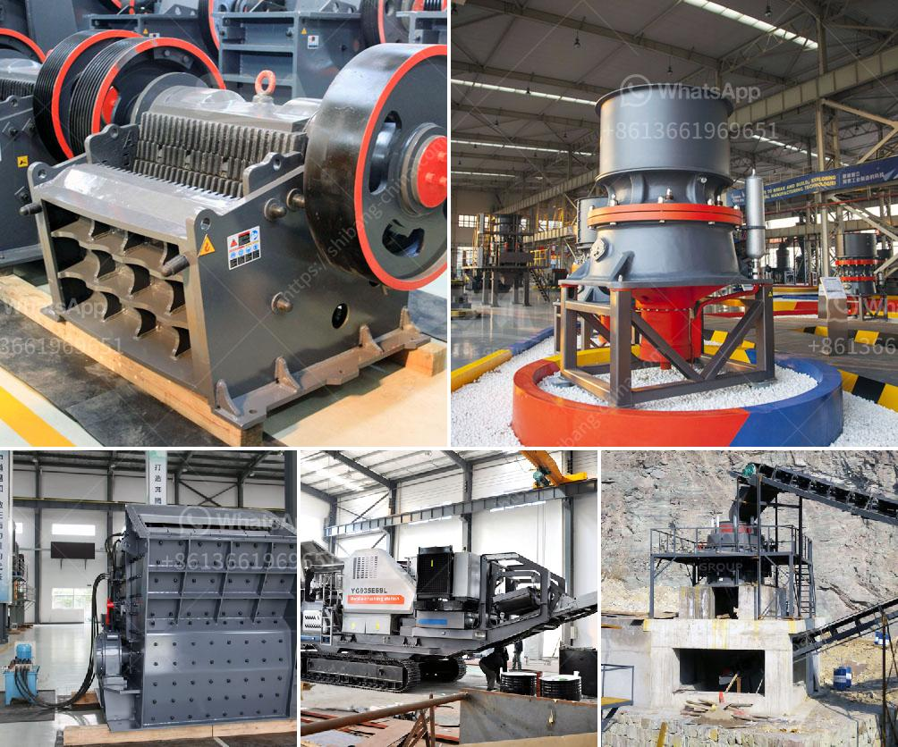

<h3>سعر مصنع الأسمنت</h3>
يعتبر الأسمنت من المواد الأساسية في صناعة البناء والتشييد، حيث يستخدم في تركيب الخرسانة والملاط والجبس والتي تساهم في إنشاء المباني والطرق والأجسام المختلفة. وباعتباره عنصرًا أساسيًا في البناء، فإن سعر مصنع الأسمنت يعتبر مهمًا للغاية.

تعتمد تكاليف إنشاء مصنع الأسمنت على العوامل المختلفة مثل مساحة المصنع والتكنولوجيا المستخدمة والعمليات الإنتاجية وتجهيز المعدات والضرائب وتكاليف المواد الأولية وتكاليف العمالة والمصاريف الإدارية والمصاريف العامة الأخرى. ومن هنا تختلف تكلفة إقامة مصنع الأسمنت من مكان إلى آخر ومن مصنع إلى آخر.

وعلى الرغم من أن سعر مصنع الأسمنت يتفاوت، إلا أنه يمكن القول بأنه يتراوح ما بين 200 إلى 400 دولار للطن الواحد من الأسمنت المنتج. ومن الجدير بالذكر أن هذا السعر قد يتأثر بالأسواق العالمية والتطورات الاقتصادية العالمية، حيث يمكن أن يزيد أو يقل حسب العرض والطلب على الأسمنت. 

كما يؤثر سعر المواد الأولية اللازمة لإنتاج الأسمنت في تحديد سعر المصنع أيضًا. فعلى سبيل المثال، فإن ارتفاع أسعار المعادن مثل الحجر الجيري والسيليكا والطين يزيد تكلفة إنتاج الأسمنت وبالتالي يرفع سعر المصنع.

بالنظر إلى أهمية الأسمنت في صناعة البناء، يعد سعر المصنع أمرًا حاسمًا لرؤية الدورة الاقتصادية الإيجابية في القطاع. وبالنظر إلى التطور المستمر في هذه الصناعة، يهدف الكثيرون إلى إنشاء مصانع أسمنت جديدة لتلبية الطلب المتزايد على الأسمنت. ولذلك، فإن تحديد سعر مصنع الأسمنت يصبح أمرًا حاسمًا للنجاح والاستمرار في هذه الصناعة التي تعد أحد ركائز النمو الاقتصادي للبلدان.

في الختام، يمكن القول بأن سعر مصنع الأسمنت يعتمد على العوامل المختلفة مثل التكنولوجيا المستخدمة وتكلفة المواد الأولية والعمليات الإنتاجية. ومع ارتفاع الطلب على الأسمنت، قد يزداد سعر المصنع، مما يشكل تحديًا للصناعة ولبناء البنية التحتية اللازمة للتطور والتقدم الاقتصادي.
<h3>Contact us</h3><ul><li><strong>Whatsapp:&nbsp;<a href="https://wa.me/8613661969651">+8613661969651</a></strong></li><li><a href="https://swt.shibang-china.com/?git&amp;zhl&amp;سعر مصنع الأسمنت"><strong>Online Service(chat now)</strong></a></li></ul><h3>Related</h3><ul><li><a href='كسارة فك الحجر الجيري للبيع.md'>كسارة فك الحجر الجيري للبيع</a></li><li><a href='استخدام كسارة الفك المتنقلة.md'>استخدام كسارة الفك المتنقلة</a></li><li><a href='كسارة المحجر للحجر.md'>كسارة المحجر للحجر</a></li><li><a href='كسارة للذهب.md'>كسارة للذهب</a></li><li><a href='مطحنة الكرة لأكسيد الرصاص.md'>مطحنة الكرة لأكسيد الرصاص</a></li></ul>