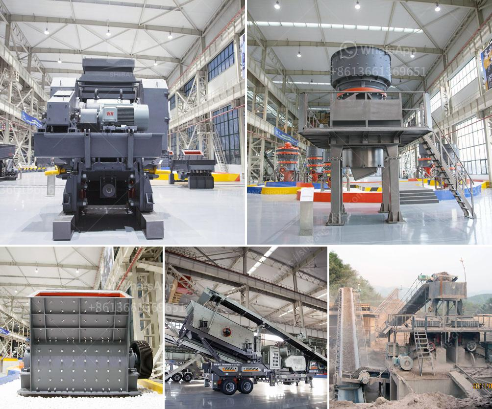

<h3>سعر مصنع التكسير والفرز في جنوب أفريقيا</h3>
يُعدّ مصنع التكسير والفرز من أهم المكونات في صناعة التعدين، وخاصة في جنوب أفريقيا التي تعتبر واحدة من أكبر الدول المنتجة للمعادن في العالم. يتم استخدام مصانع التكسير والفرز لتكسير المواد الصلبة وفصلها إلى جزيئات صغيرة لتسهيل استخلاص المعادن الموجودة فيها.

سعر مصنع التكسير والفرز في جنوب أفريقيا يتأثر بعدد من العوامل، مثل الحجم والقدرة الإنتاجية للمصنع، والتكنولوجيا المستخدمة فيه، والمواد الخام المطلوبة للفرز والتكسير وتوافرها في السوق. بشكل عام، يتراوح سعر مصنع التكسير والفرز في جنوب أفريقيا ما بين 200 و400 ألف دولار أمريكي.

يجب أن يؤخذ في الاعتبار أن هذا السعر يشمل تكلفة المعدات المستخدمة في المصنع، مثل الكسارات والغرابيل والناقلات، وأيضًا تكلفة الأجهزة والبرامج اللازمة لتشغيل المصنع والحفاظ على كفاءته. كما أن سعر المصنع يمكن أن يختلف بناءً على الشركة المصنعة وجودتها وسمعتها في السوق.

بعض العوامل المؤثرة التي قد تؤدي إلى ارتفاع سعر المصنع هي التكنولوجيا المتقدمة المعتمدة في صناعة المصنع وكفاءته في عملية التكسير والفرز. على سبيل المثال، إذا كان المصنع يستخدم تقنيات حديثة مثل تقنية الغرابيل الاهتزازية أو التحكم الآلي بالكمبيوتر، فمن المتوقع أن يكون ثمنه أعلى.

بالإضافة إلى ذلك، يجب أن تؤخذ في الاعتبار تكاليف الصيانة والتشغيل المستمرة للمصنع، حيث يتطلب الحفاظ على كفاءة المصنع صيانة دورية واستبدال الأجزاء التالفة. قد تتوجب تكاليف العمالة والطاقة أيضًا في تحديد السعر النهائي للمصنع.

بصفة عامة، يُعتبر سعر مصنع التكسير والفرز في جنوب أفريقيا مناسب ومتوسط مقارنة بأسعار أنظمة التكسير والفرز في دول أخرى. تحديد السعر المناسب يعتمد على احتياجات الشركات وقدراتها المالية والإنتاجية المتوقعة للمصنع.

في النهاية، يجب أن يتم اختيار وشراء مصنع التكسير والفرز بناءً على الاحتياجات الفعلية للشركة وتوقعاتها للعمليات المستقبلية. يجب التأكد من أن المصنع يتمتع بالتكنولوجيا والكفاءة المناسبة لتلبية متطلبات الشركة والحفاظ على تنافسيتها في سوق التعدين في جنوب أفريقيا.
<h3>Contact us</h3><ul><li><strong>Whatsapp:&nbsp;<a href="https://wa.me/8613661969651">+8613661969651</a></strong></li><li><a href="https://swt.shibang-china.com/?git&amp;zhl&amp;سعر مصنع التكسير والفرز في جنوب أفريقيا"><strong>Online Service(chat now)</strong></a></li></ul><h3>Related</h3><ul><li><a href='تكلفة مصنع تكسير الذهب.md'>تكلفة مصنع تكسير الذهب</a></li><li><a href='أفضل كسارة لمسحوق الكوارتز.md'>أفضل كسارة لمسحوق الكوارتز</a></li><li><a href='مصنع كسارة المحاجر في إيطاليا.md'>مصنع كسارة المحاجر في إيطاليا</a></li><li><a href='تكلفة ماكينات كسارة المحاجر.md'>تكلفة ماكينات كسارة المحاجر</a></li><li><a href='وحدة تكسير الحجر الكوارتز في الهند.md'>وحدة تكسير الحجر الكوارتز في الهند</a></li></ul>