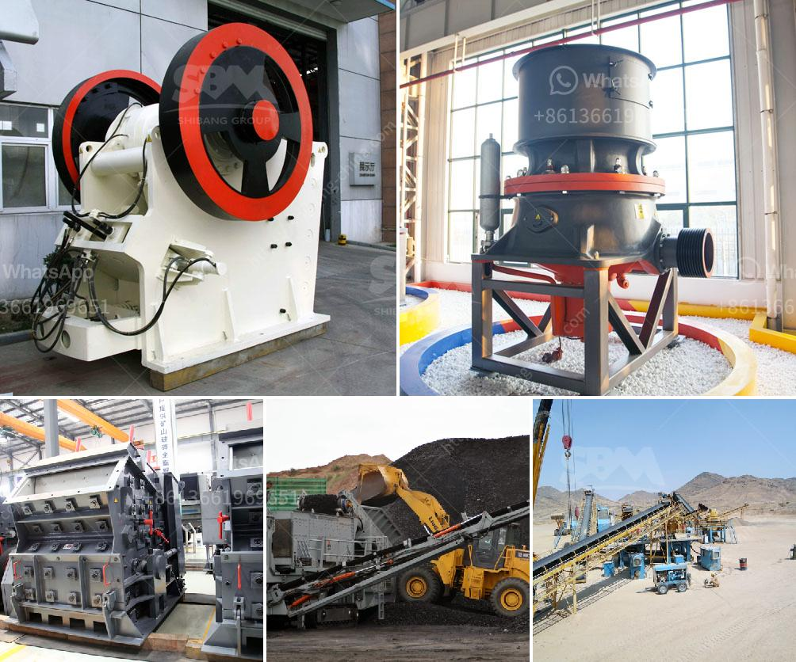

<h3>سعر مصنع التكسير</h3>
تعتبر عملية التكسير من العمليات الحاسمة في صناعة التعدين والبناء. فهي تهدف إلى تحطيم المواد الخام إلى أحجام أصغر، مما يتيح استخدامها في عمليات أخرى مثل الطحن والفصل المغناطيسي والتعويم.

تتأثر تكاليف المصنع بعدة عوامل، بدءًا من الحجم والنطاق وحتى المواصفات الفنية للآلات والمعدات المستخدمة. يمكن احتساب التكاليف بالاعتماد على نتائج الدراسة الاقتصادية وعرض الأسواق. ومن المهم أن تكون هذه التكاليف معقولة ومناسبة للأغراض التجارية وقدرة المستفيدين العملاء على تحملها.

تتفاوت تكاليف مصانع التكسير بناءً على حجمها وكفاءتها. قد تتراوح تكاليف مصنع التكسير بين بضعة آلاف من الدولارات إلى عدة ملايين من الدولارات. وتتأثر هذه التكاليف بعوامل مثل قدرة المصنع (طن / ساعة) والمواد المحطمة ونظام الشحن والتجميع والتشغيل والصيانة.

تتكون تكلفة المصنع من عدة عناصر، منها تكلفة المعدات والآلات والأجهزة اللازمة. فمن المفترض أن تكون هذه المعدات ذات جودة عالية وتوفر أعلى مستويات الأداء والإنتاجية. وبالإضافة إلى ذلك، تتكون تكاليف المصنع من تكاليف الأرض والبناء والتجهيز والضواغط والمكابس والأنظمة الهيدروليكية والكهربائية والإلكترونية والنقل والتركيب.

علاوة على ذلك، يؤثر الطلب والعرض على أسعار مصانع التكسير. عندما يكون الطلب مرتفعًا والعرض منخفضًا، فإن الأسعار قد تكون مرتفعة. وعلى العكس، عندما يكون العرض مرتفعًا والطلب منخفضًا، قد تكون الأسعار منخفضة. وبالتالي، فإن من المهم تواجد التنافس في سوق صناعة التكسير لضمان وجود أسعار مناسبة ومعتدلة للجميع.

في الختام، يجب أن تكون تكاليف المصانع المخصصة للتكسير في متناول الجميع وتلبي متطلبات السوق. فهي تعتبر أحد العوامل الرئيسية في نجاح الشركات والصناعات المعنية. ومن المهم البحث بعناية واختيار المصنع المناسب الذي يتوافق مع احتياجات الشركة ومتطلباتها لضمان الانتاجية والجودة والاستدامة البيئية.
<h3>Contact us</h3><ul><li><strong>Whatsapp:&nbsp;<a href="https://wa.me/8613661969651">+8613661969651</a></strong></li><li><a href="https://swt.shibang-china.com/?git&amp;zhl&amp;سعر مصنع التكسير"><strong>Online Service(chat now)</strong></a></li></ul><h3>Related</h3><ul><li><a href='سعر مصنع الأسمنت.md'>سعر مصنع الأسمنت</a></li><li><a href='شركة تصنيع مطحنة ريموند.md'>شركة تصنيع مطحنة ريموند</a></li><li><a href='إنتاج الركام.md'>إنتاج الركام</a></li><li><a href='آلة معالجة النحاس.md'>آلة معالجة النحاس</a></li><li><a href='تحسين مصنع التكسير.md'>تحسين مصنع التكسير</a></li></ul>