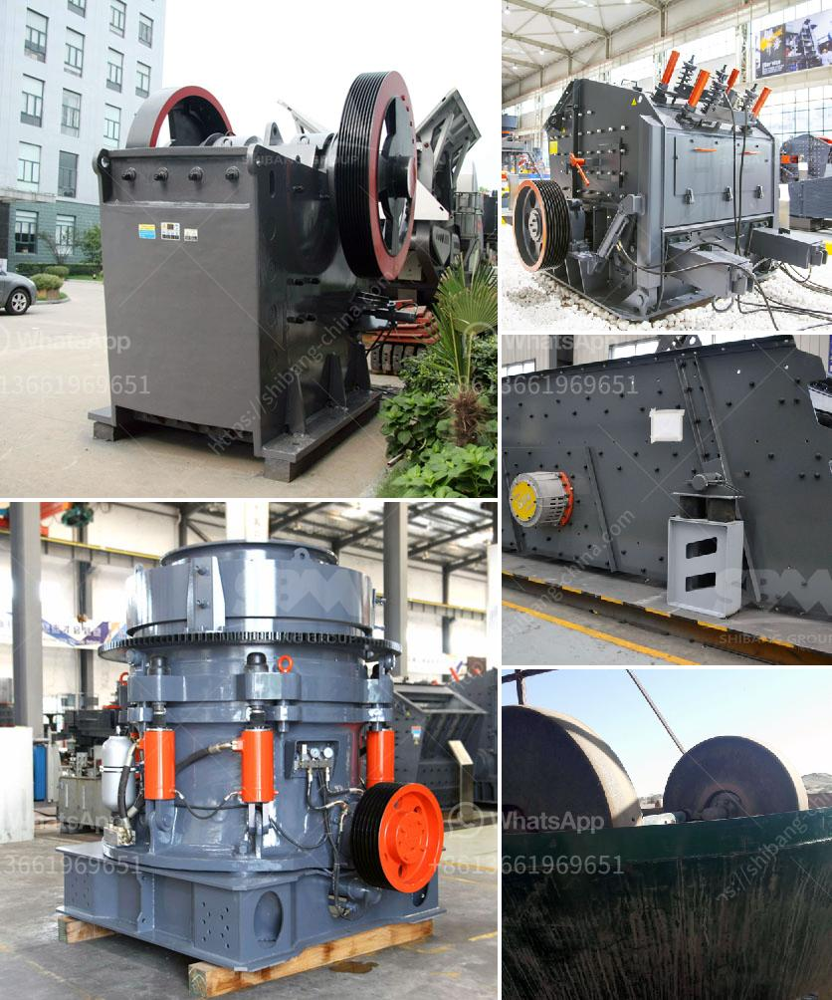

<h3>سعر مصنع الجبس</h3>
يُعتبر الجبس أحد المواد الأساسية في مجال البناء والديكور. ويتم استخدامه بكثرة في عمليات التشييد والترميم في جميع أنحاء العالم. ويُعتبر الجبس مادة رخيصة الثمن ومتوفرة في الكميات الكبيرة، مما يجعله خيارًا شائعًا في العديد من المشاريع.

تُستخدم مصانع الجبس لإنتاج الجص المستخدم في تقديم التشكيلات الديكورية والسقفية. وتكون أسعار مصانع الجبس متفاوتة حسب الكمية والجودة والبلد التي تتواجد فيه المصنع. وفي العادة، تتراوح أسعار المصانع بين 200 و 400 دولار للطن الواحد من الجبس.

تعتمد أسعار المصانع على عدة عوامل، مثل تكاليف الإنتاج والعرض والطلب في السوق. ففي الدول التي تمتلك موارد وفيرة من الجبس، قد تكون الأسعار أدنى نسبيًا نظرًا لتوفر المادة الخام بشكل مستمر. بالمقابل، في الدول التي تعاني من نقص في الجبس، قد يرتفع سعر المصنع.

علاوة على ذلك، يمكن أن تؤثر التكلفة الإنتاجية على سعر المصانع. فإنتاج الجص يتطلب موارد معينة مثل الماء والكهرباء والوقود. وتختلف تكاليف هذه الموارد من بلد إلى آخر. وقد تتأثر بأيضاً بتغيرات أسعار الطاقة في السوق العالمية.

تلعب جودة المنتج دورًا مهمًا في تحديد سعر مصانع الجبس. فتتميز بعض المصانع بجودة عالية وتنتج جبسًا متينًا وسهل الاستخدام. وعلى الرغم من رفع الأسعار، إلا أن هذه المصانع تعتبر الاختيار الأفضل بسبب تقديمها منتجات متميزة.

باختصار، فإن سعر مصنع الجبس يعتمد على العوامل المختلفة مثل الكمية والجودة والتكلفة الإنتاجية وسوق العرض والطلب. وعلى الرغم من اختلاف الأسعار، إلا أن الجبس لا يزال مادة بناء مقبولة من حيث التكلفة وسهلة الاستخدام، مما يجعلها خيارًا شائعًا في العديد من المشاريع البنائية والديكورية.
<h3>Contact us</h3><ul><li><strong>Whatsapp:&nbsp;<a href="https://wa.me/8613661969651">+8613661969651</a></strong></li><li><a href="https://swt.shibang-china.com/?git&amp;zhl&amp;سعر مصنع الجبس"><strong>Online Service(chat now)</strong></a></li></ul><h3>Related</h3><ul><li><a href='كسارات الحصى للبيع.md'>كسارات الحصى للبيع</a></li><li><a href='وحدة إنتاج مطحنة الرمل في كيرالا.md'>وحدة إنتاج مطحنة الرمل في كيرالا</a></li><li><a href='مصنع معالجة رمل الحديد للبيع في باكستان.md'>مصنع معالجة رمل الحديد للبيع في باكستان</a></li><li><a href='خط إنتاج مطحنة عمودية LM.md'>خط إنتاج مطحنة عمودية LM</a></li><li><a href='شركة كسارة الحجر.md'>شركة كسارة الحجر</a></li></ul>