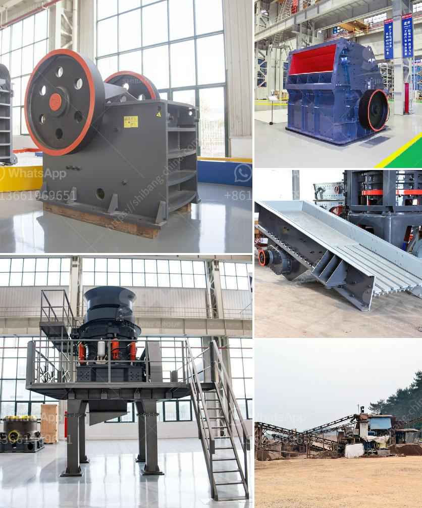

<h3>سعر مصنع الرمل والحصى في الهند</h3>
يعتبر الرمل والحصى من الموارد الاساسية والضرورية في تطوير البنية التحتية والبناء في الهند وفي جميع أنحاء العالم. وتُستخدم هذه المواد في العديد من المشاريع الكبيرة مثل الطرق والجسور والمباني وحتى في صناعة الزجاج والسيراميك.

تختلف أسعار الرمل والحصى في الهند حسب عدة عوامل مختلفة، مثل المكان والكمية المطلوبة وجودة المنتج والموارد المحلية المتاحة. يتم تصنيع الرمل والحصى في الهند عن طريق طحن الصخور والحجارة الكبيرة إلى حجم وشكل محدد.

عموماً، تتراوح أسعار الرمل والحصى في الهند بين 200 إلى 400 روبية هندية للطن الواحد. وهذا السعر يشمل التكلفة الانتاجية وتجهيز المنتج بحيث يكون جاهزًا للاستخدام.

ويجب ملاحظة أن هناك اختلافات في الأسعار بين الأماكن المختلفة في الهند. فعلى سبيل المثال، قد يكون سعر الرمل والحصى أعلى في المناطق النائية حيث تكون الموارد أقل وتكاليف النقل أكبر.

بالإضافة إلى ذلك، فإن جودة المنتج هي عامل آخر يؤثر على السعر. فعندما يتم استخدام موارد عالية الجودة في تصنيع الرمل والحصى، قد يرتفع السعر قليلاً. وهذا يكون بالتأكيد تكلفة عادلة، حيث يستخدم المنتج في مشاريع هامة تحتاج إلى استخدام منتج ذو جودة عالية للحفاظ على المتانة الطويلة الأمد.

وفي النهاية، يمكننا أن نقول أن سعر مصنع الرمل والحصى في الهند يعتمد على عدة عوامل مثل المكان والكمية المطلوبة وجودة المنتج. وبالطبع، يجب أن يتم اختيار أفضل سعر ممكن مع ضمان الحصول على جودة عالية وموثوقية في المنتج. يجب أن يتم تقدير الرمل والحصى كم صنع شريك أساسي للتنمية في أي مجتمع.
<h3>Contact us</h3><ul><li><strong>Whatsapp:&nbsp;<a href="https://wa.me/8613661969651">+8613661969651</a></strong></li><li><a href="https://swt.shibang-china.com/?git&amp;zhl&amp;سعر مصنع الرمل والحصى في الهند"><strong>Online Service(chat now)</strong></a></li></ul><h3>Related</h3><ul><li><a href='كسارة الكاولين المحمولة في نيجيريا.md'>كسارة الكاولين المحمولة في نيجيريا</a></li><li><a href='موردين طاحونة الفحم.md'>موردين طاحونة الفحم</a></li><li><a href='شركة تصنيع لوحات الجبس في سنغافورة.md'>شركة تصنيع لوحات الجبس في سنغافورة</a></li><li><a href='مطحنة كرات لتعدين الذهب للبيع.md'>مطحنة كرات لتعدين الذهب للبيع</a></li><li><a href='مطحنة حجر للبيع.md'>مطحنة حجر للبيع</a></li></ul>