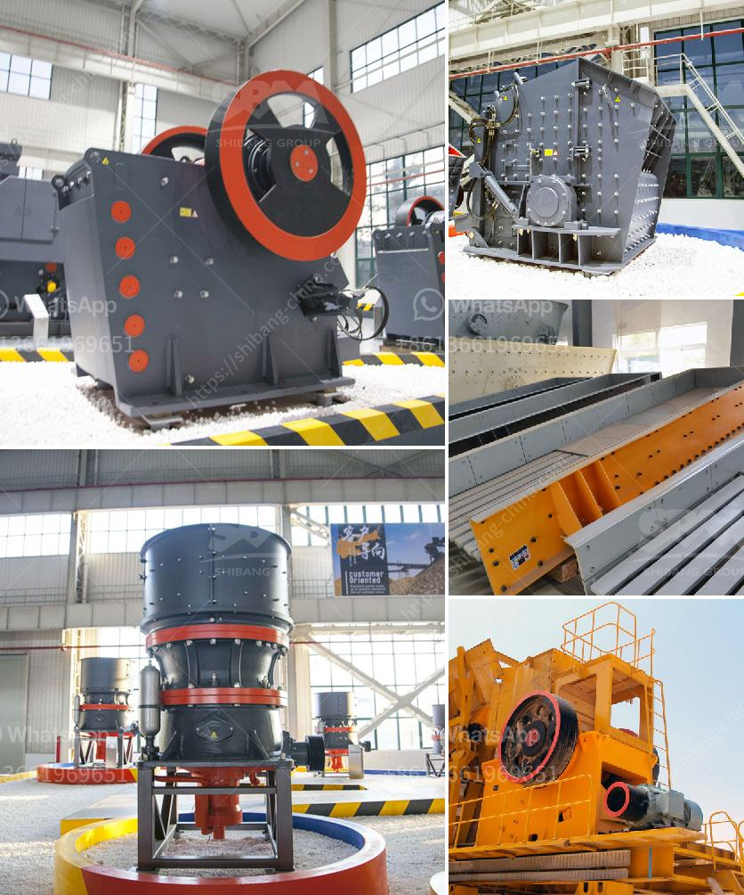

<h3>سعر مصنع الكسارة الهندسي الجديد 200 طن في الساعة</h3>
تعد الكسارات الهندسية أحدث التقنيات في صناعة التعدين والبناء، حيث تستخدم لتفتيت الصخور والمواد الخام في حجم صغير قبل استخدامها في الإنشاءات وإنتاج الأسمنت والخرسانة. تم تصميم وتصنيع مصنع الكسارة الهندسي الجديد بطاقة إنتاجية تبلغ 200 طن في الساعة وهو يمثل تطورًا كبيرًا في هذا المجال.

تتميز الكسارة الهندسية الجديدة بطاقتها الإنتاجية العالية وفعاليتها الاقتصادية. تعمل بآلية ميكانيكية تقوم بتكسير الصخور إلى قطع صغيرة بشكل أوتوماتيكي وفقًا للإعدادات المحددة مسبقًا. يتم وضع الصخور داخل الكسارة ومرورها عبر سلسلة من الأسطوانات الدوارة المزودة بأطواق من الفولاذ المقاوم للتآكل تقوم بتفتيت الصخور تدريجيًا.

تأتي الكسارة الهندسية بتصميم عصري وموثوقية عالية، بفضل استخدام مواد عالية الجودة في بنائها مثل الفولاذ المقاوم للصدأ والمعدن المقاوم للتآكل. بالإضافة إلى ذلك، يتم تزويدها بنظام إدارة التحكم الآلي الذكي الذي يسمح للمشغلين بضبط ومراقبة العملية بدقة وسهولة.

يعد سعر مصنع الكسارة الهندسي الجديد معقولًا مقارنة بالتكنولوجيا والخدمات المقدمة. يتفاوت السعر بناءً على المواصفات والملحقات المطلوبة، ولكن يتراوح عادة بين 200,000 دولار و 500,000 دولار. يعتبر هذا السعر معقولًا نظرًا لفوائد وكفاءة مصنع الكسارة الهندسي الجديد، بالإضافة إلى أنه يوفر الوقت والجهد والموارد في عمليات التشغيل والصيانة.

يعتبر مصنع الكسارة الهندسي الجديد بطاقته الإنتاجية العالية وأداءه الفعال خيارًا جيدًا للشركات والمشاريع الكبيرة في صناعة التعدين والبناء. ومع توجه العديد من العمليات الصناعية نحو الأتمتة والتحسين المستمر، من المتوقع أن يزداد الطلب على هذه الكسارات الهندسية الحديثة في المستقبل.
<h3>Contact us</h3><ul><li><strong>Whatsapp:&nbsp;<a href="https://wa.me/8613661969651">+8613661969651</a></strong></li><li><a href="https://swt.shibang-china.com/?git&amp;zhl&amp;سعر مصنع الكسارة الهندسي الجديد 200 طن في الساعة"><strong>Online Service(chat now)</strong></a></li></ul><h3>Related</h3><ul><li><a href='آلات مطحنة في جنوب أفريقيا.md'>آلات مطحنة في جنوب أفريقيا</a></li><li><a href='كسارات مصنوعة في الفلبين الجنوبية.md'>كسارات مصنوعة في الفلبين الجنوبية</a></li><li><a href='كم عدد شركات تصنيع كسارات الفك في الهند.md'>كم عدد شركات تصنيع كسارات الفك في الهند</a></li><li><a href='شركة تصنيع لطحن الكلنكر.md'>شركة تصنيع لطحن الكلنكر</a></li><li><a href='شركة تصنيع معدات الجبس.md'>شركة تصنيع معدات الجبس</a></li></ul>