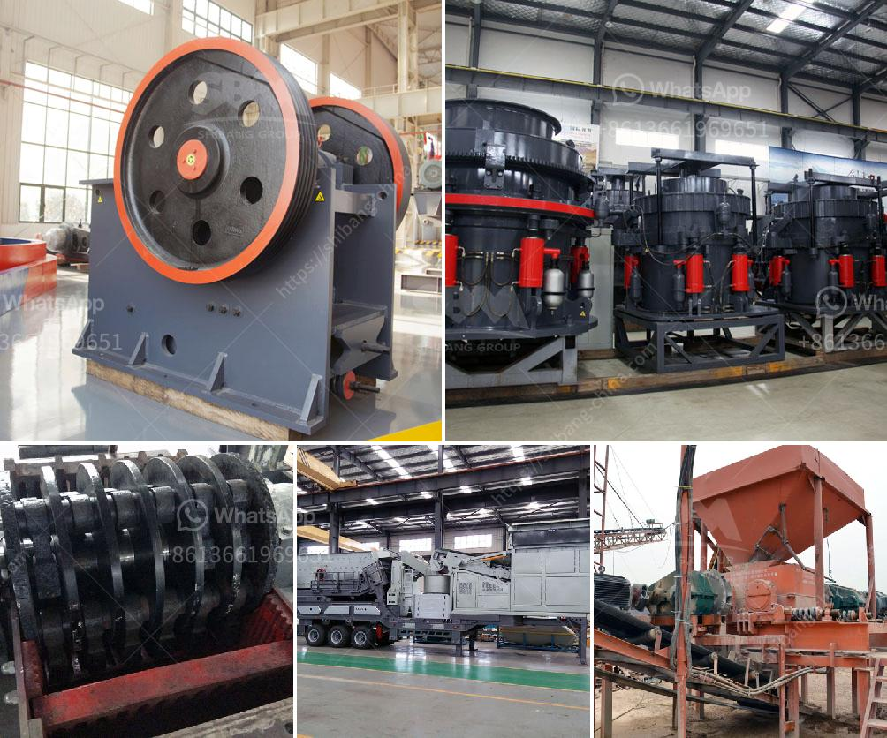

<h3>سعر مصنع الكسارة في باكستان</h3>
تعد صناعة الكسارات من الصناعات الهامة في باكستان، حيث تلعب دورًا رئيسيًا في تجهيز المواد الخام للإنشاءات والبناء. واحدة من العناصر الرئيسية التي تؤثر على تكلفة المصنع هي سعر المصنع نفسه.

تتوفر الكسارات في باكستان بمجموعة واسعة من الأحجام والأنواع. يتم تحديد سعر المصنع بناءً على عدة عوامل مختلفة، مثل سعة الإنتاج ونوع وحجم الكسارة والتقنية المستخدمة.

بشكل عام، يتراوح سعر مصانع الكسارات في باكستان بين 200 إلى 400 دولار أمريكي. ومع ذلك، يجب أخذ بعين الاعتبار أن هذه الأسعار قد تتفاوت اعتمادًا على العلامة التجارية وجودة المصنع والمواد المستخدمة في التصنيع.

هناك العديد من العوامل التي يمكن أن تؤثر في سعر مصنع الكسارة في باكستان. من بين هذه العوامل، سعة الإنتاج هي واحدة من أكثر العوامل أهمية. فمصانع الكسارات التي تتمتع بسعة إنتاج أعلى عادةً ما تكون أغلى من تلك ذات السعة الأقل.

كما يتأثر سعر المصنع أيضًا بنوع وحجم الكسارة. هناك مجموعة متنوعة من الكسارات المتاحة من كسارات الفك وكسارات الصدم وكسارات المخروط وغيرها. كما أن هناك اختلافات في الأحجام المتاحة للكسارات. كل من هذه الاختلافات يمكن أن تؤثر على سعر المصنع.

التقنية المستخدمة في تصنيع المصانع هي عامل آخر يؤثر على السعر. تصنع بعض المصانع بتقنيات أكثر تقدمًا وبجودة أعلى، وبالتالي يكون لها سعر أعلى من تلك التي تستخدم تقنيات أقل تقدمًا.

بالاختصار، يتفاوت سعر مصنع الكسارة في باكستان بناءً على العديد من العوامل، بما في ذلك سعة الإنتاج ونوع وحجم الكسارة والتقنية المستخدمة في التصنيع. لا يمكن تحديد سعر محدد للمصنع دون معرفة هذه العوامل، ومن الأفضل استشارة خبراء الصناعة والباحثين للحصول على مقارنة دقيقة لأسعار المصانع المتاحة في السوق.
<h3>Contact us</h3><ul><li><strong>Whatsapp:&nbsp;<a href="https://wa.me/8613661969651">+8613661969651</a></strong></li><li><a href="https://swt.shibang-china.com/?git&amp;zhl&amp;سعر مصنع الكسارة في باكستان"><strong>Online Service(chat now)</strong></a></li></ul><h3>Related</h3><ul><li><a href='بيع كسارة الحجر 400 طن في الساعة.md'>بيع كسارة الحجر 400 طن في الساعة</a></li><li><a href='مطحنة نيجيريا.md'>مطحنة نيجيريا</a></li><li><a href='آلة غسيل الذهب.md'>آلة غسيل الذهب</a></li><li><a href='آلة كسارة الحصى.md'>آلة كسارة الحصى</a></li><li><a href='أسعار مطاحن الكرة وللبيع في سريلانكا.md'>أسعار مطاحن الكرة وللبيع في سريلانكا</a></li></ul>