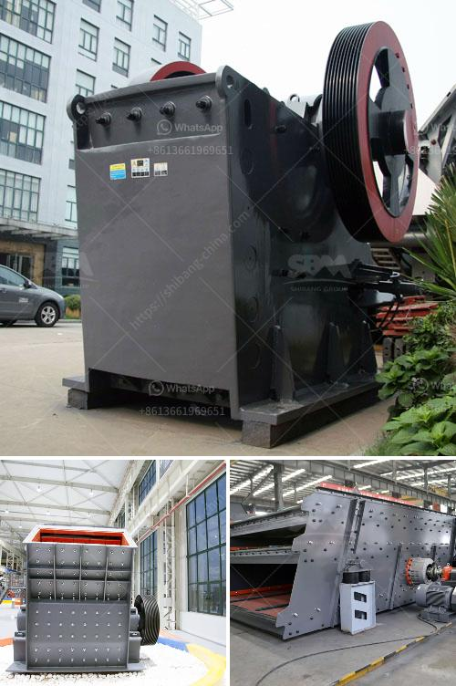

<h3>سعر مصنع تعدين الذهب في الصين</h3>
يعد قطاع التعدين واحدًا من القطاعات الهامة في الصين، حيث تمتلك البلاد واحدة من أكبر احتياطيات الذهب في العالم. يتم استغلال هذه الاحتياطات الضخمة من خلال العديد من المصانع والمناجم في الصين. سوف نتناول في هذه المقالة سعر مصنع تعدين الذهب في الصين.

تختلف تكلفة إنشاء وتشغيل مصنع تعدين الذهب في الصين باختلاف عدة عوامل. من أهم هذه العوامل هو حجم ونطاق العمليات التعدينية في المصنع. وبما أن الصين تحتل مركزًا رياديًا في إنتاج الذهب، فإن معظم مصانع التعدين في البلاد تكون ذات طاقة كبيرة وتنتج كميات كبيرة من الذهب سنويًا. وبالتالي، فإن تكلفة إنشاء هذه المصانع تكون عالية نسبيًا.

لا يتوقف سعر المصنع فقط على حجمه، ولكنه يرتبط أيضًا بمكوناته وتقنياته المستخدمة. يبذل الصينيون جهودًا رائدة في تحسين تكنولوجيا التعدين، حيث يستخدمون أحدث التقنيات والمعدات لضمان أفضل أداء لمصانعهم. وبالتالي، فإن ثمن الجهاز والتكنولوجيا تكون من ضمن العوامل المؤثرة في سعر المصنع.

من الجدير بالذكر أن سعر مصنع تعدين الذهب يمكن أن يتأثر أيضًا بالموقع الجغرافي للمنجم ومصنع التعدين. حيث قد يكون هناك تكاليف إضافية مثل تكلفة النقل وتوفير الكهرباء وغيرها من المصاريف. لذا، يمكن أن يتراوح سعر المصنع من 200 إلى 400 ألف دولار أمريكي.

وعلى الرغم من أن الصين لديها مصانع تعدين الذهب بتكاليف منخفضة نسبيًا، إلا أنها تواجه بعض التحديات والضغوط البيئية. وفي الواقع، تتخذ السلطات الصينية إجراءات لتشجيع المصانع على تحسين ظروف تشغيلها وتقليل التأثير على البيئة. وقد يؤدي ذلك إلى زيادة تكلفة المصانع وبالتالي قد يتأثر سعرها.

في الختام، يمكن القول إن سعر مصانع تعدين الذهب في الصين يتأثر بعدة عوامل، بما في ذلك حجم ونطاق العمليات، والتكنولوجيا المستخدمة، والموقع الجغرافي، والتحديات البيئية. تتعامل الصين مع هذه العوامل بحكمة لتحسين صناعتها التعدينية وتحقيق أقصى استفادة من الاحتياطات الهائلة للذهب التي تمتلكها البلاد.
<h3>Contact us</h3><ul><li><strong>Whatsapp:&nbsp;<a href="https://wa.me/8613661969651">+8613661969651</a></strong></li><li><a href="https://swt.shibang-china.com/?git&amp;zhl&amp;سعر مصنع تعدين الذهب في الصين"><strong>Online Service(chat now)</strong></a></li></ul><h3>Related</h3><ul><li><a href='سعر ماكينة مولين في ميدان.md'>سعر ماكينة مولين في ميدان</a></li><li><a href='مصنع معالجة البازلت.md'>مصنع معالجة البازلت</a></li><li><a href='تكاليف مطاحن الكرة.md'>تكاليف مطاحن الكرة</a></li><li><a href='كسارة محمولة للكوبالت.md'>كسارة محمولة للكوبالت</a></li><li><a href='مصنع التجفيف السائل في تاميل نادو.md'>مصنع التجفيف السائل في تاميل نادو</a></li></ul>