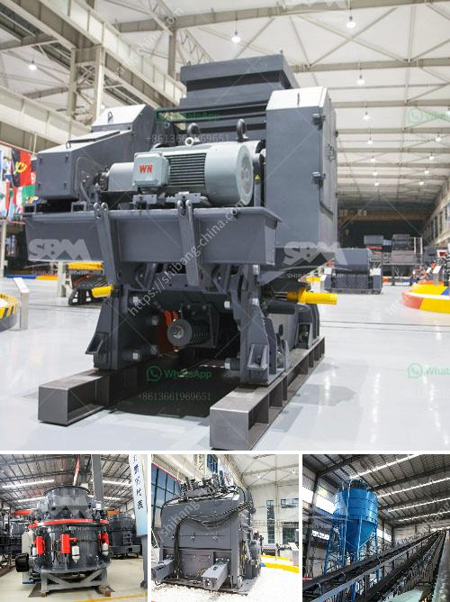

<h3>سعر مصنع خام الحديد للبيع في المكسيك</h3>
تعد المكسيك من أكبر منتجي خام الحديد في العالم، حيث تحتل المرتبة الرابعة عالميًا في إنتاج هذه السلعة الحيوية. يعتبر خام الحديد من الموارد الطبيعية الهامة في صناعات الحديد والصلب، ويستخدم على نطاق واسع في العديد من الصناعات الأخرى. لذلك، فإن السعر المطلوب لشراء خام الحديد المصنع في المكسيك يلعب دورًا حاسمًا في تحديد تكلفة الإنتاج والتنافسية في السوق.

تتأثر أسعار خام الحديد بعدة عوامل، أبرزها العرض والطلب العالمي على هذه السلعة، والتكلفة التشغيلية للمناجم والمصانع، وسياسة التصدير والاستيراد، بالإضافة إلى انتشار الأمراض مثل فيروس كورونا (كوفيد-19) الذي أدى إلى تشديد القيود والتأثير على حركة التجارة العالمية. علاوة على ذلك، يتأثر السعر أيضًا بالظروف الجغرافية والبيئية للدول المنتجة.

في المكسيك، تتواجد مناجم الحديد في مناطق متفرقة من البلاد، مثل ولاية سونورا وكوليما وتشياباس ودورانجو وتاموليباس وزاكاتيكاس، حيث تستخدم العديد من الشركات التكنولوجيا الحديثة لتعدين واستخراج الحديد بطرق فعالة وبأسعار منافسة.

على الرغم من أن الأسعار تختلف باستمرار بناءً على العديد من العوامل المذكورة سابقًا، إلا أنه يمكن أن يتراوح سعر مصنع خام الحديد في المكسيك بين 200 و 400 دولار للطن. قد يكون هذا السعر مقبولًا بالنسبة للعديد من المشترين في الدول المستوردة، خاصةً إذا كانت جودة الخام ونسبة الخصوبة مرتفعة.

تعتمد الشركات والمشترين على عوامل أخرى أيضًا قبل اتخاذ قرار الشراء، مثل توفر الشحن الملائم والمسؤوليات التجارية، وشروط الدفع، والاستدامة البيئية. يتعاون المشترون مع العديد من الشركات المكسيكية الكبيرة والصغيرة التي تعمل في مجال تعدين الحديد، وتعتبر العقود طويلة الأجل والشراكات الاستراتيجية من الطرق الفعالة لتحقيق التعاون وتأمين الإمدادات.

باختصار، يعد سعر مصنع خام الحديد للبيع في المكسيك متغيرًا باستمرار، إلا أنه يمثل فرصة استثمارية جيدة للشركات التي تهتم بالحصول على مصدر موثوق لخام الحديد عالي الجودة. تستثمر الشركات المصرح لها في المصانع والتقنيات الحديثة لزيادة الإنتاجية وتقليل التكاليف، مما يعزز التنافسية ويساهم في تلبية الطلب العالمي المتزايد على خام الحديد.
<h3>Contact us</h3><ul><li><strong>Whatsapp:&nbsp;<a href="https://wa.me/8613661969651">+8613661969651</a></strong></li><li><a href="https://swt.shibang-china.com/?git&amp;zhl&amp;سعر مصنع خام الحديد للبيع في المكسيك"><strong>Online Service(chat now)</strong></a></li></ul><h3>Related</h3><ul><li><a href='مصنع معالجة الذهب آلة كسارة الحجر التركية.md'>مصنع معالجة الذهب آلة كسارة الحجر التركية</a></li><li><a href='كسارة لفة معدات مستخدمة tph الفحم الروسية.md'>كسارة لفة معدات مستخدمة tph الفحم الروسية</a></li><li><a href='سعة مطحنة الكرة بالأطنان.md'>سعة مطحنة الكرة بالأطنان</a></li><li><a href='مصنع تكسير الكلنكر الاسمنتي.md'>مصنع تكسير الكلنكر الاسمنتي</a></li><li><a href='معلمات فنية لكسارة 20 طن في الساعة.md'>معلمات فنية لكسارة 20 طن في الساعة</a></li></ul>