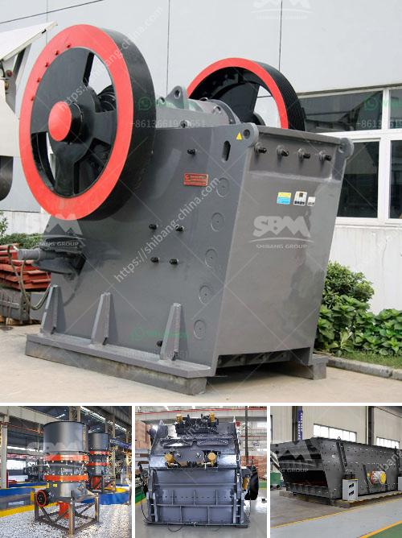

<h3>سعر مصنع كربونات الكالسيوم</h3>
يعد مصنع كربونات الكالسيوم من المصانع الهامة في صناعة المواد الكيميائية والمنتجات ذات الصلة. تستخدم كربونات الكالسيوم في العديد من الصناعات مثل الأدوية والغذاء وصناعة البلاستيك والورق والدهانات والتجميل وغيرها الكثير. يعود سبب ارتفاع طلب كربونات الكالسيوم على التشتت العربى لها بشكل سريع لمقاومتها للحرارة وتأثيرات البيئة السيئة.

تؤثر عدة عوامل على سعر مصنع كربونات الكالسيوم ، ومن بينها:

1. جودة المنتج: تعتبر جودة كربونات الكالسيوم المنتجة أحد العوامل الرئيسية التي تؤثر على السعر. إذا كانت جودة المنتج عالية وتلبي المعايير الدولية والمحلية ، فمن المرجح أن يكون سعره أعلى.

2. تكلفة المواد الخام: تتطلب عملية تصنيع كربونات الكالسيوم استخدام مواد خام مثل الحجر الجيري المعدني. إذا كانت تكلفة هذه المواد الخام مرتفعة ، فمن المرجح أن يؤدي ذلك إلى زيادة في سعر المنتج النهائي.

3. التكنولوجيا المتبعة: تعتمد التكنولوجيا المستخدمة في عملية التصنيع على كفاءة المصنع وجودة المنتج النهائي. إذا تم استخدام تكنولوجيا حديثة ومتطورة ، فمن المرجح أن يكون سعر المنتج أعلى.

4. الطلب والعرض: يؤثر الطلب والعرض على سعر كربونات الكالسيوم ، حيث إذا كان الطلب أعلى من العرض ، فمن المرجح أن يكون السعر أعلى. علاوة على ذلك ، يمكن أن تؤثر العوامل الاقتصادية والسياسية والتجارية في السوق على الطلب والعرض وبالتالي على السعر.

يتراوح سعر مصنع كربونات الكالسيوم عادةً بين 200 و 400 دولار للطن ، ولكن هذا السعر يعتمد على العوامل المذكورة أعلاه. بصفة عامة ، يميل السعر إلى الارتفاع في حالة تحقيق جودة عالية واستخدام تكنولوجيا متقدمة وزيادة الطلب على المنتج.

هناك العديد من الشركات المصنعة لكربونات الكالسيوم في جميع أنحاء العالم ، وتتنافس في تقديم أفضل جودة بأسعار تنافسية. قد يتنوع سعر المصنع حسب الشركة المصنعة ومكانها وجودة المنتج المقدم.

بالنهاية ، يعد سعر مصنع كربونات الكالسيوم مهمًا للعديد من الصناعات التي تعتمد على هذا المنتج الأساسي. لذلك ، فإن معرفة العوامل التي تؤثر على السعر يمكن أن تساعد الشركات في تخطيط استراتيجيات تسعير مناسبة وتحقيق المزيد من الربحية.
<h3>Contact us</h3><ul><li><strong>Whatsapp:&nbsp;<a href="https://wa.me/8613661969651">+8613661969651</a></strong></li><li><a href="https://swt.shibang-china.com/?git&amp;zhl&amp;سعر مصنع كربونات الكالسيوم"><strong>Online Service(chat now)</strong></a></li></ul><h3>Related</h3><ul><li><a href='من مصنع تصنيع البوكسيت في الصين.md'>من مصنع تصنيع البوكسيت في الصين</a></li><li><a href='كم تكلفة كسارة الفك.md'>كم تكلفة كسارة الفك</a></li><li><a href='كسارة تأثير صناعية.md'>كسارة تأثير صناعية</a></li><li><a href='كسارة الكرة باكستان للبيع.md'>كسارة الكرة باكستان للبيع</a></li><li><a href='سعر مطرقة مطحنة سعة صنع في الصين.md'>سعر مطرقة مطحنة سعة صنع في الصين</a></li></ul>