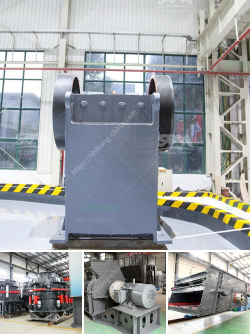

<h3>سعر مصنع كسارة الحجر بسعة 200 طن في الساعة</h3>
تعد كسارة الحجر بسعة 200 طن في الساعة أحد الآلات الهامة في صناعة التعدين والبناء. تستخدم هذه الكسارات في سحق وتكسير الصخور والأحجار الكبيرة إلى الحجم المطلوب والمناسب للاستخدام المرغوب فيه. وتتميز بأنها غاية في الكفاءة والأداء العالي.

تتنوع أسعار مصانع كسارات الحجر بسعة 200 طن في الساعة وفقًا للعديد من العوامل. أحد هذه العوامل هو الموديل والعلامة التجارية للكسارة، حيث يمكن أن يؤثر هذا على سعر المصنع. كما يمكن أن تؤثر ميزات أخرى مثل المحرك والتقنية المستخدمة وجودة الأجزاء المستخدمة في تحديد السعر.

بشكل عام، يتراوح سعر مصنع كسارة الحجر بسعة 200 طن في الساعة ما بين 50000 دولار و200000 دولار. وطبعاً، قد يتم تحديد السعر النهائي بناءً على المتطلبات المحددة للعميل، مثل الملف الشخصي للصخور المحطومة ونوعية المواد المستخدمة في البناء.

من الجدير بالذكر أنه بالإضافة إلى سعر المصنع نفسه، قد تكون هناك تكاليف إضافية لا بد من النظر فيها، مثل تكاليف الشحن والتركيب والتدريب وصيانة الكسارة. لذا، يجب على المشتري أن يأخذ في الاعتبار هذه العوامل الإضافية لتخطيط الميزانية بشكل صحيح.

بشكل عام، فإن استثمار مصنع كسارة الحجر بسعة 200 طن في الساعة يعد استثمارًا جيدًا ومجديًا. نظرًا لقدرته على سحق الصخور والأحجار ذات الحجم الكبير بكفاءة، فإن هذا يمكّن المشروعات الكبيرة مثل مواقع البناء وشركات المحاجر ومناجم التعدين من زيادة الإنتاجية وتقليل تكاليف العمل.

في النهاية، يجب على المشتري أن يأخذ بنظر الاعتبار المتطلبات الخاصة به ويقارن بين العروض المتاحة في السوق، وذلك لتحديد العلامة التجارية المناسبة والتقنية الأفضل لتلبية احتياجاته وميزانيته.

بهذه الطريقة، يمكن الحصول على مصنع كسارة الحجر بسعة 200 طن في الساعة بأفضل سعر وبأداء عالي وجودة لا مثيل لها، مما يسهم في تحقيق نجاح المشروع وتحقيق العائد المرجو.
<h3>Contact us</h3><ul><li><strong>Whatsapp:&nbsp;<a href="https://wa.me/8613661969651">+8613661969651</a></strong></li><li><a href="https://swt.shibang-china.com/?git&amp;zhl&amp;سعر مصنع كسارة الحجر بسعة 200 طن في الساعة"><strong>Online Service(chat now)</strong></a></li></ul><h3>Related</h3><ul><li><a href='آلة مطحنة الدولوميت.md'>آلة مطحنة الدولوميت</a></li><li><a href='مناجم رمل السيليكا في الفلبين.md'>مناجم رمل السيليكا في الفلبين</a></li><li><a href='تأجير حزام الناقل في أيرلندا.md'>تأجير حزام الناقل في أيرلندا</a></li><li><a href='كسارة فكية بمقدار 100 طن في الساعة.md'>كسارة فكية بمقدار 100 طن في الساعة</a></li><li><a href='معدات تعدين الذهب على نطاق صغير للبيع في مزاد.md'>معدات تعدين الذهب على نطاق صغير للبيع في مزاد</a></li></ul>