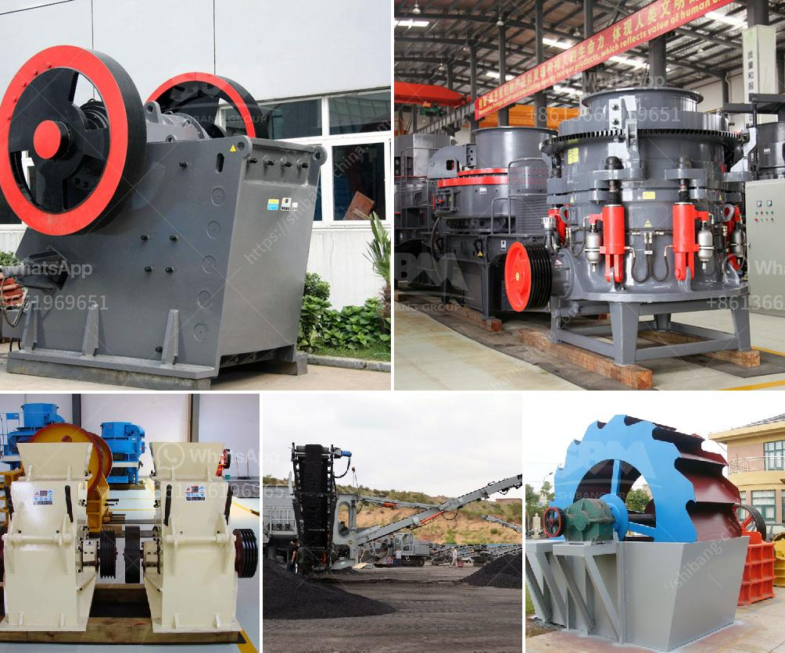

<h3>سعر مصنع كسارة الحجر في ألمانيا</h3>
يُعتبر قطاع استخراج الحجر وتصنيعه أحد القطاعات الرئيسية في ألمانيا، حيث توجد العديد من المصانع والكسارات التي تعمل في هذا المجال. تتفاوت أسعار مصانع كسارة الحجر في ألمانيا بناءً على العوامل المختلفة التي تؤثر في التكلفة الإجمالية للمصنع.

أحد العوامل الرئيسية التي تؤثر في تكلفة المصنع هي حجمه وقدرته الإنتاجية. إذا كان المصنع كبيراً وقادرًا على إنتاج كميات كبيرة من الحجر، فمن المتوقع أن يكون سعره مرتفعًا نسبيًا. وعلى العكس، إذا كان المصنع صغيرًا ومتواضعًا من حيث القدرة الإنتاجية، ستكون تكلفته أقل.

تلعب التكنولوجيا المستخدمة في المصنع دورًا أيضًا في تحديد سعره. فمصانع كسارة الحجر المتطورة التي تستخدم أحدث التقنيات في عملية التصنيع والإنتاج غالبًا ما تكون أكثر تكلفة من المصانع التقليدية التي تستخدم تقنيات أقدم.

تُؤثر تكلفة المواد الخام التي يستخدمها المصنع في سعره أيضًا. فإذا كانت تكلفة الحجر الطبيعي الذي يتم استخراجه من مناجم ألمانيا عالية، فسوف يتحمل المصنع تكلفة أعلى للإنتاج وهذا سيؤثر على سعر المنتج النهائي.

بالإضافة إلى ذلك، يجب أخذ العوامل المتعلقة بالقوانين واللوائح المحلية والدولية في الاعتبار أيضاً. فقد يتطلب المصنع استيفاء متطلبات بيئية محددة أو الامتثال لمعايير الجودة العالية المطلوبة. وهذا يؤثر على تكاليف التشغيل وبالتالي على سعر المنتج النهائي.

وفي النهاية، يجب أن نأخذ في الاعتبار العرض والطلب على الحجر في السوق. إذا كان هناك طلب كبير وعرض محدود، فمن المتوقع أن يرتفع سعر المصنع. والعكس صحيح أيضًا، إذا كان هناك توفر كبير من الحجر وطلب محدود، فمن المرجح أن يكون سعر المصنع منخفضًا.

بشكل عام، يتفاوت سعر مصانع كسارة الحجر في ألمانيا بين 200 إلى 400 ألف يورو تقريبًا. ومع ذلك، يجب أن نتذكر أن هناك العديد من العوامل التي تؤثر في تحديد السعر الدقيق للمصنع، والتي يجب أخذها بعين الاعتبار عند شراء مصنع لكسارة الحجر في ألمانيا.
<h3>Contact us</h3><ul><li><strong>Whatsapp:&nbsp;<a href="https://wa.me/8613661969651">+8613661969651</a></strong></li><li><a href="https://swt.shibang-china.com/?git&amp;zhl&amp;سعر مصنع كسارة الحجر في ألمانيا"><strong>Online Service(chat now)</strong></a></li></ul><h3>Related</h3><ul><li><a href='مطاحن الحجر الجيري المستخدمة في الفلبين.md'>مطاحن الحجر الجيري المستخدمة في الفلبين</a></li><li><a href='حجم الشبكة لمطحنة الكرة.md'>حجم الشبكة لمطحنة الكرة</a></li><li><a href='مصانع الفرز للبيع.md'>مصانع الفرز للبيع</a></li><li><a href='خطة عمل تعدين الجرانيت.md'>خطة عمل تعدين الجرانيت</a></li><li><a href='وزن آلة كسارة الصخور.md'>وزن آلة كسارة الصخور</a></li></ul>