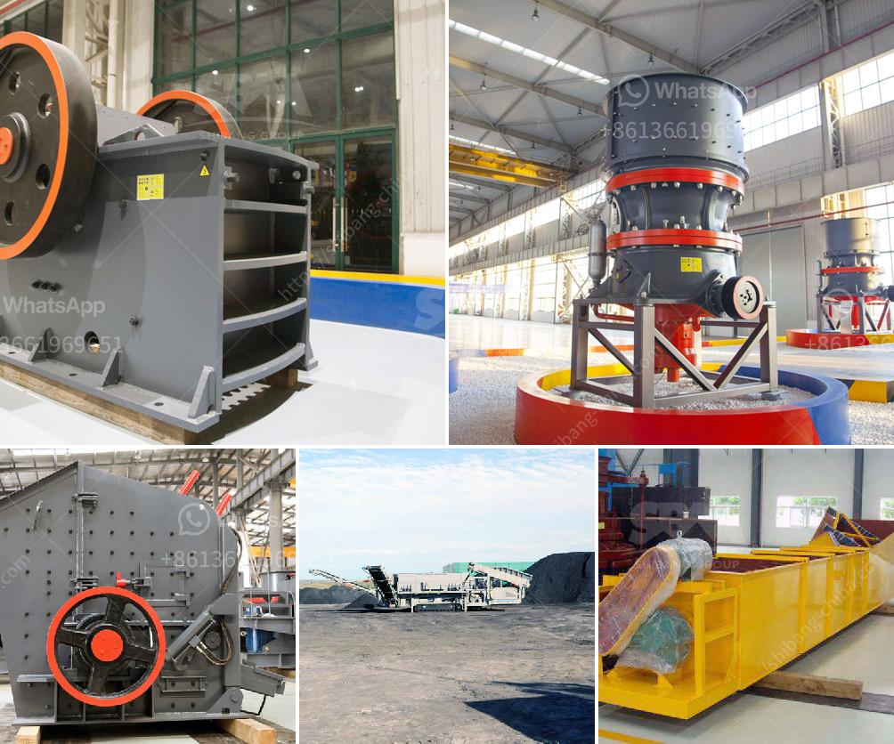

<h3>سعر مصنع كسارة الحجر في الهند</h3>
يعد الحجر أحد الموارد الطبيعية الثمينة التي توجد في العديد من الدول حول العالم بمختلف مقاييسه وأشكاله. تستخدم الحجارة في العديد من الصناعات مثل البناء والطرق والجسور والأثاث وغيرها. وتعتبر كسارة الحجر أحد الأدوات المهمة لتحويل الصخور الكبيرة إلى حصى صغيرة المقاس.

في الهند، تعتبر صناعة الحجر من أهم الصناعات التي توفر فرص عمل كبيرة للكثير من الأفراد، لا سيما في القرى والمناطق النائية. ترتبط فوائد استخدام الحجر المكسر في الهند بقلة تكلفتها مقارنة بالمواد البديلة الأخرى.

يختلف سعر مصنع كسارة الحجر في الهند بناءً على عدة عوامل، من بينها:

1- الحجر المطلوب: حيث يتوجب معرفة نوع الحجر الذي سيتم معالجته وتكسيره. فهناك أنواع مختلفة من الحجر في الهند مثل حجر الجرانيت والرخام والحجر الكلسي وغيرها. يؤثر نوع الحجر المراد تكسيره في تكنولوجيا وآلات المصنع المطلوبة وبالتالي في تكلفته.

2- الطاقة الإنتاجية المتوقعة: تؤثر الطاقة الإنتاجية التي يستهدفها المصنع بشكل كبير على تكلفته. فكلما كان المصنع قادراً على إنتاج كمية كبيرة من الحصى، زادت تكلفته بشكل طبيعي.

3- أحجام الحصى المطلوبة: يتوقف سعر مصنع الكسارة على حجم الحصى المطلوب الحصول عليه. فكلما زاد حجم الحصى، كلما احتاج المصنع إلى معدات وآلات أكثر تقدر تكلفتها باهظة.

4- تكاليف الصيانة والتشغيل: يجب أن يؤخذ في الاعتبار تكلفة الصيانة والتشغيل المستمرة للمصنع، بما في ذلك تكلفة الطاقة والمواد الاستهلاكية والعمالة والصيانة الدورية.

على الرغم من أنه لا يمكننا تحديد سعر مصنع كسارة الحجر في الهند بشكل دقيق، إلا أنه يمكن القول إنه قد يتراوح عادة بين 200-400 دولار. ومع ذلك، يجب أخذ جميع العوامل المذكورة في الاعتبار قبل اتخاذ قرار شراء مصنع كسارة الحجر في الهند.

في النهاية، يعتبر سعر مصنع كسارة الحجر في الهند مهماً للمستثمرين والصناعيين في هذا القطاع. يجب أن يحقق المصنع التوازن المثالي بين السعر والجودة والقدرة الإنتاجية لضمان نجاح العمل والتنافسية في السوق المحلية والعالمية.
<h3>Contact us</h3><ul><li><strong>Whatsapp:&nbsp;<a href="https://wa.me/8613661969651">+8613661969651</a></strong></li><li><a href="https://swt.shibang-china.com/?git&amp;zhl&amp;سعر مصنع كسارة الحجر في الهند"><strong>Online Service(chat now)</strong></a></li></ul><h3>Related</h3><ul><li><a href='كسارة الحجر الجيري المتنقلة.md'>كسارة الحجر الجيري المتنقلة</a></li><li><a href='كسارة خام الحديد في المكسيك.md'>كسارة خام الحديد في المكسيك</a></li><li><a href='عملية الكرة الطحن.md'>عملية الكرة الطحن</a></li><li><a href='سعر آلة طحن الرخام في الهند.md'>سعر آلة طحن الرخام في الهند</a></li><li><a href='آلات مصنع الحصى الكوارتز.md'>آلات مصنع الحصى الكوارتز</a></li></ul>