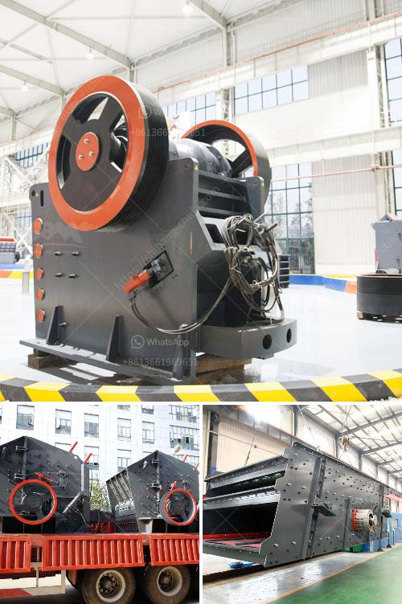

<h3>سعر مصنع كسارة الفك</h3>
مع تطور صناعة التعدين والبناء، أصبحت كسارة الفك واحدة من أهم الأدوات في صناعة التكسير. تعتبر كسارة الفك من الأدوات الحديثة التي يمكن أن تساعد في تحقيق عملية التكسير بطريقة سريعة وفعالة. تتراوح أسعار مصنع كسارة الفك من 200 إلى 400 ألف دولار، وهذا يعتمد على العوامل المختلفة مثل قوة التكسير والمواد المستخدمة في التصنيع.

إحدى العوامل التي تؤثر في سعر مصنع كسارة الفك هي قوة التكسير. فكلما كانت قوة التكسير أعلى، زاد سعر المصنع. تعمل كسارة الفك عند تطبيق قوة ضغط لسحق المواد. وتتوفر الكسارات بعدة قدرات منخفضة ومتوسطة وعالية، حيث يتطلب الحصول على الكسارة ذات القدرة العالية دعمًا تقنيًا وتكنولوجيًا أكثر مما يعني تكلفة إضافية.

وتعدّ المواد المستخدمة في تصنيع مصنع كسارة الفك أيضًا عاملاً رئيسيًا في تحديد السعر. فبعض المصانع مصنوعة من المعادن عالية الجودة والتي توفر المتانة والأداء العالي، وهذه المصانع تكون أكثر تكلفة. ومع ذلك، هناك أنواع أخرى من المصانع المصنوعة من المواد ذات الجودة المنخفضة وبأسعار أقل. يجب ملاحظة أن الجودة المنخفضة قد تؤدي إلى تلف المصنع بسرعة، مما يؤدي إلى تكاليف إصلاح وصيانة إضافية.

إلى جانب ذلك، هناك عوامل أخرى يجب مراعاتها عند شراء مصنع كسارة الفك. من بين هذه العوامل هي التكنولوجيا المستخدمة في المصنع. فتسارع التكنولوجيا في صناعة التعدين والبناء يجعل أحدث التقنيات مرغوبة. وهذا يؤدي إلى ارتفاع الأسعار بسبب التحديثات المتكررة للتقنية.

في الختام، يمكن القول أن سعر مصنع كسارة الفك يختلف حسب العوامل المختلفة التي تؤثر فيه. من المهم توفير الميزانية المناسبة والبحث عن الأجهزة ذات الجودة العالية وفقًا لاحتياجاتك الخاصة. يمكن للمشترين التعامل مع الشركات المصنعة الموثوقة للحصول على المشورة المهنية والمساعدة في اختيار مصنع كسارة الفك المناسب لهم.
<h3>Contact us</h3><ul><li><strong>Whatsapp:&nbsp;<a href="https://wa.me/8613661969651">+8613661969651</a></strong></li><li><a href="https://swt.shibang-china.com/?git&amp;zhl&amp;سعر مصنع كسارة الفك"><strong>Online Service(chat now)</strong></a></li></ul><h3>Related</h3><ul><li><a href='خطة عمل كاملة لمصنع تكسير الحجارة.md'>خطة عمل كاملة لمصنع تكسير الحجارة</a></li><li><a href='مصنعي أحزمة الناقلات في بنجلاديش.md'>مصنعي أحزمة الناقلات في بنجلاديش</a></li><li><a href='معدات طحن الباريت.md'>معدات طحن الباريت</a></li><li><a href='مورد آلة كسارة الفك.md'>مورد آلة كسارة الفك</a></li><li><a href='كسارة حجر إيطالية.md'>كسارة حجر إيطالية</a></li></ul>