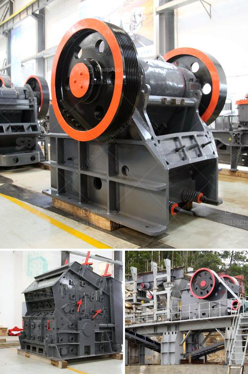

<h3>سعر مصنع كسارة محمولة في الهند</h3>
تعد الهند واحدة من الدول الرائدة في صناعة التعدين والبناء، وتشهد البلاد طلبًا متزايدًا على الكسارات المحمولة. تعتبر الكسارات المحمولة حلاً مثاليًا للشركات والمقاولين الذين يحتاجون إلى تكسير المواد في عدة مواقع مختلفة. فهي تسمح باستغلال الطاقة والموارد بشكل فعال وتوفير التكاليف ووقت النقل.

عند النظر في سعر مصنع كسارة محمولة في الهند، يتأثر السعر بعدة عوامل. أحد هذه العوامل هو الحجم والسعة الإنتاجية للكسارة. كلما زادت السعة الإنتاجية للكسارة، زاد سعرها. عادةً ما تكون الكسارات ذات السعات الكبيرة أكثر تكلفة من الكسارات ذات السعات الصغيرة.

عامل آخر يؤثر في سعر المصنع هو نوع التكنولوجيا المستخدمة في الكسارة. هناك العديد من الشركات المصنعة للمعدات الثقيلة في الهند التي تزود السوق بأنواع مختلفة من الكسارات المحمولة. يمكن أن تختلف التكنولوجيا المستخدمة من شركة لأخرى، وقد تؤثر هذه التقنيات في الأداء والجودة وبالتالي في السعر.

سعر المصنع يمكن أيضًا أن يتأثر بتكاليف التشغيل والصيانة اللاحقة. بعض الشركات توفر خدمات ما بعد البيع وصيانة الكسارة، وهذا يؤثر في تكلفة الكسارة نفسها. قد تحدث بعض المشاكل أو الأعطال خلال استخدام الكسارة، ويجب أن تتوفر خدمات صيانة متاحة لحل هذه المشاكل بأقل تكلفة ممكنة.

قد يتحدد السعر أيضًا من خلال منافسة السوق. زيادة العرض والطلب على الكسارات المحمولة في الهند يمكن أن تؤثر في الأسعار التنافسية بين الشركات المصنعة. قد يكون للشركات القوية زخم أكبر بسبب خبرتها وسمعتها في السوق، مما يعطيها فرصة لتحقيق تكلفة أقل وجذب المزيد من العملاء.

بشكل عام، يمكن أن تتراوح أسعار مصانع الكسارات المحمولة في الهند بين 200 و 400 ألف جنيهًا. ومع ذلك، يجب أن يتم اختيار الكسارة المثلى وفقًا لاحتياجات الشركة أو المقاول. فقد توفر الكسارات المحمولة فوائد متعددة، بما في ذلك توفير التكاليف وزيادة الإنتاجية، ولكن يجب أن تتم دراسة الخيارات المتاحة ومقارنة الأسعار والمواصفات قبل اتخاذ القرار النهائي والاستثمار في مصنع الكسارة المحمولة المناسب.
<h3>Contact us</h3><ul><li><strong>Whatsapp:&nbsp;<a href="https://wa.me/8613661969651">+8613661969651</a></strong></li><li><a href="https://swt.shibang-china.com/?git&amp;zhl&amp;سعر مصنع كسارة محمولة في الهند"><strong>Online Service(chat now)</strong></a></li></ul><h3>Related</h3><ul><li><a href='مطاحن الحجر للبيع في كينيا.md'>مطاحن الحجر للبيع في كينيا</a></li><li><a href='غسالة مواد خام جرايستون مستعملة.md'>غسالة مواد خام جرايستون مستعملة</a></li><li><a href='أرض الجرانيت الأسود للبيع في تاميل نادو.md'>أرض الجرانيت الأسود للبيع في تاميل نادو</a></li><li><a href='مصنعي مطاحن الرايموند في الهند.md'>مصنعي مطاحن الرايموند في الهند</a></li><li><a href='مصنع سحق الحجر في ألمانيا.md'>مصنع سحق الحجر في ألمانيا</a></li></ul>