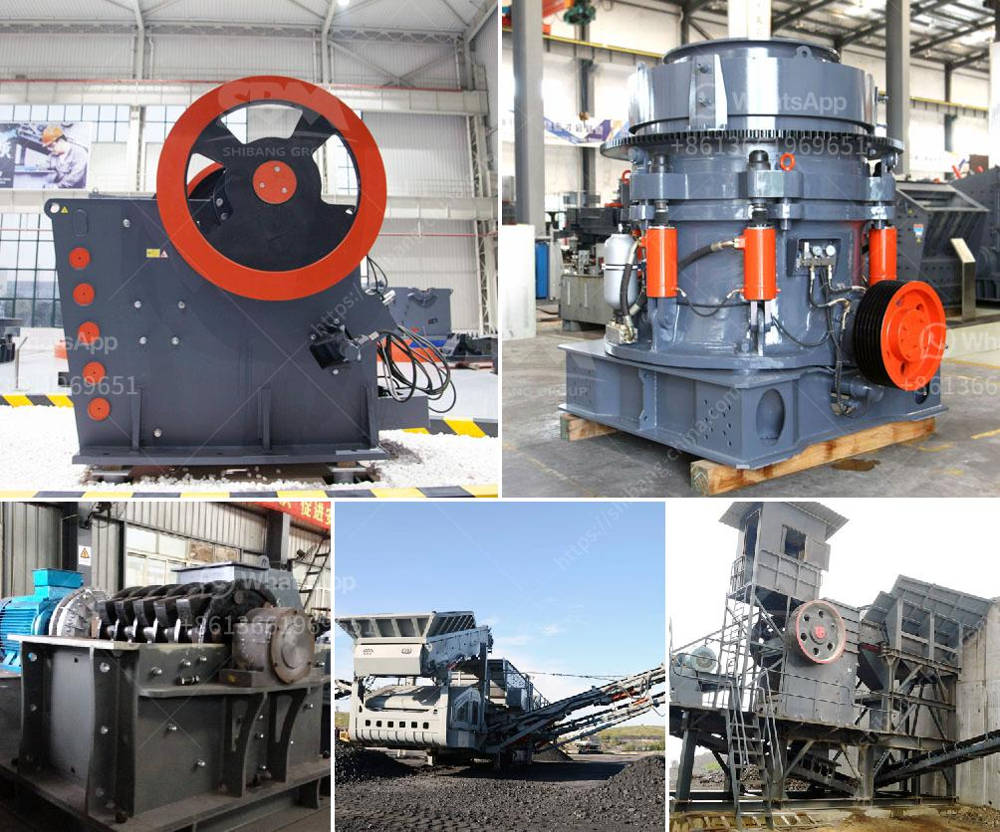

<h3>سعر مصنع كسارة محمولة في نيجيريا</h3>
تعتبر الكسارات المحمولة أحد الأدوات الهامة في صناعة التعدين والبناء، وتستخدم بشكل واسع في نيجيريا وفي أنحاء العالم. وتعتبر نيجيريا واحدة من أكبر الدول المنتجة للفحم في العالم، ولذلك فإن الكسارات المحمولة لديها طلب كبير في هذا البلد.

تعتمد تكلفة مصنع الكسارة المحمولة في نيجيريا على عدة عوامل، بما في ذلك الحجم والطاقة الإنتاجية والماركة والتكنولوجيا المستخدمة في الجهاز. قد يتراوح سعر مصنع الكسارة المحمولة في نيجيريا من 200 إلى 400 ألف نيرة نيجيرية، وهو ما يعادل تقريباً 500 إلى 1000 دولار أمريكي.

تعتبر الكسارات المحمولة في نيجيريا مفضلة لدى العديد من المستخدمين بسبب مرونتها وقدرتها على تحويل المواد الخام إلى منتجات نهائية مفيدة في موقع البناء أو محجر التعدين. كما أنها توفر الوقت والعمل المتعب الذي يحتاجه نقل المواد من مكان لآخر. بالإضافة إلى ذلك، فإن استخدام الكسارات المحمولة يمكن أن يساعد في زيادة الإنتاجية وتقليل التكاليف وتحسين البيئة.

على الرغم من الفوائد المذكورة، فإن هناك بعض التحديات التي يمكن أن تواجهها عند شراء مصنع الكسارة المحمولة في نيجيريا. يجب أن يتم اختيار المورد الذي يستوفي المعايير العالمية فيما يتعلق بالجودة والأداء. بالإضافة إلى ذلك، قد يكون هناك تكاليف إضافية مثل الصيانة وتوريد قطع الغيار وتكاليف الشحن.

في الختام، تعتبر الكسارات المحمولة أداة مهمة في صناعة التعدين والبناء في نيجيريا. يمكن العثور على مصانع الكسارة المحمولة بأسعار متفاوتة في السوق النيجيرية، ولذلك ينبغي على المشتري أن يقارن بين الموردين والموديلات والمواصفات قبل اتخاذ قرار الشراء. كما يجب أن يضع المشتري في اعتباره التكاليف المرتبطة بصيانة وتشغيل المصنع على المدى الطويل، بالإضافة إلى احتياجاته المحددة من الكسارة المحمولة.
<h3>Contact us</h3><ul><li><strong>Whatsapp:&nbsp;<a href="https://wa.me/8613661969651">+8613661969651</a></strong></li><li><a href="https://swt.shibang-china.com/?git&amp;zhl&amp;سعر مصنع كسارة محمولة في نيجيريا"><strong>Online Service(chat now)</strong></a></li></ul><h3>Related</h3><ul><li><a href='كيفية إعداد خطة عمل لمصنع الكسارات.md'>كيفية إعداد خطة عمل لمصنع الكسارات</a></li><li><a href='مصنع غسيل الرمال بسعة 50 طن في اليوم.md'>مصنع غسيل الرمال بسعة 50 طن في اليوم</a></li><li><a href='آلة تعدين الرمال التقليدية في ماليزيا.md'>آلة تعدين الرمال التقليدية في ماليزيا</a></li><li><a href='كسارة حجر مستعملة للبيع في أوروبا.md'>كسارة حجر مستعملة للبيع في أوروبا</a></li><li><a href='أفكار مشروع مصفاة النحاس صغيرة المقياس.md'>أفكار مشروع مصفاة النحاس صغيرة المقياس</a></li></ul>