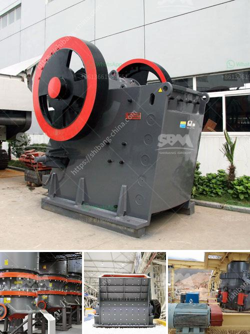

<h3>سعر مصنع معالجة الحجر الجيري</h3>
تعتبر صناعة معالجة الحجر الجيري أحد القطاعات الحيوية في الاقتصاد العالمي، حيث يُستخدم الحجر الجيري في العديد من الصناعات مثل البناء والطلاء والزجاج والأسمدة. يتم استخراج الحجر الجيري من المحاجر ثم يتم معالجته ليتناسب مع احتياجات الصناعات المختلفة، وذلك من خلال مصانع معالجة الحجر الجيري.

عند البحث عن مصنع لمعالجة الحجر الجيري، يعتبر سعره من العوامل الرئيسية المؤثرة في اتخاذ القرار. يتأثر سعر مصنع معالجة الحجر الجيري بعدة عوامل مختلفة، منها:

- الموقع الجغرافي: يؤثر الموقع الجغرافي للمصنع على تكلفة النقل والشحن، فإذا كان المصنع قريبًا من مناطق استخدام الحجر الجيري، فإن تكاليف النقل ستكون أقل، وبالتالي سيكون السعر أقل.

- الطاقة الكهربائية: تعتبر تكاليف الطاقة الكهربائية من العناصر الأساسية في مصانع معالجة الحجر الجيري. إذ تحتاج هذه المصانع إلى كميات كبيرة من الكهرباء لتشغيل المعدات والآلات. وبالتالي، إذا كان سعر الكهرباء منخفضًا في المنطقة التي يقع فيها المصنع، فإن ذلك سينعكس إيجابيًا على سعر المنتج النهائي.

- التكنولوجيا المستخدمة: يؤثر استخدام التكنولوجيا الحديثة في مصنع معالجة الحجر الجيري على سعر المنتج النهائي. فإذا كان المصنع مجهزًا بأحدث المعدات والآلات التي تساعد على تحسين عملية التصنيع وزيادة الإنتاجية، فإن ذلك يُعد ميزة تستحق الدفع.

- حجم الإنتاج: يتحدد سعر مصنع معالجة الحجر الجيري أيضًا بناءً على حجم الإنتاج الشهري أو السنوي المتوقع. ففي حالة كانت مصانع معالجة الحجر الجيري تنتج بكميات كبيرة، فقد يتواجد تفاوت في الأسعار بين المصانع وذلك بسبب فرصة الاقتصادات من حجم الإنتاج.

يختلف سعر مصنع معالجة الحجر الجيري باختلاف العوامل المذكورة أعلاه وغيرها من العوامل. ومع ذلك، يمكن تقدير سعر مصنع معالجة الحجر الجيري بين 200 إلى 400 دولار أمريكي للطن. ويراعى في هذا التقدير المتغيرات المختلفة المشار إليها سابقًا، مع الأخذ في الاعتبار أن هذا التقدير قد يتفاوت من مصنع لآخر ومن سوق لآخر بناءً على الظروف الاقتصادية والتشريعات المحلية واحتياجات السوق.

باختصار، سعر مصنع معالجة الحجر الجيري يتأثر بالعوامل المتعددة كالموقع الجغرافي وتكاليف الطاقة والتكنولوجيا المستخدمة وحجم الإنتاج. وبناءً على تلك العوامل، يُمكن تقدير سعر المصنع بين 200 إلى 400 دولار أمريكي للطن.
<h3>Contact us</h3><ul><li><strong>Whatsapp:&nbsp;<a href="https://wa.me/8613661969651">+8613661969651</a></strong></li><li><a href="https://swt.shibang-china.com/?git&amp;zhl&amp;سعر مصنع معالجة الحجر الجيري"><strong>Online Service(chat now)</strong></a></li></ul><h3>Related</h3><ul><li><a href='شركة مبيعات كسارة الحجر في كينيا.md'>شركة مبيعات كسارة الحجر في كينيا</a></li><li><a href='كسارة الكرةست في كينيا صنعت في الصين.md'>كسارة الكرةست في كينيا صنعت في الصين</a></li><li><a href='آلات إنتاج الرمل سحق الطحن والفرز.md'>آلات إنتاج الرمل سحق الطحن والفرز</a></li><li><a href='معدات فحص الكسارات.md'>معدات فحص الكسارات</a></li><li><a href='جهاز كسر الصخور في جنوب أفريقيا.md'>جهاز كسر الصخور في جنوب أفريقيا</a></li></ul>