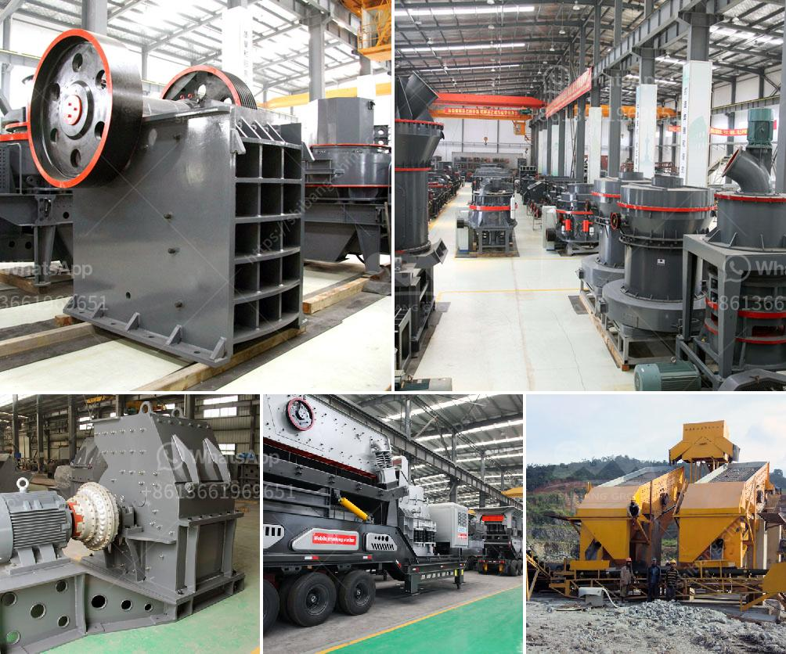

<h3>سعر مطاحن الكرة</h3>
تعتبر مطاحن الكرة أحد أنواع المعدات الهامة في صناعة الطحن والتي تستخدم لطحن الخامات والمواد الصلبة المختلفة. تتكون مطاحن الكرة من جسم أسطواني يحتوي على كرات من الصلب في الداخل، وعندما يتم تشغيل المطحنة يتم تحريك الكرات داخل الجسم الأسطواني بسبب قوة الاحتكاك والجاذبية، وهذا يؤدي إلى طحن وسحق المواد الصلبة وتفتيتها إلى جسيمات أصغر.

تختلف أسعار مطاحن الكرة اختلافًا كبيرًا بناءً على عدة عوامل، مثل الحجم والقدرة والجودة والماركة والمواصفات والتقنيات المستخدمة في الصناعة. قد يتراوح سعر مطاحن الكرة من 200 إلى 400 دولار في بعض الحالات.

في المطاحن ذات الأسعار المنخفضة التي تتراوح بين 200-300 دولار، قد يكون الجسم غير مصنوع بجودة عالية ومن المواد الرديئة، كما أن القدرة قد تكون محدودة ولا تلبي متطلبات الإنتاج الكبير. ومع ذلك، فإن هذه المطاحن الاقتصادية قد تكون مناسبة للاستخدام المنزلي أو الصغير لبعض الصناعات ذات الإنتاج المحدود.

من ناحية أخرى، تعتبر المطاحن التي تتراوح أسعارها بين 300-400 دولار أكثر جودة واحترافية. ففي هذا النطاق الأعلى من الأسعار، قد تكون المطاحن مصنوعة من مواد عالية الجودة وتحتوي على تقنيات أكثر تطورًا، مما يجعلها أكثر قدرة وكفاءة في العمل. هذه المطاحن غالبًا ما تُستخدم في الصناعات الكبيرة والمصانع التجارية التي تحتاج إلى قدرة إنتاج أكبر وجودة متميزة.

يجب ملاحظة أن الأسعار المذكورة هي قابلة للتغيير وقد تختلف بناءً على السوق والعروض والطلب. ينصح بإجراء البحث والاستشارة من الشركات والموردين المختلفين للحصول على الأسعار الأكثر تحديدًا قبل الشراء.

وبشكل عام، يجب على المستهلكين أخذ جميع العوامل المذكورة في الاعتبار قبل اتخاذ قرار الشراء. فإذا كان الهدف هو استخدام المطحنة على نطاق صغير، فيمكن الحصول على مطحنة بأسعار تناسب ميزانية الشخص. ولكن إذا كان التطبيق يتطلب استخدام مطحنة ذات قدرة عالية وجودة ممتازة، فقد يكون هناك حاجة إلى الاستثمار في مطاحن الكرة ذات الأسعار الأعلى لضمان الأداء والكفاءة المطلوبة.
<h3>Contact us</h3><ul><li><strong>Whatsapp:&nbsp;<a href="https://wa.me/8613661969651">+8613661969651</a></strong></li><li><a href="https://swt.shibang-china.com/?git&amp;zhl&amp;سعر مطاحن الكرة"><strong>Online Service(chat now)</strong></a></li></ul><h3>Related</h3><ul><li><a href='كسارة مستعملة للبيع في تنزانيا.md'>كسارة مستعملة للبيع في تنزانيا</a></li><li><a href='مورد كسارة النحاس.md'>مورد كسارة النحاس</a></li><li><a href='الجيوكيمياء التطبيقية لمعالجة اللميكا.md'>الجيوكيمياء التطبيقية لمعالجة اللميكا</a></li><li><a href='سحق الجرانيت إلى مسحوق.md'>سحق الجرانيت إلى مسحوق</a></li><li><a href='خط إنتاج الحجر الجيري.md'>خط إنتاج الحجر الجيري</a></li></ul>