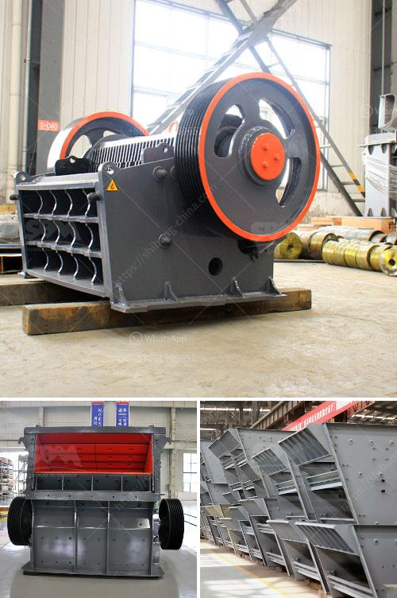

<h3>سعر مطحنة أبولو في الهند</h3>
تعتبر مطحنة أبولو في الهند واحدة من أحدث التكنولوجيات في صناعة الأرز. يتم استخدام هذا الجهاز الفعال والمبتكر لطحن وتجهيز الأرز بكفاءة عالية وبأسعار مناسبة. واحدة من أسباب شهرتها الكبيرة هي سعرها المعقول والذي يتراوح بين 200 و 400 دولار، مما يجعلها ميسرة التكلفة للعديد من الفلاحين وأصحاب المطاحن في الهند.

تتميز مطحنة أبولو بعدة ميزات تجعلها اختيارًا مثاليًا لعملية طحن الأرز. فهي مصممة لتكون سهلة الاستخدام والتشغيل، حيث يمكن للمستخدمين تشغيلها وضبطها بسهولة لتلبية احتياجاتهم الخاصة. بالإضافة إلى ذلك، يعد أداء مطحنة أبولو فائقًا حيث تقوم بطحن الحبوب بسرعة وكفاءة عالية، مما يساعد في توفير الوقت والجهد للمستخدمين.

تتوفر مجموعة واسعة من النماذج والأحجام لمطحنة أبولو في الهند، مما يتيح للعملاء اختيار الجهاز الأكثر مناسبة لهم وفقًا لاحتياجاتهم الخاصة. وبفضل توفر هذه التشكيلة الواسعة من النماذج، فإن إمكانية العثور على مطحنة ذات سعر معقول ضمن النطاق المحدد تعد واقعة. بالإضافة إلى ذلك، يضمن السعر المعقول لمطحنة أبولو في الهند الوصول إلى المنتج لفئات واسعة من العملاء الذين يبحثون عن عملية طحن الأرز الميسورة التكلفة.

تعتبر مطحنة أبولو في الهند اختيارًا مثاليًا للمزارعين الصغار وأصحاب المطاحن الصغيرة. تساعد هذه المطحنة الفعالة في تقديم حلول مثالية لطحن الأرز بكفاءة عالية وإنتاجية ممتازة، مما يساعد المزارعين وأصحاب المطاحن على زيادة إنتاجيتهم وربحيتهم بشكل كبير.

باختصار، يمثل سعر مطحنة أبولو في الهند الذي يتراوح بين 200 و 400 دولار فرصة مهمة للمزارعين وأصحاب المطاحن للاستفادة من أحدث التكنولوجيا في صناعة الأرز بتكلفة معقولة. بفضل سهولة الاستخدام والأداء العالي لمطحنة أبولو، فإنها تساعد على تحسين جودة وكفاءة عملية طحن الأرز، مما يعزز الانتاجية والربحية للفلاحين وأصحاب المطاحن في الهند.
<h3>Contact us</h3><ul><li><strong>Whatsapp:&nbsp;<a href="https://wa.me/8613661969651">+8613661969651</a></strong></li><li><a href="https://swt.shibang-china.com/?git&amp;zhl&amp;سعر مطحنة أبولو في الهند"><strong>Online Service(chat now)</strong></a></li></ul><h3>Related</h3><ul><li><a href='تاجر كسارة الحجر في الصين.md'>تاجر كسارة الحجر في الصين</a></li><li><a href='شاشة تهتز الفحم المصنعين في جنوب أفريقيا.md'>شاشة تهتز الفحم المصنعين في جنوب أفريقيا</a></li><li><a href='مصنع معالجة رمل السيليكا.md'>مصنع معالجة رمل السيليكا</a></li><li><a href='جر المحمول في.md'>جر المحمول في</a></li><li><a href='مطحنة للحجر الجيري في إيطاليا.md'>مطحنة للحجر الجيري في إيطاليا</a></li></ul>