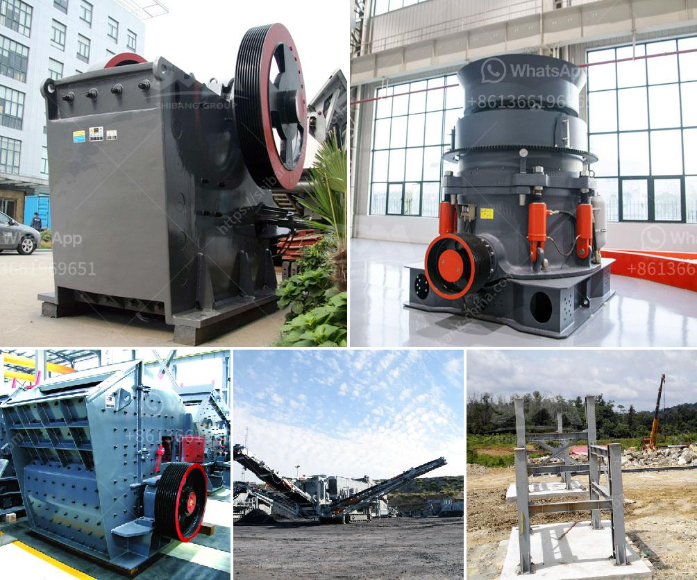

<h3>سعر مطحنة الحجر في المغرب</h3>
تعتبر مطحنة الحجر واحدة من الأدوات التقليدية التي تستخدم في المغرب لطحن الحبوب والبهارات. إنها تعتبر جزءًا جوهريًا من التراث المغربي وتستخدم بشكل واسع في المنازل والأسواق المحلية.

يتفاوت سعر مطحنة الحجر في المغرب وفقًا للحجم والجودة والعلامة التجارية. في المتوسط، يتراوح السعر من 200 درهم إلى 400 درهم. ومع ذلك، يجب أن نلاحظ أن الأسعار قد تختلف في المدن الكبرى مثل الدار البيضاء والرباط وفاس. قد يكون هناك طفرة في الأسعار في هذه المناطق.

تختلف جودة مطحنة الحجر وفقًا للمواد المستخدمة في صنعها. يفضل العديد من الناس شراء المطحنة التي تتكون من حجر طبيعي عالي الجودة لضمان الأداء الجيد والتحمل. التجار المحليون يوفرون مجموعة متنوعة من العلامات التجارية ، كل منها يحمل سمات فريدة. ومع ذلك ، قد يتصاعد سعر المطحنة مع شهرتها وانتشارها في السوق.

العديد من الأسر المغربية تعتبر مطحنة الحجر أحد الاستثمارات التي تستدام على المدى الطويل. بدلاً من شراء الدقيق والبهارات المطحونة جاهزة من المتاجر، يعتمد العديد من الأشخاص على طحن الحبوب والبهارات في المنزل باستخدام مطحنة الحجر. هذا يسمح لهم بالاستمتاع بجودة أفضل وطعم طازج ويوفر المال على المدى الطويل.

بشكل عام، يمكن القول أن سعر مطحنة الحجر في المغرب معقول ومتاح لمعظم الأسر. إنها استثمارة مفيدة لتلبية احتياجات المطبخ ومساعدة الأسر في تحقيق توفير مالي والاستمتاع بالطعام الصحي والذيذ. بالإضافة إلى ذلك، تعتبر مطحنة الحجر أيضاً رمزًا للتراث المغربي الغني والثقافة الغذائية التقليدية التي تحافظ عليها الأجيال القادمة.
<h3>Contact us</h3><ul><li><strong>Whatsapp:&nbsp;<a href="https://wa.me/8613661969651">+8613661969651</a></strong></li><li><a href="https://swt.shibang-china.com/?git&amp;zhl&amp;سعر مطحنة الحجر في المغرب"><strong>Online Service(chat now)</strong></a></li></ul><h3>Related</h3><ul><li><a href='تحجيم مطاحن الكرة.md'>تحجيم مطاحن الكرة</a></li><li><a href='قائمة أسعار كسارة الحجر بسعة 300 طن في الساعة.md'>قائمة أسعار كسارة الحجر بسعة 300 طن في الساعة</a></li><li><a href='صناعة سحق الركام في تنزانيا.md'>صناعة سحق الركام في تنزانيا</a></li><li><a href='آلة كسارة الذهب للبيع في جنوب أفريقيا.md'>آلة كسارة الذهب للبيع في جنوب أفريقيا</a></li><li><a href='كسارات تأثير للبيع في الولايات المتحدة.md'>كسارات تأثير للبيع في الولايات المتحدة</a></li></ul>