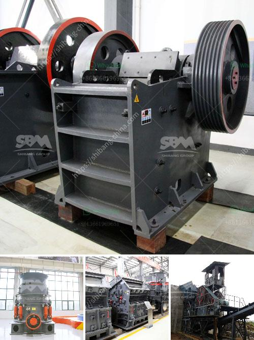

<h3>سعر مطحنة الكرات بمقدار 25 طن في الساعة</h3>
تعتبر مطحنة الكرات واحدة من الآلات الرئيسية المستخدمة في عمليات طحن المواد الصلبة. تستخدم هذه المطاحن عادة في صناعات مثل صناعة الأسمنت وصناعة التعدين وصناعة الكيماويات. وتعمل بواسطة وضع المواد الصلبة في جوف الأسطوانة المحورية وتكسيرها بواسطة الكرات المعدنية الموجودة داخلها. سعر مطحنة الكرات بمقدار 25 طن في الساعة يعتمد على عدة عوامل.

أحد العوامل المؤثرة في سعر مطحنة الكرات هو حجمها وقوتها. مواصفات مطحنة الكرات بمقدار 25 طن في الساعة تشمل أحجام الأسطوانة وعدد الكرات المستخدمة وقوة المحرك. هذه العوامل تؤثر على قدرة المطحنة على طحن الأمثلة الصلبة داخل الأسطوانة بشكل فعال. بالطبع، كلما زادت مواصفات المطحنة، زاد سعرها.

عوامل أخرى تؤثر على سعر مطحنة الكرات هي تكلفة المواد الخام وتكلفة العمالة وتكلفة الصيانة. تعتمد التكلفة الإجمالية للمطحنة أيضًا على سعر المناطق البئرية التي تحتاج إلى إعدادها لتركيب المطحنة وتزويدها بالكهرباء والمياه. معظم المطاحن الكبيرة تحتاج إلى بنية تحتية قوية وتجهيزات خاصة لتلبية متطلباتها. وبالتالي، كلما زادت التكاليف الإجمالية، زاد سعر المطحنة.

بشكل عام، يتناقص سعر المطحنة عندما يتم طلبها بكمية أكبر. قد يكون لديك أفضل قدرة على التفاوض على سعر مطحنة الكرات إذا كنت تطلب 25 طن في الساعة بدلاً من كمية أقل. ومع ذلك، يجب مراعاة أن الشحن والتركيب والصيانة قد يزيد من التكاليف الإجمالية للمشروع.

بصورة عامة، تتراوح سعر مطحنة الكرات بمقدار 25 طن في الساعة من حوالي [200,000-500,000] دولار أمريكي. يتعين على المشتري أن يقرر الاستثمار المناسب له ويأخذ في الاعتبار جودة المنتج النهائي والاحتياجات المحددة للعملية التي يستخدمها.

في النهاية، سعر مطحنة الكرات بمقدار 25 طن في الساعة يعتمد على عدة عوامل مثل المواصفات وتكلفة المواد الخام والعمل والصيانة. لذا، يجب على المشتري أن يقوم بدراسة جيدة لاحتياجاته والبحث عن الموردين الموثوق بهم للحصول على أفضل عرض ممكن.
<h3>Contact us</h3><ul><li><strong>Whatsapp:&nbsp;<a href="https://wa.me/8613661969651">+8613661969651</a></strong></li><li><a href="https://swt.shibang-china.com/?git&amp;zhl&amp;سعر مطحنة الكرات بمقدار 25 طن في الساعة"><strong>Online Service(chat now)</strong></a></li></ul><h3>Related</h3><ul><li><a href='بائعي آلة المحجر المحمولة في نيجيريا.md'>بائعي آلة المحجر المحمولة في نيجيريا</a></li><li><a href='سعة مطحنة الكرة بالأطنان.md'>سعة مطحنة الكرة بالأطنان</a></li><li><a href='مخططات تدفق لتصنيع الحديد الزهر.md'>مخططات تدفق لتصنيع الحديد الزهر</a></li><li><a href='مقترح مشروع أعمال لكسارة الحجر.md'>مقترح مشروع أعمال لكسارة الحجر</a></li><li><a href='معدات كسارة الفك للبيع في الفلبين.md'>معدات كسارة الفك للبيع في الفلبين</a></li></ul>