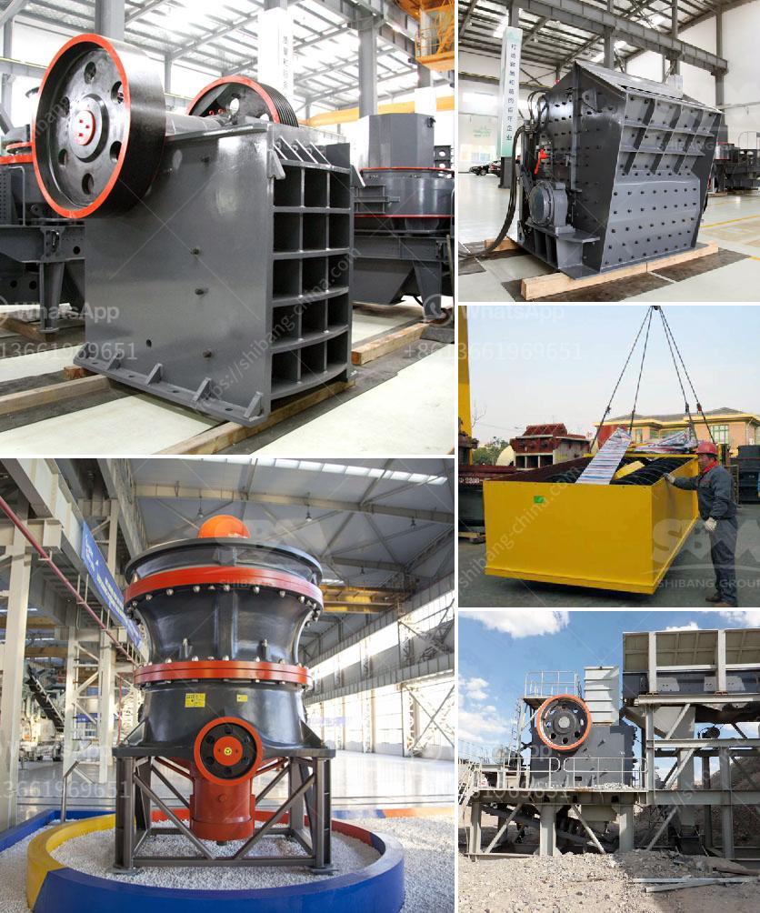

<h3>سعر مطحنة الكرات</h3>
تعتبر مطحنة الكرات واحدة من أهم الأدوات المستخدمة في صناعة التعدين وتكسير المواد. فهي تستخدم لطحن المواد الصلبة وتخفيض حجمها إلى جسيمات أصغر. وتعد سعر مطحنة الكرات أحد العوامل المؤثرة في اختيار العملاء لشراءها.

تتفاوت أسعار مطاحن الكرات بناءً على العديد من العوامل مثل:

1. الحجم والسعة: تتوفر مطاحن الكرات بأحجام وسعات مختلفة، حيث تزداد التكلفة مع زيادة السعة والحجم. يحدد العميل حجم وسعة المطحنة استنادًا إلى حجم المواد التي يود طحنها وكمية الإنتاج المطلوبة.

2. المواد الأولية: تستخدم مطاحن الكرات في طحن مجموعة متنوعة من المواد الصلبة مثل الخامات المعدنية والأسمنت والحبوب والكيماويات والمواد الغذائية. بعض المواد الأولية تتطلب مطاحن عالية الدقة ومقاومة للتآكل، وهذا يؤثر على سعرها.

3. العلامة التجارية والجودة: هناك العديد من الشركات المصنعة لمطاحن الكرات في السوق، وتختلف العلامات التجارية في الجودة والأداء. يمكن أن تكون المطاحن ذات العلامات التجارية الرائدة أغلى من غيرها، ولكنها توفر عادة جودة أعلى ومدة حياة أطول.

4. التكنولوجيا والابتكار: تختلف مطاحن الكرات في التقنيات والابتكارات التي تستخدمها. مطاحن الكرات الحديثة قد تحتوي على تقنيات متقدمة مثل التحكم الآلي وتقنيات الطحن الحادة. هذا قد يؤثر على سعر المطحنة.

بشكل عام، يتراوح سعر مطحنة الكرات بين 200 إلى 400 دولارًا وفقًا للحجم والسعة والمواد الأولية والعلامة التجارية والتكنولوجيا المستخدمة. من الضروري أن يقوم العميل بالبحث والتحقق من معلومات المطحنة قبل الشراء للتأكد من اختيار المطحنة المناسبة لاحتياجاته وميزانيته.

في الختام، يمكن القول إن سعر مطحنة الكرات يتأثر بعدة عوامل وعليه فإن العميل يجب أن ينظر إلى المعايير المناسبة ويقوم بمقارنة الموديلات المختلفة قبل اتخاذ قرار الشراء.
<h3>Contact us</h3><ul><li><strong>Whatsapp:&nbsp;<a href="https://wa.me/8613661969651">+8613661969651</a></strong></li><li><a href="https://swt.shibang-china.com/?git&amp;zhl&amp;سعر مطحنة الكرات"><strong>Online Service(chat now)</strong></a></li></ul><h3>Related</h3><ul><li><a href='مصنع الجبس في باكستان.md'>مصنع الجبس في باكستان</a></li><li><a href='خط إنتاج التلك.md'>خط إنتاج التلك</a></li><li><a href='معلمات كسارة 250 طن في الساعة.md'>معلمات كسارة 250 طن في الساعة</a></li><li><a href='مصنع مطحنة الكرة في باكستان.md'>مصنع مطحنة الكرة في باكستان</a></li><li><a href='شاشة اهتزاز الحصى.md'>شاشة اهتزاز الحصى</a></li></ul>