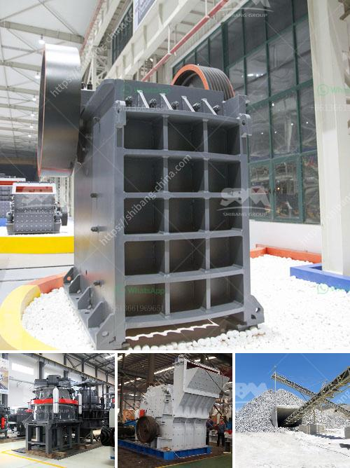

<h3>سعر مطحنة الكرة في باكستان</h3>
تعد مطحنة الكرة أحد الأجهزة الهندسية التي تستخدم لطحن المواد الخام وتحويلها إلى مسحوق ناعم. يتم استخدامه في صناعات مثل التعدين والبناء ومعالجة المعادن. في باكستان، تتراوح أسعار مطاحن الكرة بين 200 و400 دولار.

يعتمد سعر مطحنة الكرة على العديد من العوامل مثل الحجم والقدرة والجودة. قد يكون لدى بعض الشركات مطاحن صناعية كبيرة تستخدم في عمليات التصنيع الضخمة وتتوفر بأسعار أعلى نظرًا للمواصفات الأعلى والقدرات الأكبر. على الجانب الآخر، يمكن العثور على مطاحن الكرة الصغيرة بأسعار أقل وتستخدم بشكل أكثر شيوعًا في الورش والحرف اليدوية الصغيرة.

تتراوح الأسعار في الفئة من 200 إلى 400 دولار، حيث تكون الأجهزة ذات الجودة العالية والقدرات الكبيرة في النطاق الأعلى من المدى. هذه المطاحن الكبيرة قادرة على معالجة كميات كبيرة من المواد الخام وتحقيق طحن فعال وسريع. تتوفر أيضًا مطاحن الكرة ذات القدرات الأصغر بأسعار أقل، والتي تصلح للاستخدام في المشاريع الصغيرة والتطبيقات المنزلية.

يجب أن يتم اختيار مطحنة الكرة بناءًا على احتياجات المشتري ومتطلباته. يتعين على الشخص التأكد من أن الجهاز يتوافق مع المواد التي يرغب في طحنها وأنه يحتوي على الميزات والمواصفات المطلوبة. قد يكون من الضروري الاطلاع على مستوى أداء الجهاز وعمر البطارية الافتراضية وسرعة الطحن.

من المهم الإشارة إلى أن السعر ليس هو العامل الوحيد الذي يجب أخذه في الاعتبار عند شراء مطحنة الكرة. يجب أن تكون الجودة والأداء والمتانة أيضًا عوامل رئيسية في الاختيار. الجودة العالية تضمن تشغيل فعال وعمرًا طويلًا للجهاز، بينما الأداء الجيد يؤدي إلى طحن ناعم وتصنيع منتج نهائي ذو جودة عالية.

باختصار، فإن سعر مطحنة الكرة في باكستان في النطاق من 200 إلى 400 دولار يعتمد على الحجم والقدرة والجودة والمواصفات. يجب على المشتري الاهتمام بإيجاد التوازن المثالي بين الأسعار والجودة والأداء للحصول على المطحنة التي تلبي احتياجاته وتوقعاته.
<h3>Contact us</h3><ul><li><strong>Whatsapp:&nbsp;<a href="https://wa.me/8613661969651">+8613661969651</a></strong></li><li><a href="https://swt.shibang-china.com/?git&amp;zhl&amp;سعر مطحنة الكرة في باكستان"><strong>Online Service(chat now)</strong></a></li></ul><h3>Related</h3><ul><li><a href='طاحونة الكرة 800 طن يومياً.md'>طاحونة الكرة 800 طن يومياً</a></li><li><a href='قائمة معدات تعدين الذهب.md'>قائمة معدات تعدين الذهب</a></li><li><a href='آلات تصنيع كتل الجبس في إيطاليا.md'>آلات تصنيع كتل الجبس في إيطاليا</a></li><li><a href='محطة كسارة نيجيريا.md'>محطة كسارة نيجيريا</a></li><li><a href='كيفية بدء مشروع كسارة الحجر.md'>كيفية بدء مشروع كسارة الحجر</a></li></ul>