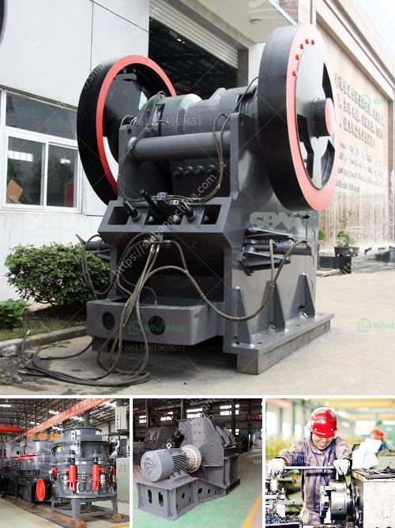

<h3>سعر مطحنة الكرة في نيجيريا</h3>
تعتبر مطحنة الكرة واحدة من أهم الآلات المستخدمة في عملية الطحن في صناعة التعدين. وتعتبر نيجيريا واحدة من الدول الرئيسية في إنتاج النفط والغاز الطبيعي في إفريقيا، ولديها أيضًا موارد تعدين غنية مثل الفحم والطين والحجر الجيري والجبس.

سعر مطحنة الكرة في نيجيريا يمكن أن يتراوح بين 200 إلى 400 دولار، ويعتمد هذا السعر على العديد من العوامل مثل الحجم الخارجي للمطحنة وقدرتها الانتاجية ونوع المواد المستخدمة في صناعتها والشركة المصنعة.

عند شراء مطحنة الكرة في نيجيريا، يجب أن تنظر في عدة عوامل قبل اتخاذ القرار النهائي. أولاً، يجب أن تحدد احتياجاتك الخاصة من حيث قدرة الإنتاج والدقة المطلوبة ونوعية المواد التي ستتم طحنها. ثم، يجب أن تبحث عن شركة مصنعة موثوقة وذات سمعة جيدة تقدم مطاحن ذات جودة عالية بسعر معقول.

من بين الشركات المصنعة الشهيرة والرائدة في صناعة مطاحن الكرة التي تتوفر في نيجيريا هي شركة Dangote Group. وهي شركة نيجيرية متعددة الجنسيات تعمل في مجالات مختلفة مثل التصنيع والبناء والتعدين والنفط والغاز. وتوفر Dangote Group مجموعة متنوعة من المطاحن التي تتناسب مع احتياجات مختلفة من حيث السعة والمواصفات التقنية.

علاوة على ذلك، يمكن شراء مطاحن الكرة في نيجيريا من خلال الشركات المتخصصة في استيراد وتوزيع المعدات والآلات الصناعية. مثل هذه الشركات تعمل على توفير مجموعة واسعة من المنتجات من مختلف الشركات المصنعة العالمية.

عند النظر في سعر مطحنة الكرة في نيجيريا، يجب أن تتذكر أن أي حساب للتكاليف يجب أن يتضمن أيضًا تكاليف الشحن والتوريد والتركيب والصيانة. كما يجب أن تعتبر تكاليف الاستثمار الإضافية المتعلقة بمصدر الطاقة والتشغيل.

تختلف أسعار مطاحن الكرة في نيجيريا بناءً على العديد من العوامل المذكورة أعلاه، وبالتالي من المهم أن تقوم بالبحث والمقارنة بين العروض المتاحة قبل اتخاذ القرار النهائي. يجب أن تتعاون مع مستشاري صناعة المعدات والآلات الصناعية المحليين للحصول على المشورة والمساعدة في اختيار المطحنة المناسبة التي تلبي احتياجاتك وميزانيتك.

باختصار، فإن سعر مطحنة الكرة في نيجيريا يتراوح بين 200 إلى 400 دولار، ويعتمد على العديد من العوامل مثل الحجم والقدرة الانتاجية والمواد المستخدمة. يجب أن تقوم بالبحث والمقارنة والتعاون مع مستشاري الصناعة للحصول على أفضل صفقة تناسب احتياجاتك وميزانيتك.
<h3>Contact us</h3><ul><li><strong>Whatsapp:&nbsp;<a href="https://wa.me/8613661969651">+8613661969651</a></strong></li><li><a href="https://swt.shibang-china.com/?git&amp;zhl&amp;سعر مطحنة الكرة في نيجيريا"><strong>Online Service(chat now)</strong></a></li></ul><h3>Related</h3><ul><li><a href='طحن مطحنة الاسمنت.md'>طحن مطحنة الاسمنت</a></li><li><a href='استخدام كسارة الفك المتنقلة.md'>استخدام كسارة الفك المتنقلة</a></li><li><a href='مصنع كسارة المطرقة.md'>مصنع كسارة المطرقة</a></li><li><a href='أسعار آلات تكسير الحجر في زيمبابوي.md'>أسعار آلات تكسير الحجر في زيمبابوي</a></li><li><a href='طاحونة طحن الكالسيوم.md'>طاحونة طحن الكالسيوم</a></li></ul>