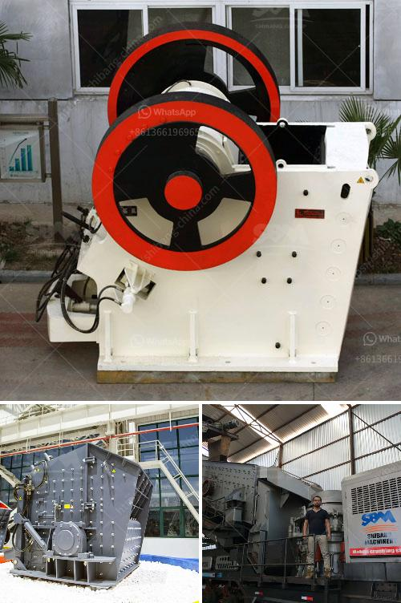

<h3>سعر مطحنة الكرة لطحن الأسمنت</h3>
تعتبر مطحنة الكرة أحد المعدات الرئيسية في صناعة الأسمنت، حيث تستخدم لطحن المواد الخام وتحويلها إلى مسحوق ناعم يُدعى الكلنكر. وتُستخدم هذه المطاحن بشكل واسع في مصانع الأسمنت حول العالم.

يعتبر سعر مطحنة الكرة لطحن الأسمنت عاملاً مهماً يتم النظر إليه عند اتخاذ القرار بشأن شراء المطحنة. يتأثر سعر المطاحن بعدة عوامل، بما في ذلك القدرة المطلوبة (متر مكعب في الساعة) والحجم والجودة والعلامة التجارية والمواصفات والمميزات الإضافية والتكنولوجيا المستخدمة.

أحد العوامل الرئيسية التي تؤثر على سعر المطحنة هي القدرة المطلوبة. فكلما زادت القدرة المطلوبة، ارتفع سعر المطحنة. وتختلف احتياجات الشركات المصنعة للأسمنت من حيث القدرة المطلوبة وفقًا لحجم الإنتاج والطلب العمليات. على سبيل المثال، يحتاج مصنع أسمنت كبير بسعة إنتاج عالية إلى مطحنة كرة أكبر وأقوى، بينما يحتاج مصنع أسمنت صغير بقدرة إنتاج أقل إلى مطحنة أصغر وأقل تكلفة.

بالإضافة إلى القدرة، يتأثر سعر المطحنة أيضًا بجودة ومواصفات المعدات المستخدمة في البناء والتصميم والمكونات. على سبيل المثال، يمكن أن تكلف المطاحن المصنوعة من المواد ذات الجودة العالية بشكل عام أكثر من المطاحن المصنوعة من المواد ذات الجودة المنخفضة. كما تؤثر التصميمات الفريدة والمميزات الإضافية في سعر المطحنة. وتشمل هذه الميزات المثالية تقنيات التشغيل والصيانة وأنظمة التحكم والتتبع والتبريد والتسخين وغيرها.

وأخيرًا، يلعب الاسم التجاري والعلامة التجارية دورًا أيضًا في تحديد سعر المطحنة. فمن المعروف أن هناك العديد من الشركات المصنعة لمطاحن الكرة لطحن الأسمنت حول العالم، ويختلف كل منها في الجودة والمواصفات والتقنيات المستخدمة. فشراء مطحنة من شركة معروفة وموثوق بها في قطاع صناعة الأسمنت يعني غالبًا دفع سعر أعلى.

باختصار، فإن سعر مطحنة الكرة لطحن الأسمنت يعتمد على العديد من العوامل، بما في ذلك القدرة المطلوبة، والجودة والمواصفات، والعلامة التجارية، والمميزات الإضافية. توجد العديد من الشركات المصنعة لمطاحن الكرة المختلفة، لذا ينصح بإجراء بحث وتقييم شامل قبل اتخاذ قرار الشراء للتأكد من الحصول على أفضل قيمة مقابل المال المستثمر.
<h3>Contact us</h3><ul><li><strong>Whatsapp:&nbsp;<a href="https://wa.me/8613661969651">+8613661969651</a></strong></li><li><a href="https://swt.shibang-china.com/?git&amp;zhl&amp;سعر مطحنة الكرة لطحن الأسمنت"><strong>Online Service(chat now)</strong></a></li></ul><h3>Related</h3><ul><li><a href='مصنع زينيث للسحق.md'>مصنع زينيث للسحق</a></li><li><a href='كسارة ومطحنة للذهب.md'>كسارة ومطحنة للذهب</a></li><li><a href='تكلفة آلات الحديد الاسفنجي 300 طن في اليوم.md'>تكلفة آلات الحديد الاسفنجي 300 طن في اليوم</a></li><li><a href='مواد أحزمة الناقلات القطاعية.md'>مواد أحزمة الناقلات القطاعية</a></li><li><a href='مصنع الأسمنت للبيع في دبي.md'>مصنع الأسمنت للبيع في دبي</a></li></ul>