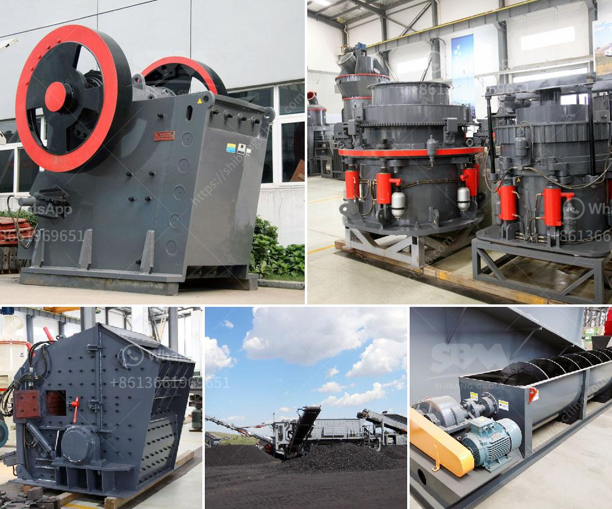

<h3>سعر مطحنة الكسارة سعر الحجر</h3>
تعتبر مطحنة الكسارة أحد الأدوات الهامة في صناعة البناء والتشييد، حيث تستخدم لطحن الحجر وتحويله إلى قطع صغيرة مناسبة للاستخدام في البناء. يعتبر سعر مطحنة الكسارة عاملاً مهماً يؤثر في تحديد تكلفة عملية الإنتاج وبالتالي سعر الحجر النهائي.

تختلف أسعار مطاحن الكسارة بناءً على العديد من العوامل، مثل حجمها وقدرتها على العمل والتقنيات المستخدمة في تصنيعها. هناك أيضاً اختلاف في الأسعار بناءً على ماركة المطحنة ومكان صناعتها. بشكل عام، يتراوح سعر مطحنة الكسارة بين 200 و400 دولار، ويمكن أن يزيد أو ينقص هذا السعر بناءً على العوامل المذكورة سابقاً.

ومن الجدير بالذكر أن مطحنة الكسارة ليست العامل الوحيد في تحديد سعر الحجر النهائي. هناك أيضاً عوامل أخرى مثل تكلفة شراء الحجر الخام وتكلفة نقله وتكاليف التشغيل والصيانة للمطحنة. بالإضافة إلى ذلك، يؤثر سعر المطحنة أيضاً على سعر الحجر النهائي بسبب تكلفة تشغيل المطحنة وتوفير الطاقة اللازمة لها.

وبالنظر إلى أهمية الحجر في صناعة البناء والتشييد، فإن سعر مطحنة الكسارة يعتبر استثماراً مهماً للشركات والأفراد المعنيين بإنتاج الحجر بكميات كبيرة. من خلال اختيار مطحنة الكسارة المناسبة والتي تحقق أداءً عالياً وتكلفة تشغيل منخفضة، يمكن للشركات زيادة إنتاجيتها وتحقيق أرباح أكبر.

لذلك، يجب على المشترين أن يأخذوا في الاعتبار العديد من العوامل عند اختيار مطحنة الكسارة المناسبة، لتحقيق أفضل قيمة مقابل المال المستثمر. من المهم أيضاً أن يتعاونوا مع موردين موثوقين وذوي خبرة، الذين يقدمون ضمانات على المعدات وخدمات ما بعد البيع المتميزة.

باختصار، يمكن القول إن سعر مطحنة الكسارة يعتبر عوامل مهمة في تحديد سعر الحجر النهائي. لذلك، يجب أن يكون المشتري حذراً ومدروساً في اختيار مطحنة الكسارة المناسبة التي تتوافق مع احتياجاته وتقديم أداءً عالياً وتكلفة تشغيل منخفضة. من خلال ذلك، يمكن تحقيق أفضل نتائج إنتاجية وتقليل التكلفة النهائية للحجر المنتج.
<h3>Contact us</h3><ul><li><strong>Whatsapp:&nbsp;<a href="https://wa.me/8613661969651">+8613661969651</a></strong></li><li><a href="https://swt.shibang-china.com/?git&amp;zhl&amp;سعر مطحنة الكسارة سعر الحجر"><strong>Online Service(chat now)</strong></a></li></ul><h3>Related</h3><ul><li><a href='كسارة الحجر المحمولة للبيع في الفلبين.md'>كسارة الحجر المحمولة للبيع في الفلبين</a></li><li><a href='مطحنة الكرات لكربونات الكالسيوم.md'>مطحنة الكرات لكربونات الكالسيوم</a></li><li><a href='مطحنة عمودية للكالسيوم.md'>مطحنة عمودية للكالسيوم</a></li><li><a href='مطحنة الكرة لخام الذهب للبيع في زيمبابوي.md'>مطحنة الكرة لخام الذهب للبيع في زيمبابوي</a></li><li><a href='معدات تعدين الرمال في ماليزيا.md'>معدات تعدين الرمال في ماليزيا</a></li></ul>