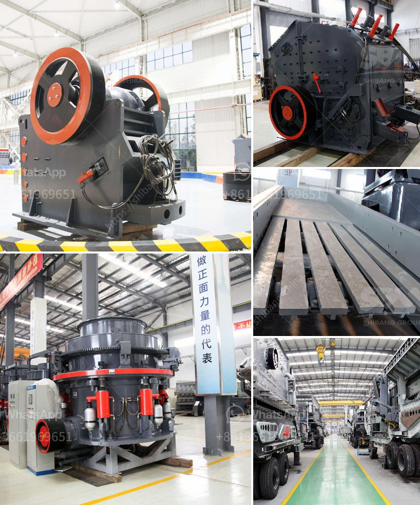

<h3>سعر مطحنة المطرقة للطين</h3>
يعتبر الطين من المواد الطبيعية التي استخدمت في صناعة الأواني والأدوات لآلاف السنين. ومن أجل تشكيل الطين وصنع القطع الخزفية ، يحتاج الفنانون والحرفيون إلى معدات وأدوات خاصة لمعالجة الطين وتحويله إلى قوالب جاهزة للتشكيل والتصنيع.

تعتبر مطاحن المطرقة من الأدوات الهامة في صناعة الخزف والسيراميك. تعمل هذه المطاحن على طحن الطين وتهيئته للتشكيل والتصنيع. وفي السنوات الأخيرة ، أصبحت مطاحن المطرقة للطين شائعة الاستخدام في الورش الفنية والمصانع الصغيرة وحتى في المنازل الخاصة.

يتراوح سعر مطحنة المطرقة للطين بين 200 إلى 400 دولارًا تقريبًا ، حسب الحجم والمواصفات والعلامة التجارية. وتتوفر هذه المطاحن بمختلف الأحجام ، حيث تجد مطاحن الطين الصغيرة التي يمكن استخدامها في المنازل الصغيرة وورش العمل الفنية ، ومطاحن الطين الكبيرة التي تستخدم في المصانع الكبيرة وورش العمل الكبيرة.

تتميز مطاحن المطرقة للطين بعدة مزايا. فهي سهلة الاستخدام ومرنة في العمل. قد تحتاج إلى بعض التجارب والتدريب للحصول على النتائج المرغوبة في التشكيل والتصنيع. كما أنها توفر وقتًا وجهدًا في عملية تحضير الطين وتشكيله. كما أنها قابلة للتعديل بحيث يمكن تحديد درجة نعومة الطين المطحون وفقًا لاحتياجات الفنان أو الصانع.

يمكن شراء مطاحن المطرقة للطين من خلال العديد من المحال التجارية المختصة في بيع معدات الخزف والسيراميك. يمكن أيضًا العثور على هذه المطاحن عبر الإنترنت ، حيث يتوفر العديد من المواقع التجارية التي توفر معدات الخزف والسيراميك بجميع أحجامها وأنواعها.

إذا كنت ترغب في دخول عالم صناعة الخزف والسيراميك وتشكيل الطين ، فإن امتلاك مطحنة المطرقة سيكون استثمارًا مثمرًا. ستكون هذه المطاحن الأداة المثالية لتحويل الطين إلى شكل جاهز للتشكيل والتصنيع. ستساعدك على تنفيذ أفكارك الإبداعية والتعبير عنها من خلال الطين بسهولة ودقة وفاعلية. سيعزز امتلاك مطحنة المطرقة قدراتك ومهاراتك في صناعة الخزف والسيراميك ، ويمكن أن يكون له تأثير إيجابي على جودة وتنوع إنتاجك.
<h3>Contact us</h3><ul><li><strong>Whatsapp:&nbsp;<a href="https://wa.me/8613661969651">+8613661969651</a></strong></li><li><a href="https://swt.shibang-china.com/?git&amp;zhl&amp;سعر مطحنة المطرقة للطين"><strong>Online Service(chat now)</strong></a></li></ul><h3>Related</h3><ul><li><a href='شركة تصنيع كسارة الحصى.md'>شركة تصنيع كسارة الحصى</a></li><li><a href='آلات كسارة للبيع.md'>آلات كسارة للبيع</a></li><li><a href='سعر كسارة الحجر المحمولة في.md'>سعر كسارة الحجر المحمولة في</a></li><li><a href='آلة كسارة الفك في المملكة العربية السعودية.md'>آلة كسارة الفك في المملكة العربية السعودية</a></li><li><a href='محطم الحجر الجيري روتور.md'>محطم الحجر الجيري روتور</a></li></ul>