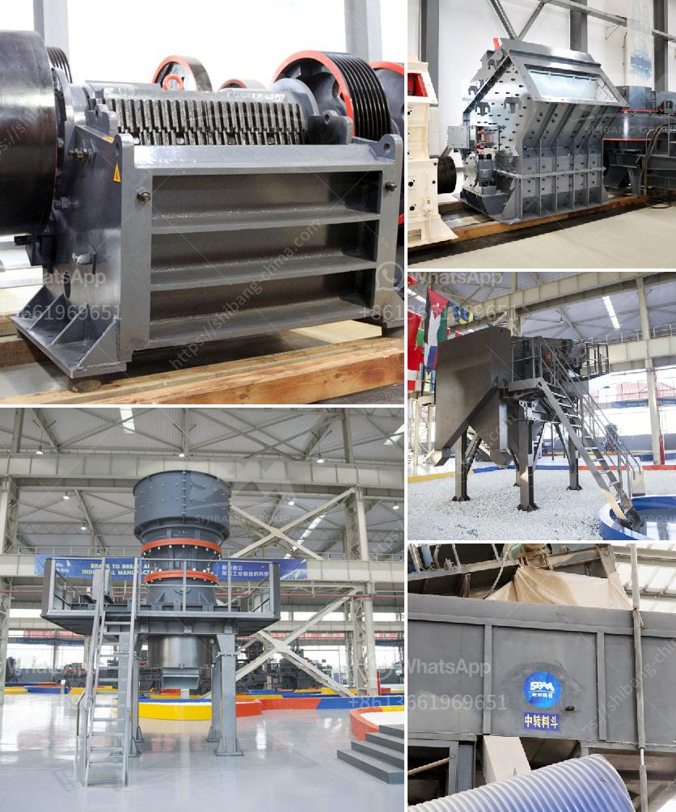

<h3>سعر مطحنة رايموند للكاولين</h3>
تعتبر مطحنة رايموند من المطاحن الشهيرة والمرغوبة في صناعة الكاولين. يتم استخدام مطحنة رايموند بشكل رئيسي في طحن المواد الخام الصلبة غير المتقلبة التي تم تجهيزها مسبقًا. يعمل هذا الجهاز على تحويل المواد الخام إلى مسحوق ناعم مناسب للاستخدام في مجالات مختلفة مثل صناعة البلاط، والبورسلين، والألواح الكهربائية، وصناعة الشحوم، وصناعة الأدوية، والصناعات الكيماوية ، وغيرها.

سعر مطحنة رايموند للكاولين يتراوح عادةً بين 78000 دولار و120000 دولار. ومع ذلك، يتأثر السعر بعدة عوامل مثل:

1- الحجم والمواصفات: يتوفر مطحنة رايموند بعدة أحجام ومواصفات مختلفة، وكلما كانت السعة والمخرجات أعلى، كان السعر أعلى أيضًا.

2- جودة البناء: يتم تصنيع مطاحن رايموند من مواد عالية الجودة تضمن الاستدامة والكفاءة العالية. بناء جيد يجعل المطحنة تدوم لفترة أطول وتعمل بكفاءة أعلى، وبالتالي يكون له تأثير على السعر.

3- المنطقة الجغرافية: قد يختلف سعر مطحنة رايموند في كل منطقة وفقًا للتكاليف المحلية للإنتاج والنقل. بعض الدول قد تفرض رسوم استيراد عالية أو ضرائب على المعدات الثقيلة، وهذا يؤثر على سعر المطحنة.

4- العلامة التجارية: تختلف العلامات التجارية في سوق المطاحن، وبعض العلامات التجارية الشهيرة والموثوقة قد تكون أغلى بعض الشيء من العلامات التجارية الأخرى.

يجب أن يتم اختيار مطحنة رايموند المناسبة بناءً على احتياجات الإنتاج والميزانية المتاحة. قبل اتخاذ القرار، من المهم النظر في جميع العوامل المذكورة أعلاه واستشارة خبراء موثوق بهم في صناعة الكاولين. يمكن أن تساعد المطاحن الجيدة في زيادة كفاءة الإنتاج وتقليل تكاليف التشغيل على المدى الطويل.
<h3>Contact us</h3><ul><li><strong>Whatsapp:&nbsp;<a href="https://wa.me/8613661969651">+8613661969651</a></strong></li><li><a href="https://swt.shibang-china.com/?git&amp;zhl&amp;سعر مطحنة رايموند للكاولين"><strong>Online Service(chat now)</strong></a></li></ul><h3>Related</h3><ul><li><a href='كسارة كونيكا في إثيوبيا.md'>كسارة كونيكا في إثيوبيا</a></li><li><a href='سعر الكسارة من الصين.md'>سعر الكسارة من الصين</a></li><li><a href='مصنع طحن كلنكر الإسمنت في الهند.md'>مصنع طحن كلنكر الإسمنت في الهند</a></li><li><a href='شركة تصنيع آلة كسارة الحجر.md'>شركة تصنيع آلة كسارة الحجر</a></li><li><a href='تسعير حزام الناقل في ماليزيا.md'>تسعير حزام الناقل في ماليزيا</a></li></ul>