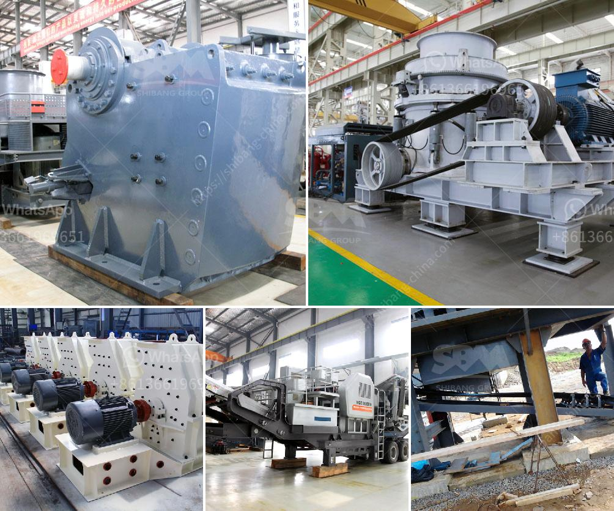

<h3>سعر مطحنة ريموند الفائقة الدقة</h3>
مطحنة ريموند الفائقة الدقة هي مطحنة تستخدم في عمليات طحن المواد الصلبة ، والتي تم تطويرها بواسطة شركة ريموند في الولايات المتحدة. تعتبر هذه المطحنة واحدة من أكثر المطاحن تقدمًا ودقة في السوق حاليًا.

تتميز مطحنة ريموند الفائقة الدقة بالعديد من المزايا التي تجعلها خيارًا مناسبًا للعديد من الصناعات التي تعتمد على عملية الطحن. أحد هذه الايجابيات هو نظام الطحن الفعال ، حيث يتم استخدام تقنية الطحن المبتكرة والدقيقة التي تسمح بتحقيق دقة عالية وجودة ممتازة في النتائج.

توفر مطحنة ريموند الفائقة الدقة أيضًا قدرة عالية على المعالجة ، حيث يمكنها طحن المواد الخام بسرعة وكفاءة فائقة. تستخدم هذه المطحنة أساسًا في صناعة الأسمدة ، والصناعات الكيميائية ، وصناعة الفحم ، وصناعة المعادن ، حيث يتم طحن المواد الخام وتحويلها إلى منتجات نهائية عالية الجودة.

بالإضافة إلى ذلك ، فإن مطحنة ريموند الفائقة الدقة تتميز بتصميمها العصري والمتقدم ، حيث تم تجهيزها بنظام السيطرة الأوتوماتيكية الحديثة وتقنيات الحساب الدقيق. هذا يسمح للمشغلين بضبط كافة المعلمات المتعلقة بعملية الطحن بدقة وتفصيل.

أما بالنسبة للسعر ، فإن مطحنة ريموند الفائقة الدقة تتراوح أسعارها عادة من حوالي 50,000 دولار إلى 100,000 دولار للوحدة الواحدة. يجب الانتباه إلى أن هذه الأسعار قابلة للتغيير حسب المواصفات والميزات المختلفة المطلوبة.

في النهاية ، تعتبر مطحنة ريموند الفائقة الدقة خيارًا ممتازًا للشركات التي تبحث عن جودة عالية ودقة في عملية الطحن. بفضل تصميمها المتقدم والتقنيات المبتكرة التي تستخدمها ، تلبي هذه المطحنة احتياجات العديد من الصناعات بشكل ممتاز.
<h3>Contact us</h3><ul><li><strong>Whatsapp:&nbsp;<a href="https://wa.me/8613661969651">+8613661969651</a></strong></li><li><a href="https://swt.shibang-china.com/?git&amp;zhl&amp;سعر مطحنة ريموند الفائقة الدقة"><strong>Online Service(chat now)</strong></a></li></ul><h3>Related</h3><ul><li><a href='مواد أحزمة الناقلات القطاعية.md'>مواد أحزمة الناقلات القطاعية</a></li><li><a href='مطاحن صناعية للفحم.md'>مطاحن صناعية للفحم</a></li><li><a href='حجم منتج التغذية لكسارات المخروط.md'>حجم منتج التغذية لكسارات المخروط</a></li><li><a href='إجمالي الطاقة لكسارة الفك 500 طن في الساعة.md'>إجمالي الطاقة لكسارة الفك 500 طن في الساعة</a></li><li><a href='آلة تعدين الذهب في الصين.md'>آلة تعدين الذهب في الصين</a></li></ul>