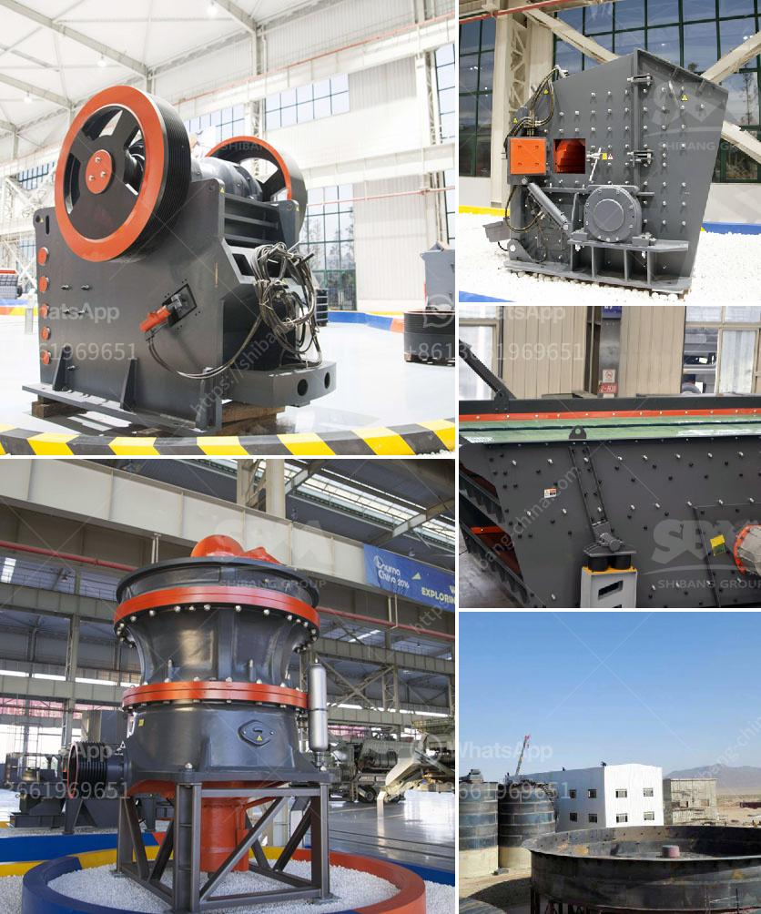

<h3>سعر مطحنة صغيرة</h3>
مع مرور الوقت وتقدم التكنولوجيا، أصبحت المطاحن الصغيرة ضرورة للعديد من الأشخاص في المنازل والمكاتب وحتى المقاهي. وتعتبر هذه المطاحن الصغيرة حلاً مثاليًا لطحن البن والتوابل والبهارات والحبوب الأخرى.

تتوفر مطاحن صغيرة بأسعار تتراوح بين 200 و400 دولار. وعلى الرغم من وجود بعض الاختلافات في الأسعار، إلا أنها توفر قيمة عالية مقابل المال. فهذه المطاحن تأتي بتصاميم مبتكرة ومواصفات عالية الجودة تساعدك على طحن المكونات بشكل سريع وفعال، مما يسمح لك بتحضير القهوة اللذيذة أو الطعام اللذيذ بسهولة في منزلك أو مكتبك.

ما يميز هذه المطاحن الصغيرة هو قدرتها على طحن المكونات بشكل دقيق. حيث تحتوي على أسطوانة طحن مصنوعة من السيراميك أو الفولاذ المقاوم للصدأ، مما يسمح بطحن الحبوب إلى مستوى نعومة مطلوب بدقة. وتعمل هذه المطاحن عن طريق ضبط الوقت أو حتى الوزن، مما يوفر لك الكمية الدقيقة من المكونات التي تحتاجها، سواء كان ذلك لتحضير القهوة العربية التقليدية أو القهوة المختصة.

بالإضافة إلى ذلك، يتميز هذا النوع من المطاحن بسهولة الاستخدام. فهي تأتي بأزرار تحكم سهلة لتحديد الوقت أو التيار الكهربائي المستخدم. ويمكن أيضًا تنظيفها بسهولة عن طريق فك الأجزاء القابلة للفصل وغسلها بالماء والصابون.

بصفة عامة، تعتبر المطاحن الصغيرة بأسعار تتراوح بين 200 و 400 دولار مستثمرة جيدة. إذ تقدم لك تجربة طحن ممتازة وسهلة الاستخدام. سواء كنت تستخدمها في المنزل أو في العمل، فإنها تعد إضافة لا غنى عنها للمطبخ الخاص بك. كما أنها تعد هدية مثالية لأحبائك الذين يحبون تحضير القهوة اللذيذة أو الطعام المنزلي بأنفسهم.
<h3>Contact us</h3><ul><li><strong>Whatsapp:&nbsp;<a href="https://wa.me/8613661969651">+8613661969651</a></strong></li><li><a href="https://swt.shibang-china.com/?git&amp;zhl&amp;سعر مطحنة صغيرة"><strong>Online Service(chat now)</strong></a></li></ul><h3>Related</h3><ul><li><a href='تكنولوجيا معالجة خام الباريت.md'>تكنولوجيا معالجة خام الباريت</a></li><li><a href='معدات تعدين النحاس.md'>معدات تعدين النحاس</a></li><li><a href='صناعة الحجر الجيري في الفلبين.md'>صناعة الحجر الجيري في الفلبين</a></li><li><a href='كسارة الفك من الصين.md'>كسارة الفك من الصين</a></li><li><a href='تقرير جدوى مصنع الأسمنت.md'>تقرير جدوى مصنع الأسمنت</a></li></ul>