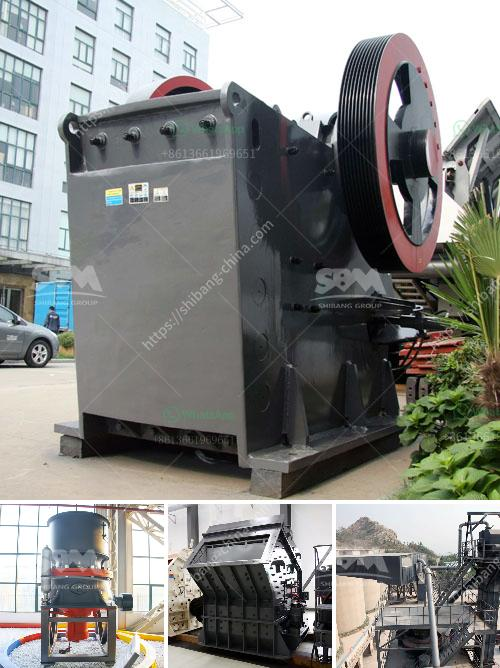

<h3>سعر مطحنة طاحونة عمودية</h3>
تعتبر مطاحن الطحن العمودية من أهم الأدوات التي يستخدمها عدد كبير من الصناعات المختلفة، مثل صناعة الأسمنت وصناعة الكيماويات وصناعة الحبوب وغيرها. وتعتبر هذه المطاحن اختيارًا رئيسيًا للعديد من الشركات نظرًا لفعاليتها وكفاءتها.

يتوفر في السوق العديد من موديلات مطاحن الطحن العمودية ، وتتفاوت أسعارها بحسب الحجم والقدرة الإنتاجية والتقنية المطبقة. في ما يلي سنتحدث عن سعر مطحنة طاحونة عمودية بين 200-400 كلمة.

إذا كنت تبحث عن مطحنة طحن عمودية بأسعار معقولة، فإن الأسعار تتفاوت حسب العوامل السابقة. فمثلاً، يمكن العثور على مطحنة طحن عمودية صغيرة الحجم بسعر يتراوح بين 200-400 دولار أمريكي. وتعتبر هذه الأجهزة مناسبة للعديد من الأعمال المنزلية، مثل طحن الحبوب المنزلية أو التوابل.

ومع ذلك، عند النظر إلى مطاحن الطحن الصناعية ذات القدرة الكبيرة والتقنية المتقدمة، قد يصل سعرها إلى الآلاف من الدولارات. وتعتبر هذه المطاحن الأكثر فعالية في استخدام الطاقة وتوفير الوقت، مما يجعلها اختيارًا مثاليًا للشركات التي تحتاج إلى معالجة كميات كبيرة من الحبوب أو المواد الخام الأخرى.

بالإضافة إلى العوامل التقنية، تؤثر أيضًا العلامة التجارية والبلد المُصنع في تحديد سعر مطحنة الطحن العمودية. فبعض الشركات العالمية المشهورة قد تقدم معدات عالية الجودة لكن بأسعار أعلى.

في النهاية، عند شراء مطحنة طحن عمودية، يجب أن يتم اختيار النموذج الذي يتناسب مع احتياجات الشركة أو المستخدم الفردي، وصيانتها بانتظام لضمان الأداء الأمثل وطول عمر الجهاز.

باختصار، تتفاوت أسعار مطاحن الطحن العمودية بين 200-400 دولار للطُرز المنزلية والصغيرة، بينما قد تصل الأسعار إلى الآلاف من الدولارات للأجهزة الصناعية ذات القدرة الكبيرة والتقنية المتقدمة. يجب دائمًا اختيار الطراز المناسب حسب الاحتياجات والميزانية.
<h3>Contact us</h3><ul><li><strong>Whatsapp:&nbsp;<a href="https://wa.me/8613661969651">+8613661969651</a></strong></li><li><a href="https://swt.shibang-china.com/?git&amp;zhl&amp;سعر مطحنة طاحونة عمودية"><strong>Online Service(chat now)</strong></a></li></ul><h3>Related</h3><ul><li><a href='مطحنة صغيرة للمعادن.md'>مطحنة صغيرة للمعادن</a></li><li><a href='مورد كسارة الأسطوانة المزدوجة.md'>مورد كسارة الأسطوانة المزدوجة</a></li><li><a href='كسارة حجر مستعملة للبيع في أوروبا.md'>كسارة حجر مستعملة للبيع في أوروبا</a></li><li><a href='آلات معالجة الجير.md'>آلات معالجة الجير</a></li><li><a href='قمع التفريغ لمطحنة الكرة.md'>قمع التفريغ لمطحنة الكرة</a></li></ul>