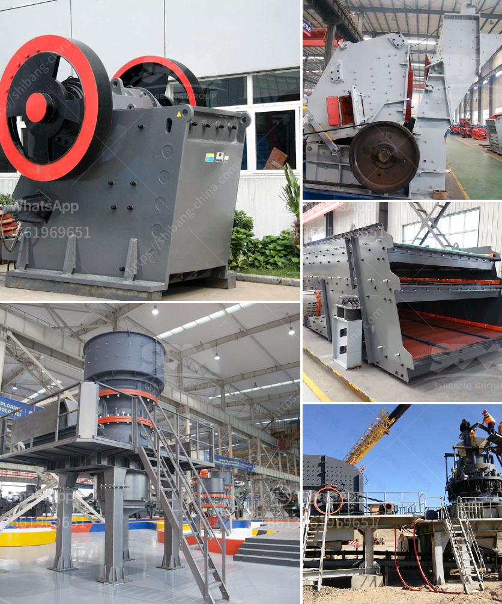

<h3>سعر مطحنة ليما</h3>
تتنوع مطاحن القهوة في الأسواق بأحجام وأنواع مختلفة، واحدة من هذه المطاحن الشهيرة هي "مطحنة ليما".

يعد سعر مطحنة ليما المناسب بين بقية المطاحن المتاحة في السوق. تتراوح أسعار مطاحن ليما من حوالي 200 إلى 400 دولار، وهي تعتبر خيارًا مناسبًا لمحبي القهوة الذين يبحثون عن جودة عالية بسعر معقول.

تتميز مطاحن ليما بالحصول على نتائج رائعة في طحن حبوب البن. واحدة من أهم المزايا التي تجذب المستخدمين هو المظهر الجذاب والتصميم العصري للمطحنة. يتم تصنيع المطاحن باستخدام مواد ذات جودة عالية وتقنيات حديثة لضمان المتانة والأداء الممتاز. تتوفر أيضًا المطاحن بألوان وخيارات متعددة لتلبية تفضيلات العملاء المختلفة.

تستخدم مطاحن ليما أنظمة طحن متقدمة تعمل على ضمان طحن متجانس ومتساوي لحبوب البن لتقديم كوب قهوة لذيذ. بفضل القوة العالية للمحرك والشفرات الحادة، يتم طحن حبوب البن بسرعة وسهولة. يمكن تعديل مستوى الطحن لتلبية تفضيلات الشخص المستخدم ونوع القهوة التي يرغب في إعدادها.

تعد مطاحن ليما اختيارًا مثاليًا لعشاق القهوة المهتمين بالتفاصيل الدقيقة والنكهة الغنية للقهوة المطحونة قبل التحضير. السعر التنافسي لمطاحن ليما يعد أحد العوامل المهمة في جذب المستخدمين، حيث يمكن الحصول على جودة فائقة مع الاستفادة من السعر المناسب.

بشكل عام، تعد مطاحن ليما خيارًا مثاليًا لمن يبحثون عن مطحنة قهوة عالية الجودة بسعر معقول. تقدم هذه المطاحن تجربة طحن مدهشة وتضيف لمسة فاخرة لمطبخك. باستخدام مطحنة ليما، يمكنك الاستمتاع بكوب قهوة رائعة في أي وقت من اليوم.
<h3>Contact us</h3><ul><li><strong>Whatsapp:&nbsp;<a href="https://wa.me/8613661969651">+8613661969651</a></strong></li><li><a href="https://swt.shibang-china.com/?git&amp;zhl&amp;سعر مطحنة ليما"><strong>Online Service(chat now)</strong></a></li></ul><h3>Related</h3><ul><li><a href='موردين مطاحن الطحن في الصين.md'>موردين مطاحن الطحن في الصين</a></li><li><a href='آلة طحن مطحنة الأسطوانة.md'>آلة طحن مطحنة الأسطوانة</a></li><li><a href='كسارة الكرة للحديد فقط الشركة.md'>كسارة الكرة للحديد فقط الشركة</a></li><li><a href='كيفية عمل مصنع سحق الحجر.md'>كيفية عمل مصنع سحق الحجر</a></li><li><a href='تنقية الجرافيت في معالجة المعادن.md'>تنقية الجرافيت في معالجة المعادن</a></li></ul>