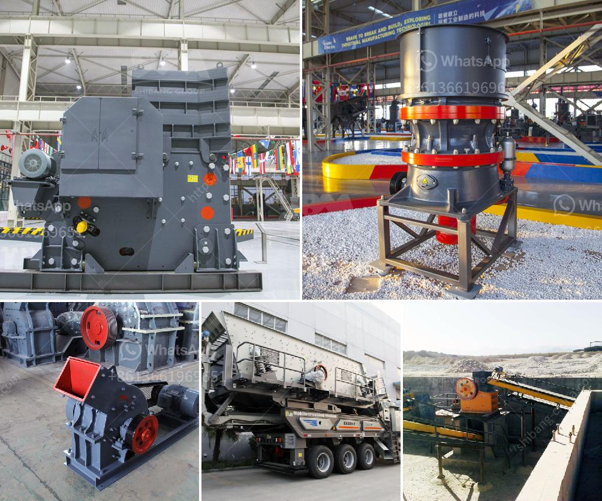

<h3>سعر مطرقة مطحنة سعة صنع في الصين</h3>
تعتبر صناعة الأدوات اليدوية من أهم الصناعات في العالم، وتلعب المطارق دورًا هامًا في تنفيذ الأعمال اليومية. تتوفر المطارق بأحجام وأوزان مختلفة لتناسب احتياجات العملاء المختلفة. ومن بين المطارق المستخدمة على نطاق واسع، تأتي في المقدمة مطارق المطاحن.

تعد مطارق المطاحن معدات أساسية في صناعة التكسير والطحن، حيث يتم استخدامها لسحق المواد الصلبة من خلال ضربها بقوة على السطح المرغوب. وفي السوق العالمية، تعتبر الصين واحدة من أبرز الدول المصنعة لمطارح المطاحن بنوعية عالية وبأسعار تنافسية.

يتوفر في الصين مطارق مطاحن بمجموعة واسعة من الأحجام والأوزان والسعات، مما يتيح للمشترين الاختيار من بين مجموعة متنوعة من المنتجات وفقًا لاحتياجاتهم. يتراوح سعر المطارق بين 200 إلى 400 دولار، ويعتمد السعر بشكل رئيسي على السعة والجودة المقدمة.

تعتبر مطارح المطاحن المصنوعة في الصين بأسعارها المنخفضة وجودتها العالية، خيارًا جيدًا للعملاء من مختلف الدول. ذلك يرجع إلى الإمكانيات التحضيرية الكبيرة والتطور التكنولوجي الذي يشهده قطاع التصنيع في الصين. كما يساهم الطلب المتزايد على المطارح من الصين في تحفيز الابتكار وتحسين عملية الإنتاج وتقليل التكاليف.

في الختام، تُعد مطارح المطاحن منتجات ضرورية في صناعة التكسير والطحن، وتحظى بشعبية كبيرة في السوق العالمية، خاصةً تلك التي تتم صناعتها في الصين. بفضل التقنيات المتقدمة والأسعار التنافسية، يعتبر العثور على مطرقة مطحنة بالسعة المطلوبة في الصين أمرًا سهلاً واقتصاديًا.
<h3>Contact us</h3><ul><li><strong>Whatsapp:&nbsp;<a href="https://wa.me/8613661969651">+8613661969651</a></strong></li><li><a href="https://swt.shibang-china.com/?git&amp;zhl&amp;سعر مطرقة مطحنة سعة صنع في الصين"><strong>Online Service(chat now)</strong></a></li></ul><h3>Related</h3><ul><li><a href='شركات تصنيع آلات الطحن في تايلاند.md'>شركات تصنيع آلات الطحن في تايلاند</a></li><li><a href='معلومات عن الكسارة المحمولة.md'>معلومات عن الكسارة المحمولة</a></li><li><a href='مصنع تحسين الكروم في الصين.md'>مصنع تحسين الكروم في الصين</a></li><li><a href='البحث عن شريك لكسارة الآلات.md'>البحث عن شريك لكسارة الآلات</a></li><li><a href='مصنع كسارة الحجر الجيري في الهند.md'>مصنع كسارة الحجر الجيري في الهند</a></li></ul>