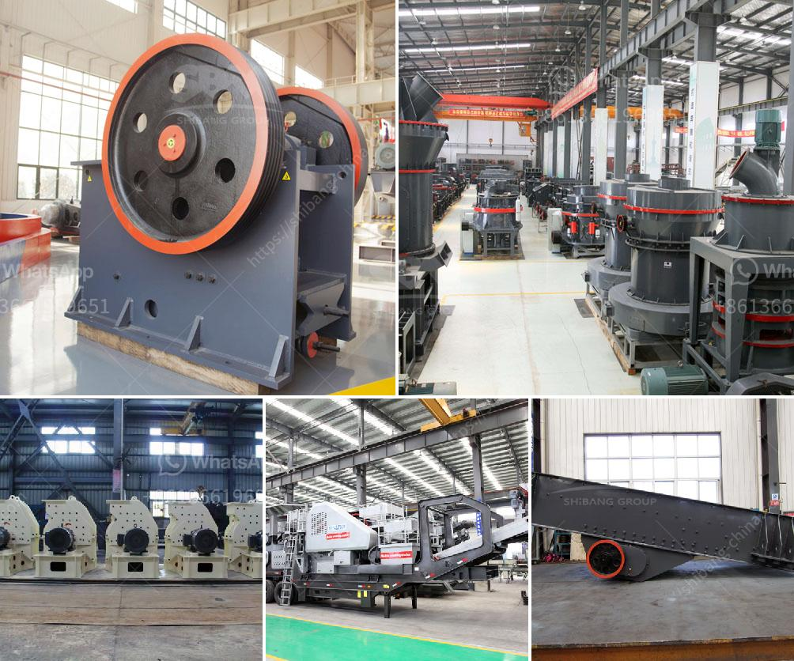

<h3>سعر معدات التعدين المستخدمة</h3>
تعتبر معدات التعدين من الأدوات الأساسية التي تستخدم في عمليات استخراج الموارد الطبيعية مثل الفحم والنفط والذهب والفضة والحديد والنحاس والرصاص وغيرها. تتنوع معدات التعدين بشكل كبير حسب نوع الموارد المستهدفة ونوع العملية المراد تنفيذها، بدءًا من الحفر والتنقيب إلى عمليات النقل والتصفية.

تتفاوت أسعار معدات التعدين المستخدمة حسب العديد من العوامل، مثل الحجم والقوة والكفاءة والتقنية والعلامة التجارية. على سبيل المثال، يمكن توفير الحفارات بأسعار تتراوح بين عدة آلاف إلى عدة ملايين الدولارات، حيث تعود الأسعار المنخفضة في الغالب إلى الحفارات الصغيرة المستخدمة في الأعمال البسيطة، بينما تكون الحفارات الكبيرة والمتقدمة التقنية أكثر تكلفة.

بالنسبة للمعدات الأخرى مثل الشاحنات والمقطورات والكسارات والطاحونات، فإن الأسعار تتراوح أيضًا بين نطاق واسع. يعتمد ذلك على سعة الإنتاج والاستخدام المطلوب لهذه المعدات. على سبيل المثال، من الشاحنات الصغيرة إلى الكبيرة ، يمكن أن تتراوح الأسعار بين عدة آلاف إلى عدة مئات من الآلاف من الدولارات.

عادةً ما يكون سعر معدات التعدين المستخدمة أقل بكثير مقارنة بالمعدات الجديدة. يتأثر السعر بحالة المعدات وعمرها وساعات الاستخدام وقطع الغيار والصيانة. يمكن العثور على معدات التعدين المستخدمة بأسعار أقل في السوق الثانوية أو من خلال المزادات العامة.

من الجدير بالذكر أن العديد من شركات التعدين يفضلون شراء المعدات المستخدمة بدلاً من الجديدة لتوفير التكاليف. يعتبر ذلك خيارًا جيدًا إذا تمت مراعاة العديد من العوامل المذكورة سابقًا وتم التحقق من حالة المعدات قبل الشراء.

في النهاية، فإن سعر معدات التعدين المستخدمة يعتمد على العديد من العوامل، ومن المهم أن يتم إجراء البحوث والتقييمات اللازمة قبل اتخاذ القرار بشأن الاستثمار في معدات التعدين المستخدمة. فمن خلال الحصول على معدات ذات جودة جيدة وبأسعار مناسبة، يمكن لشركات التعدين تحقيق الكفاءة والربحية في عمليات التعدين.
<h3>Contact us</h3><ul><li><strong>Whatsapp:&nbsp;<a href="https://wa.me/8613661969651">+8613661969651</a></strong></li><li><a href="https://swt.shibang-china.com/?git&amp;zhl&amp;سعر معدات التعدين المستخدمة"><strong>Online Service(chat now)</strong></a></li></ul><h3>Related</h3><ul><li><a href='كسارة حجر محمولة.md'>كسارة حجر محمولة</a></li><li><a href='سحق متنقل في دبي.md'>سحق متنقل في دبي</a></li><li><a href='تكلفة تعدين الفحم في جنوب أفريقيا للطن الواحد.md'>تكلفة تعدين الفحم في جنوب أفريقيا للطن الواحد</a></li><li><a href='مصنع الأسمنت من الصهر 100 طن.md'>مصنع الأسمنت من الصهر 100 طن</a></li><li><a href='مطحنة كرات صغيرة للبيع.md'>مطحنة كرات صغيرة للبيع</a></li></ul>