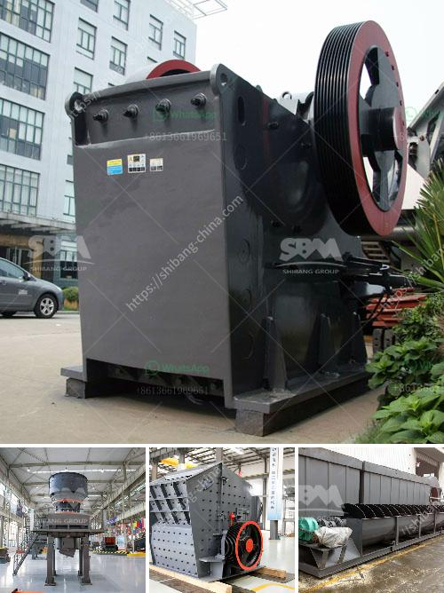

<h3>سعر معدات الطحن 250 طن</h3>
تعد معدات الطحن من المعدات الأساسية في صناعة الأغذية والمواد الكيميائية والمعادن. تستخدم هذه المعدات لطحن المواد الخام إلى حجم الجسيمات المطلوبة لتحقيق النتائج المرجوة في العملية الإنتاجية.

يعتبر سعر معدات الطحن بمقدار 250 طن من القدرة الإنتاجية هو مرجع هام لأصحاب الصناعات المختلفة. يتأثر سعر هذه المعدات بالعديد من العوامل، بما في ذلك جودة المعدات والمواد المستخدمة في تصنيعها وتقنية الطحن المستخدمة.

قد تتراوح أسعار معدات الطحن بين 200 إلى 400 دولار للطن الواحد من الطاقة الإنتاجية. وبالتالي، يمكن أن يبلغ سعر معدات الطحن بـ 250 طن من القدرة الإنتاجية مابين 50،000 إلى 100،000 دولار.

ومع ذلك، يجب أن نأخذ في الاعتبار أن هذه الأسعار تمثل فقط نفقات المعدات ذاتها ولا تشمل تكاليف التشغيل والصيانة والتوصيل. قد تزيد تلك التكاليف على سعر المعدات بشكل كبير.

بالإضافة إلى ذلك، يمكن أن يتأثر سعر معدات الطحن بنوعية الشركة المصنعة وسمعتها في السوق. قد تعرض بعض الشركات أسعارًا منخفضة لكسب حصة السوق ولكن قد تتأثر جودة المعدات التي يتم توريدها.

من المهم أن يعرف المستهلكون أن معدات الطحن ذات الجودة العالية والموثوقة قد تكون مكلفة في البداية ولكنها قد توفر المال والوقت على المدى الطويل. قد تتميز المعدات ذات الجودة العالية بعمر خدمة أطول وأداء أفضل وتكاليف صيانة منخفضة.

في النهاية، يجب تقييم الاحتياجات والمتطلبات الفعلية للمشروع قبل اتخاذ قرار شراء معدات الطحن. يجب أن يتم دراسة السوق ومقارنة العروض المتاحة من الشركات المصنعة المختلفة للحصول على أفضل قيمة مقابل المال المستثمر.

معدات الطحن هي استثمار قيم في صناعة الإنتاج، ويجب أن تتم دراسة السوق والاحتياجات جيدًا قبل اتخاذ أي قرار. ينبغي البحث عن شركة موثوقة وذات سمعة جيدة في توريد المعدات المطلوبة، حيث تقدم ضمانات على الجودة والأداء وخدمات ما بعد البيع.
<h3>Contact us</h3><ul><li><strong>Whatsapp:&nbsp;<a href="https://wa.me/8613661969651">+8613661969651</a></strong></li><li><a href="https://swt.shibang-china.com/?git&amp;zhl&amp;سعر معدات الطحن 250 طن"><strong>Online Service(chat now)</strong></a></li></ul><h3>Related</h3><ul><li><a href='آلة صنع الرمل الحجر في نيجيريا.md'>آلة صنع الرمل الحجر في نيجيريا</a></li><li><a href='كسارة الكرة النحاس آلة كسارة النحاس.md'>كسارة الكرة النحاس آلة كسارة النحاس</a></li><li><a href='معدات جص صنع الجدار الخرساني في ألمانيا.md'>معدات جص صنع الجدار الخرساني في ألمانيا</a></li><li><a href='كسارة الحجر في الفلبين.md'>كسارة الحجر في الفلبين</a></li><li><a href='مخطط تدفق التعدين ومعالجة المعادن للنيكل.md'>مخطط تدفق التعدين ومعالجة المعادن للنيكل</a></li></ul>