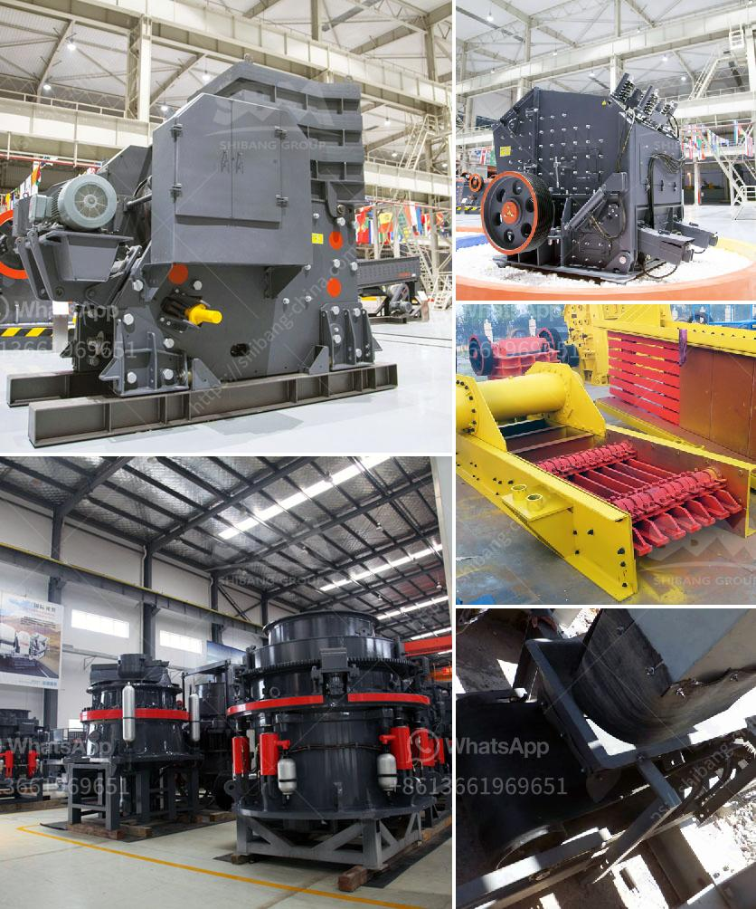

<h3>سعر معدات غسل الفحم</h3>
يعتبر غسل الفحم من العمليات الهامة في صناعة التعدين، حيث يتم استخدامه لتنقية الفحم من الشوائب والأتربة قبل أن يتم استخدامه في عمليات التوليد الحراري أو في صناعة الحديد والصلب. تتوفر معدات غسل الفحم بأسعار متنوعة تتراوح بين 200 و 400 دولار تقريبًا، حسب الحجم والقدرة التي تتطلبها عمليات الغسل.

تتضمن معدات غسل الفحم عادة أجهزة التعدين الثقيلة مثل الكسارات والغرابيل وأجهزة الفصل المغناطيسي وجهاز غسل الرمال. تعتمد تكلفة المعدات على العديد من العوامل، بما في ذلك حجم الإنتاج المطلوب ونوع الفحم المعالج والخصائص الفيزيائية والكيميائية للفحم.

من بين العوامل التي تؤثر على تكلفة المعدات هي ماركة الماكينة وجودتها وقدرتها على تحمل عمليات الغسل، إضافةً إلى تكاليف الصيانة المستقبلية وقابلية القطع الغيار. تعتبر المعدات ذات الجودة العالية والتي تعمل بكفاءة مرتفعة أكثر تكلفةً بالمقارنة مع المعدات ذات الجودة المنخفضة.

علاوة على ذلك، يتم أيضًا احتساب تكاليف الشحن والتركيب والتشغيل والتدريب على استخدام المعدات. قد يتطلب التجهيز والتنصيب والتشغيل لمعدات غسل الفحم خبرة فنية أو مهندسين متخصصين، وهذا يعتبر جزءًا من تكلفة المعدات.

ولا يجب نسيان أن هناك أشكالًا وأحجامًا مختلفة لمعدات غسل الفحم، مما يؤثر أيضًا على السعر. فبعض المعدات صالحة للاستخدام في الصناعات الكبيرة وتتطلب مساحة أكبر، بينما تتوفر أجهزة أصغر بحجم للاستخدام في مناجم الفحم الأصغر.

بصفة عامة، يجب على المستخدمين دراسة احتياجاتهم بعناية واختيار المعدات التي تلبي احتياجاتهم بكفاءة وبأسعار معقولة. قبل اتخاذ القرار النهائي، يوصى بالبحث والاطلاع على مراجع المعدات، والتشاور مع المصنعين والموردين المعتمدين، للحصول على معلومات تفصيلية حول المعدات والتكلفة والصيانة وأي توجيهات أخرى تتعلق بعمليات الغسل والمعالجة.
<h3>Contact us</h3><ul><li><strong>Whatsapp:&nbsp;<a href="https://wa.me/8613661969651">+8613661969651</a></strong></li><li><a href="https://swt.shibang-china.com/?git&amp;zhl&amp;سعر معدات غسل الفحم"><strong>Online Service(chat now)</strong></a></li></ul><h3>Related</h3><ul><li><a href='البحث عن شريك لكسارة الآلات.md'>البحث عن شريك لكسارة الآلات</a></li><li><a href='آلة معالجة الرماد الطائر.md'>آلة معالجة الرماد الطائر</a></li><li><a href='شركة تصنيع معدات التعدين في الصين.md'>شركة تصنيع معدات التعدين في الصين</a></li><li><a href='كسارة فكية صغيرة في المملكة المتحدة.md'>كسارة فكية صغيرة في المملكة المتحدة</a></li><li><a href='محجر مستعمل بشكل معقول في نيجيريا.md'>محجر مستعمل بشكل معقول في نيجيريا</a></li></ul>