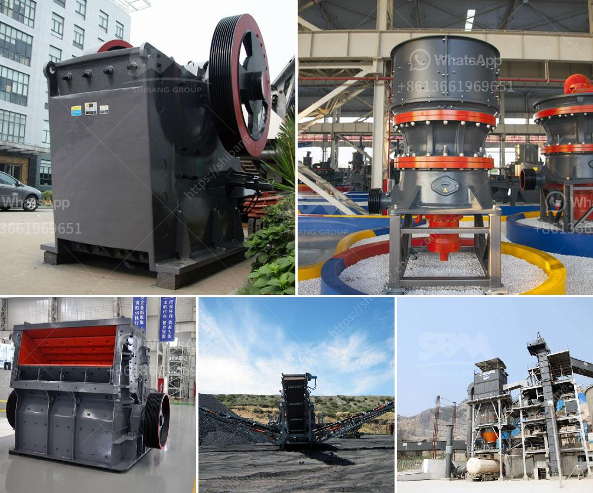

<h3>سعر معدات معالجة الكاولين</h3>
تستخدم معدات معالجة الكاولين في صناعة تصنيع الورق والمنتجات السيراميكية ومواد التجميل والدهانات والألوان والأدوية والمبيدات الحشرية والعديد من التطبيقات الأخرى. يعتبر الكاولين معدناً رمادياً أو أبيض اللون، وتتواجد ترسيباته بكميات كبيرة في جميع أنحاء العالم.

تتكون معدات معالجة الكاولين من عدة أجزاء رئيسية، بما في ذلك المحافظ والكسّارات والفرز والغربلة ومصنفات الهواء ووحدات التجفيف. يختلف سعر هذه المعدات حسب حجمها وقدرتها على معالجة الكميات المختلفة من الكاولين.

في المتوسط، تتراوح أسعار معدات معالجة الكاولين بين 50,000 دولار إلى 500,000 دولار. وتعتمد الفارق في السعر على القدرة الإنتاجية المطلوبة ومستوى التقنية المطلوب والعلامة التجارية للمعدات. بشكل عام، يحقق شراء معدات ذات جودة عالية توفيرًا أكبر في المستقبل بسبب المتانة والكفاءة العالية لها.

هناك العديد من الموردين والشركات المصنعة لمعدات معالجة الكاولين في جميع أنحاء العالم. ولذلك، ينبغي على المشتري أن يقوم بمقارنة الأسعار والمواصفات والخدمات المقدمة قبل اتخاذ قرار الشراء. يجب أن يحتوي القرار على تحليل الاحتياجات الدقيقة وتوفير الميزانية المناسبة.

بالإضافة إلى ذلك، يجب أن يتم اختيار العملاء لمعدات معالجة الكاولين وفقًا لسمعتهم وتاريخهم في تصنيع هذه المعدات. يجب أن تكون الشركة المصنعة قادرة على توفير خدمة ما بعد البيع كما ينبغي، بما في ذلك التدريب على استخدام المعدات وصيانتها وإصلاحها.

في النهاية، يتعين على المشتري تقييم تكلفة شراء وصيانة وتشغيل معدات معالجة الكاولين بدقة. على الرغم من أن سعر المعدات يمكن أن يكون مهماً، إلا أن الجودة والكفاءة يجب أن تكون في المقام الأول. إذا تم اختيار المعدات المناسبة بحنكة وتم صيانتها وتشغيلها بشكل صحيح، فإن معدات معالجة الكاولين يمكن أن تثري عملية التصنيع وتساهم في زيادة الإنتاجية وتقليل التكاليف.
<h3>Contact us</h3><ul><li><strong>Whatsapp:&nbsp;<a href="https://wa.me/8613661969651">+8613661969651</a></strong></li><li><a href="https://swt.shibang-china.com/?git&amp;zhl&amp;سعر معدات معالجة الكاولين"><strong>Online Service(chat now)</strong></a></li></ul><h3>Related</h3><ul><li><a href='كسارة التعدين في تنزانيا.md'>كسارة التعدين في تنزانيا</a></li><li><a href='كسارة صناعية.md'>كسارة صناعية</a></li><li><a href='مورد كسارة النحاس.md'>مورد كسارة النحاس</a></li><li><a href='آلة كسارة الحجر.md'>آلة كسارة الحجر</a></li><li><a href='معدات فاصل المغناطيس للبيع.md'>معدات فاصل المغناطيس للبيع</a></li></ul>