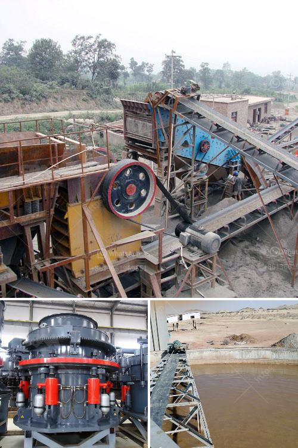

<h3>سعر معدات معالجة المنغنيز</h3>
معدات معالجة المنغنيز هي معدات رئيسية تستخدم في صناعة تعدين المنغنيز. يعتبر المنغنيز معدنًا هامًا يستخدم في العديد من التطبيقات الصناعية والتجارية. تتضمن استخدامات المنغنيز صناعة الصلب والألمنيوم والبطاريات والأدوية والأسمدة والتجهيزات الطبية والعديد من المنتجات الأخرى.

تتألف معدات معالجة المنغنيز عادة من العديد من الأجزاء المختلفة التي تعمل معًا لاستخلاص المعدن من الخام. تشمل هذه الأجزاء الكسارات والطواحين والفاصلات المغناطيسية والقواطع والغرابيل والناقلات ومعدات التحكم. تعتمد تكلفة المعدات على العديد من العوامل، بما في ذلك حجم المعدات وسعة الإنتاج المطلوبة ومستوى تكنولوجيا المعالجة.

يتراوح سعر معدات معالجة المنغنيز عادة بين 200 و 400 ألف دولار. ومع ذلك، يجب ملاحظة أن هذا السعر يعتمد على مجموعة متنوعة من العوامل ولا يشمل تكاليف أخرى مثل التجميع والتركيب والصيانة وتكاليف التشغيل الخاصة بالمعدات. قد يؤدي ارتفاع التكاليف غير المذكورة إلى زيادة السعر الإجمالي للمعدات.

من المهم أيضًا مراعاة أنواع المعدات المستخدمة في معالجة المنغنيز قد تؤثر على السعر. على سبيل المثال، قد تكون المعدات الحديثة والمتطورة أكثر تكلفة من المعدات القديمة أو التقليدية. يتأثر السعر أيضًا بالشركة المصنعة للمعدات، حيث قد تكون بعض العلامات التجارية الشهيرة أكثر تكلفة من العلامات التجارية الأخرى.

علاوة على ذلك، يتأثر السعر أيضًا بنوعية المعدات وموثوقيتها وكفاءتها. المعدات ذات الجودة العالية والتصميم المتقدم قد تكون أكثر تكلفة لشراءها، ولكنها قد تكون أكثر فعالية في تعدين المنغنيز وتحقيق نسبة استرداد عالية وتكون أيضًا أقل تكلفة في المدى الطويل.

باختصار، سعر معدات معالجة المنغنيز يتفاوت وفقًا لعدة عوامل، بما في ذلك حجم المعدات وسعة الإنتاج وتكنولوجيا المعالجة ونوعية المعدات وشركة التصنيع. يجب على الشركات الناشئة أو الشركات التي تبحث عن تجديد المعدات الحالية دراسة العوامل المختلفة وقياس فوائد الاستثمار في معدات معالجة المنغنيز المناسبة لاحتياجاتها.
<h3>Contact us</h3><ul><li><strong>Whatsapp:&nbsp;<a href="https://wa.me/8613661969651">+8613661969651</a></strong></li><li><a href="https://swt.shibang-china.com/?git&amp;zhl&amp;سعر معدات معالجة المنغنيز"><strong>Online Service(chat now)</strong></a></li></ul><h3>Related</h3><ul><li><a href='مصنع سحق وطحن.md'>مصنع سحق وطحن</a></li><li><a href='آلات تعدين الذهب مستعملة.md'>آلات تعدين الذهب مستعملة</a></li><li><a href='عملية سحق التعدين لخام الحديد.md'>عملية سحق التعدين لخام الحديد</a></li><li><a href='كسارات الفك المستعملة في إسبانيا.md'>كسارات الفك المستعملة في إسبانيا</a></li><li><a href='معدات إعادة تدوير الجبس للبيع.md'>معدات إعادة تدوير الجبس للبيع</a></li></ul>