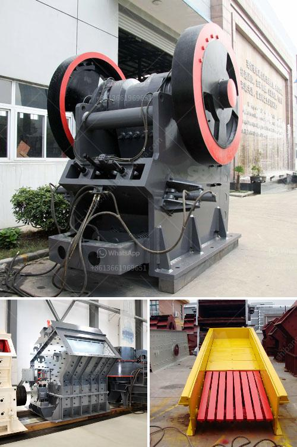

<h3>سعر منتج الكسارة في جنوب أفريقيا</h3>
تعدّ جنوب أفريقيا، واحدة من الدول الرائدة في قارة أفريقيا، بتاريخ طويل في صناعة التعدين والبناء. في هذا السياق، يأتي منتج الكسارة كواحد من المعدات الرئيسية المستخدمة في عمليات تكسير الصخور والتخلص من الخرسانة والحجارة المختلفة.

ينتج الكسارة من شركات عديدة في جنوب أفريقيا وتتوفر بمختلف الأحجام والأنواع وتستخدم بشكل واسع في مجموعة متنوعة من الصناعات. يتأثر سعر منتج الكسارة في جنوب أفريقيا بعدة عوامل مختلفة، بدءًا من حجم وسعة الكسارة وصولًا إلى العلامة التجارية ومستوى الجودة والتكنولوجيا المستخدمة فيها.

تتوفر الكسارات في جنوب أفريقيا بأسعار تتراوح بين 200 إلى 400 ألف راند جنوب أفريقي، وفقًا لحجم ومواصفات الكسارة. فعلى سبيل المثال، يمكنك الحصول على كسارة صخور بأسعر تتراوح بين 200 إلى 300 ألف راند، في حين أن كسارة الحجارة الكبيرة تتوفر بأسعار تتراوح بين 300 إلى 400 ألف راند.

ومع ذلك، يجب أن يتم اختيار الكسارة المناسبة بناءً على احتياجات المشروع المحددة، ولا يتم تحديدها فقط بناءً على السعر. يجب أن يتم النظر في جميع العوامل الأخرى مثل سعة الإنتاج المطلوبة، ومستوى الضوضاء، والفوائد والميزات المختلفة للكسارة.

علاوة على ذلك، يجب أيضًا مراعاة تكلفة الصيانة والتشغيل المستقبلية للكسارة، حيث يمكن أن تؤثر بشكل كبير على الجانب المالي للمشروع.

عند شراء الكسارة، يجب التعاون مع مورد موثوق وتتوفر العديد من الشركات المصنعة للكسارات في جنوب أفريقيا. يمكن العثور على المعلومات عن تلك الشركات عبر الإنترنت أو من خلال الاتصال بجمعيات الصناعة والجمعيات التجارية.

باختصار، يتراوح سعر منتج الكسارة في جنوب أفريقيا بين 200 إلى 400 ألف راند، وتتأثر هذه الأسعار بالعديد من العوامل المختلفة. ومن الضروري اختيار الكسارة المناسبة بناءً على احتياجات المشروع والميزانية المتاحة مع النظر في عوامل أخرى مثل التكلفة المستقبلية للصيانة والتشغيل.
<h3>Contact us</h3><ul><li><strong>Whatsapp:&nbsp;<a href="https://wa.me/8613661969651">+8613661969651</a></strong></li><li><a href="https://swt.shibang-china.com/?git&amp;zhl&amp;سعر منتج الكسارة في جنوب أفريقيا"><strong>Online Service(chat now)</strong></a></li></ul><h3>Related</h3><ul><li><a href='خط إنتاج الخرسانة الثاني.md'>خط إنتاج الخرسانة الثاني</a></li><li><a href='شركة تصنيع مطحنة ريموند.md'>شركة تصنيع مطحنة ريموند</a></li><li><a href='أنواع السيور الناقلة.md'>أنواع السيور الناقلة</a></li><li><a href='فرضية عامة لكسارة الفك.md'>فرضية عامة لكسارة الفك</a></li><li><a href='آلة كسارة الحجر 250 400.md'>آلة كسارة الحجر 250 400</a></li></ul>