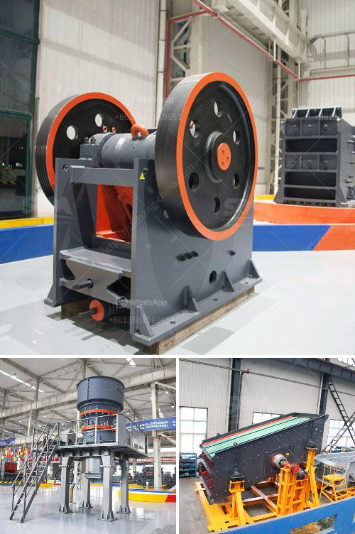

<h3>سعر ناقل الحزام للتعدين</h3>
ناقل الحزام هو جهاز يستخدم في صناعة التعدين لنقل المواد من مكان إلى آخر. يعتبر ناقل الحزام أحد الأدوات الرئيسية والمهمة في عمليات التعدين، حيث يمكنه نقل كميات كبيرة من المواد بكفاءة وسرعة.

تختلف أسعار نواقل الحزام للتعدين حسب الحجم والسعة المطلوبة، فقد تبدأ الأسعار من حوالي 200 دولار وتصل إلى 400 دولار أو أكثر للنماذج ذات السعة الكبيرة والمواصفات المتقدمة.

يعتمد سعر ناقل الحزام أيضًا على مكوناته وجودة التصنيع. فعلى سبيل المثال، يعتبر الحزام الناقل المصنوع من المواد الفولاذية المتينة أكثر تكلفة من الحزام الناقل المصنوع من المواد البلاستيكية المتجددة.

بالإضافة إلى ذلك، قد ينتج تكلفة ناقل الحزام أيضًا عن العوامل البيئية والتشغيلية. فعلى سبيل المثال، إذا كان الموقع الذي ستستخدم فيه آلة نقل الحزام يتطلب تكاليف إضافية مثل الأعمال الأرضية أو التمهيديّة، فقد يرتفع سعر الناقل بشكل كبير.

علاوة على ذلك، يجب أن تضاف تكاليف الصيانة والاستبدال للتكلفة الإجمالية لناقل الحزام. فرغم أن النواقل الحزامية تعتبر عادةً موثوقة وتحتاج إلى صيانة أقل من غيرها من الأدوات، تحتاج لاستبدال الأجزاء التالفة بمرور الوقت. قد تشمل تكلفة الصيانة العادية تكاليف مثل تزييت الحزام وتغيير الأسطوانات والسيور المسننة.

في النهاية، يجب مراعاة أن ناقل الحزام للتعدين طرازة متعددة ومتنوعة، ويمكن تخصيصها وفقًا لاحتياجات العميل المحددة. وبغض النظر عن السعر، يجب على المشتري تقييم المواصفات المطلوبة وجودة التصنيع للوصول إلى أفضل اختيار.

باختصار، فإن سعر ناقل الحزام للتعدين يتفاوت حسب الحجم والسعة والجودة والمكونات والمواصفات المطلوبة، ويمكن أن يتراوح بين 200 و400 دولار أو أكثر، ويجب مراعاة التكاليف الإضافية مثل التركيب والصيانة واحتياجات الموقع قبل اتخاذ القرار النهائي بشراء الناقل المناسب.
<h3>Contact us</h3><ul><li><strong>Whatsapp:&nbsp;<a href="https://wa.me/8613661969651">+8613661969651</a></strong></li><li><a href="https://swt.shibang-china.com/?git&amp;zhl&amp;سعر ناقل الحزام للتعدين"><strong>Online Service(chat now)</strong></a></li></ul><h3>Related</h3><ul><li><a href='قائمة الآلات المستخدمة في تعدين الفحم.md'>قائمة الآلات المستخدمة في تعدين الفحم</a></li><li><a href='خطة عمل لإنتاج الجبس.md'>خطة عمل لإنتاج الجبس</a></li><li><a href='كسارة للإيجار في نيو جيرسي.md'>كسارة للإيجار في نيو جيرسي</a></li><li><a href='كسارة حجر للبناء.md'>كسارة حجر للبناء</a></li><li><a href='كسارات محمولة مستعملة للبيع في جنوب أفريقيا.md'>كسارات محمولة مستعملة للبيع في جنوب أفريقيا</a></li></ul>