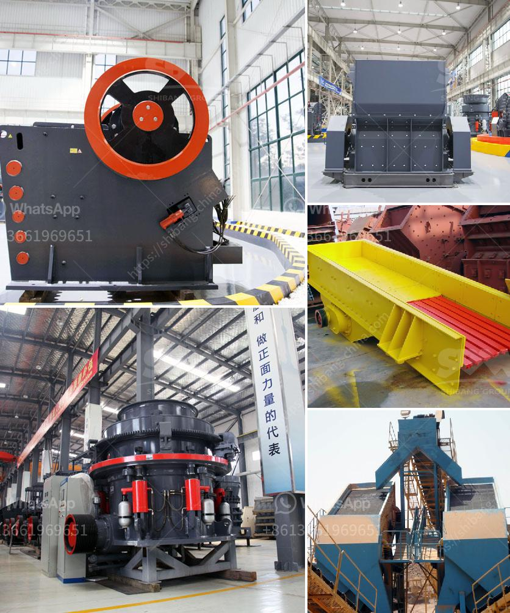

<h3>سلاسل ناقلات للكسارات</h3>
تعتبر سلاسل ناقلات للكسارات أحد الأدوات الهامة والضرورية في صناعة التعدين والبناء. فهي تستخدم لنقل المواد الخام والحجارة المكسورة من مكان الكسارة إلى مكان التخزين أو المعالجة. تلعب السلاسل الناقلة دورًا حيويًا في تسهيل تدفق المواد وتحقيق الكفاءة العالية في عملية الإنتاج.

تتميز سلاسل ناقلات الكسارات بالعديد من المزايا. فأولًا وقبل كل شيء، فإنها قوية ومتينة، مصنوعة من مواد عالية الجودة مثل الفولاذ المقاوم للصدأ أو البوليمرات المقواة بالألياف، مما يتيح لها تحمل الأحمال الثقيلة والتحديات البيئية المختلفة مثل الحرارة والغبار والرطوبة.

بالإضافة إلى ذلك، تعزز تصميمات السلاسل الناقلة القوية استقرار التحميل، مما يقلل من خطر الانزلاق والانقطاعات في سير العمل. كما أنها تسمح بسهولة تكييف الكسارات مع الطبقات الأخرى في الناقلة مثل السيور والأسطوانات ، مما يوفر نظامًا متكاملاً لنقل المواد وتحسين الكفاءة.

وبفضل تقنيات الأتمتة المتقدمة، استخدام السلاسل الناقلة للكسارات أصبح بسيطًا ومريحًا. توفر الأجهزة المركزية القدرة على التحكم في عملية النقل بكفاءة عالية وبدقة متناهية، مما يقلل من الأخطاء البشرية ويزيد من الأمان في العمل.

بالإضافة إلى ذلك، يعتبر استخدام سلاسل ناقلات الكسارات هو الخيار الاقتصادي الأمثل للشركات. فهي تساعد على زيادة الإنتاجية وتقليل تكاليف التشغيل. فعندما تكون العملية سلسة وفعالة، يتم تحقيق زيادة في إنتاجية الكسارات مع توجيه المعدات المكسورة بشكل سليم ودقيق إلى مكان التخزين أو المعالجة.

في الختام، فإن سلاسل ناقلات الكسارات تعد أحد العوامل الأساسية في الصناعة التعدينية والبنائية. فهي تسهم في تسهيل عمليات الإنتاج وتحقيق الكفاءة العالية. بفضل تكنولوجيا التحكم والتصميمات القوية ، فإن استخدام هذه السلاسل يعد الخيار الأمثل لتلبية احتياجات الشركات وتحقيق الازدهار الاقتصادي.
<h3>Contact us</h3><ul><li><strong>Whatsapp:&nbsp;<a href="https://wa.me/8613661969651">+8613661969651</a></strong></li><li><a href="https://swt.shibang-china.com/?git&amp;zhl&amp;سلاسل ناقلات للكسارات"><strong>Online Service(chat now)</strong></a></li></ul><h3>Related</h3><ul><li><a href='شركات تصنيع آلات الطحن في تايلاند.md'>شركات تصنيع آلات الطحن في تايلاند</a></li><li><a href='تأجير كسارة تأجير في غانا.md'>تأجير كسارة تأجير في غانا</a></li><li><a href='مصنع كسارة متنقلة للبيع.md'>مصنع كسارة متنقلة للبيع</a></li><li><a href='سعة الكسارة المحمولة ٢٠٠ طن في الساعة.md'>سعة الكسارة المحمولة ٢٠٠ طن في الساعة</a></li><li><a href='معدات فحص الكسارات.md'>معدات فحص الكسارات</a></li></ul>