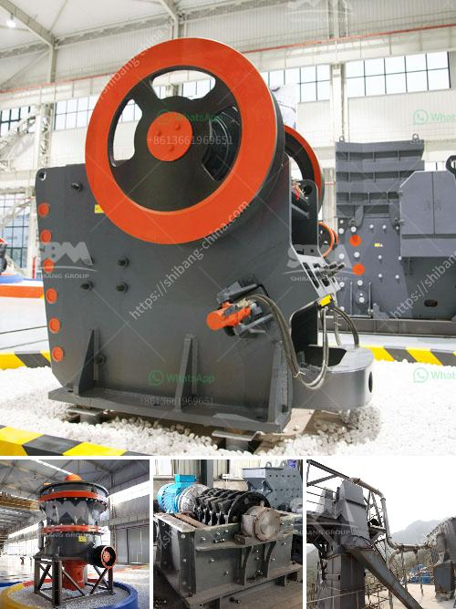

<h3>سلامة سير الناقلات ppt</h3>
تعتبر سلامة سير الناقلات ppt أمرًا بالغ الأهمية في العديد من الصناعات، بما في ذلك صناعة النفط والغاز والتعدين والصناعات الثقيلة الأخرى. تهدف هذه الناقلات إلى نقل المواد الخام والمنتجات النهائية بأمان وفعالية من مكان لآخر. ومع ذلك، فإن سلامة سير الناقلات ppt قد تتعرض للعديد من المخاطر التي يجب توخي الحذر منها.

أحد أهم جوانب سلامة سير الناقلات ppt هو الحفاظ على الاستقرار ومنع الانقلاب أثناء التشغيل. ولإنجاز ذلك، يجب أن يكون التصميم الهندسي للناقلة محسّنًا لتوفير توزان مثلى وتوزيع للوزن صحيح. يجب أيضًا تأمين الحمولة بشكل صحيح وتجنب فوضى تنظيم الشحنة، وذلك حتى لا تؤثر على استقرار الناقلة.

علاوة على ذلك، يتعين توفير الصيانة الدورية والروتينية لجميع أجزاء الناقلة، بما في ذلك الأحزمة والأسلاك والألواح والمحركات والتروس. يجب فحص هذه الأجزاء بشكل منتظم وتنظيفها وإصلاحها عند الحاجة، حتى لا تقدم على أي أعطال غير متوقعة تعرض سلامة سير الناقلة ppt للخطر.

من المهم أيضًا توفير التدريب المناسب للعمال المشتغلين على الناقلات ppt. يجب على العاملين أن يكونوا على دراية بجميع الإجراءات الأمنية والتشغيلية، وأن يتم تجهيزهم بالمعرفة المطلوبة للتعرف على المخاطر والتصرف فيها. يجب أيضًا على العاملين ارتداء الملابس الواقية واستخدام وسائل الحماية الشخصية المطلوبة لضمان سلامتهم أثناء العمل بالناقلات.

في النهاية، يجب على الشركات وأصحاب المصانع أن يلتزموا بالتشريعات والأنظمة السلامة والصحة المهنية الصارمة التي تنص على سلامة سير الناقلات ppt. ينبغي عليهم أيضًا تعزيز ثقافة السلامة في مكان العمل من خلال التوعية والتدريب والتفتيش المنتظم. فالاستثمار في سلامة سير الناقلات ppt لا يكلف الشركات الكثير، ولكنه يمكن أن يحقق انخفاضًا كبيرًا في المخاطر والأضرار غير المرغوب فيها ويحسّن بشكل عام السلامة والأداء.

باختصار، سلامة سير الناقلات ppt أمرٌ لا غنى عنه في الصناعات المختلفة. يجب العمل على توفير التصميم الهندسي المثلى، والصيانة الدورية، والتدريب المناسب للعاملين، والامتثال للتشريعات والأنظمة المنصوص عليها. تعتبر سلامة سير الناقلات ppt تدابير حماية ضرورية للحفاظ على سلامة العاملين وممتلكات الشركة وبيئة العمل.
<h3>Contact us</h3><ul><li><strong>Whatsapp:&nbsp;<a href="https://wa.me/8613661969651">+8613661969651</a></strong></li><li><a href="https://swt.shibang-china.com/?git&amp;zhl&amp;سلامة سير الناقلات ppt"><strong>Online Service(chat now)</strong></a></li></ul><h3>Related</h3><ul><li><a href='كسارة تأثير الحجر الجيري.md'>كسارة تأثير الحجر الجيري</a></li><li><a href='تكلفة الآلات لمصنع الأسمنت.md'>تكلفة الآلات لمصنع الأسمنت</a></li><li><a href='مطحنة طحن فائقة الدقة.md'>مطحنة طحن فائقة الدقة</a></li><li><a href='آخر مطحنة هامر.md'>آخر مطحنة هامر</a></li><li><a href='كسارة التعدين في تنزانيا.md'>كسارة التعدين في تنزانيا</a></li></ul>