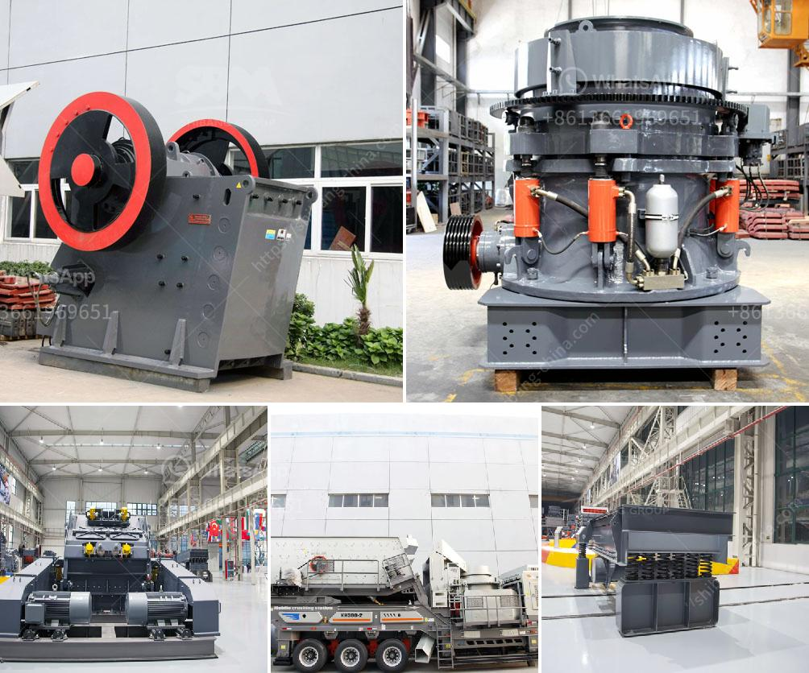

<h3>سلسلة SCM لطحن المساحيق الدقيقة</h3>
تعتبر سلسلة SCM لطحن المساحيق الدقيقة من أهم الأدوات التي يمكن استخدامها في العديد من الصناعات مثل صناعة الأسمنت والفحم والمعادن والمواد الكيميائية. توفر هذه السلسلة تقنيات طحن متقدمة تعمل على تحويل المواد الخام الخشنة إلى مساحيق دقيقة ومتجانسة.

تتضمن سلسلة SCM لطحن المساحيق الدقيقة عدة مكونات أساسية مثل الكسارة الفكية، ومغذي الاهتزاز، ومطحنة الأسطوانة، ومصعد الدلو، والكشاف الدوامي، وحقيبة الفلتر، والكهرومغناطيسي، ومراقبة الكمبيوتر. تعمل هذه المكونات بتناغم لتحقيق عملية طحن سلسة وفعالة.

تعمل الكسارة الفكية على تفتيت المواد الخام الخشنة إلى قطع أصغر تصلح للطحن. بعد ذلك، يتم إرسال المواد إلى مغذي الاهتزاز الذي يقوم بتوزيع المواد بالتساوي في مطحنة الأسطوانة. تعتبر مطحنة الأسطوانة العنصر الأساسي في عملية طحن المساحيق، حيث يتم طحن المواد الخام تحت ضغط عالٍ بين الأسطوانات المتداولة.

بعد طحن المواد، يتم نقلها إلى مصعد الدلو للوصول إلى الكشاف الدوامي، الذي يساعد على فصل المساحيق الدقيقة من الجسيمات الخشنة. ثم يتم إرسال المساحيق الدقيقة إلى حقيبة الفلتر حيث يتم تصفية الأتربة والشوائب. وأخيرًا، يتم تفريغ المساحيق النهائية باستخدام الكهرومغناطيسي إلى وسيلة التخزين المناسبة.

توفر سلسلة SCM لطحن المساحيق الدقيقة العديد من المزايا. فهي تستخدم تقنيات طحن متقدمة تعمل على تحسين جودة المساحيق النهائية وزيادة كفاءة الإنتاج. كما توفر أيضًا عملية طحن آمنة وموثوقة بفضل نظام الحماية والتحكم في الأمان المدمج. وبفضل مظهرها المعاصر وتصميمها المبتكر، فإن سلسلة SCM تتناسب مع الاحتياجات الصناعية المتنوعة وتلبي متطلبات العملاء.

باختصار، فإن سلسلة SCM لطحن المساحيق الدقيقة تعتبر أداة حديثة وفعالة في صناعة التحويل من المواد الخام الخشنة إلى مساحيق دقيقة. توفر هذه السلسلة أداء متفوقًا وجودة منتج فائقة، مما يساهم في تحسين العملية الصناعية وتلبية احتياجات السوق.
<h3>Contact us</h3><ul><li><strong>Whatsapp:&nbsp;<a href="https://wa.me/8613661969651">+8613661969651</a></strong></li><li><a href="https://swt.shibang-china.com/?git&amp;zhl&amp;سلسلة SCM لطحن المساحيق الدقيقة"><strong>Online Service(chat now)</strong></a></li></ul><h3>Related</h3><ul><li><a href='آلة فحص الرمل في ماليزيا.md'>آلة فحص الرمل في ماليزيا</a></li><li><a href='تكلفة مشروع إنتاج الرمل في الهند.md'>تكلفة مشروع إنتاج الرمل في الهند</a></li><li><a href='معدات زراعية للبيع بأسعار مناسبة.md'>معدات زراعية للبيع بأسعار مناسبة</a></li><li><a href='كسارات الحجر في نيجيريا.md'>كسارات الحجر في نيجيريا</a></li><li><a href='كتالوج كسارة الفك بوزولانا.md'>كتالوج كسارة الفك بوزولانا</a></li></ul>