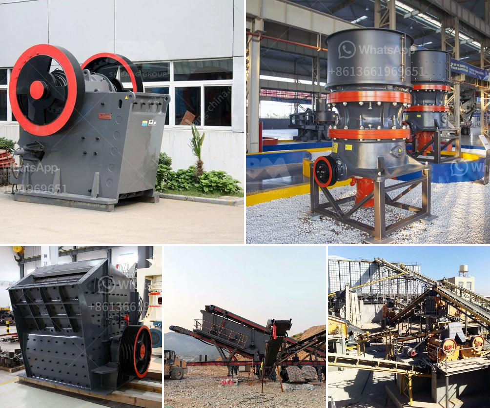

<h3>سيارة الوحش كسارة الحجر</h3>
تعتبر سيارة الوحش "كسارة الحجر" أحد أفضل الآليات الثقيلة في عالم البناء والتشييد. تم تصميم هذه السيارة لتحمل الأوزان الثقيلة وتحقيق الإنتاجية العالية في عمليات سحق الحجارة والصخور داخل المحاجر والمناجم.

تتميز كسارة الحجر بالعديد من الميزات الفريدة التي تساعدها على القيام بمهامها بكفاءة عالية. فهي تحتوي على مجموعة من الأسنان الحادة التي تستخدم لسحق الحجارة وتحويلها إلى قطع صغيرة متجانسة. بالإضافة إلى ذلك، يتميز الوحش بنظام تحكم متقدم يسمح للمشغل بضبط سرعة العمل واختيار حجم القطع المرغوب فيه.

تعتبر قوة المحرك من أهم جوانب هذه السيارة الضخمة. فهي تعمل بمحرك ذو قدرة عالية وباستخدام الديزل، مما يسمح لها بالتحرك بسهولة على الطرق غير المستوية وتسلق التلال الصعبة. كما أن الوحش مزود بنظام تعليق قوي يسمح له بالتحرك بسرعة وثبات برغم الظروف الوعرة.

من الجوانب الأخرى المهمة لهذه السيارة الضخمة هو حجمها الكبير. تتميز كسارة الحجر ببنية خارجية قوية مصنوعة من الفولاذ المقاوم للصدأ، مما يجعلها قادرة على مواجهة الاحتكاك العالي والتآكل المحتمل. كما يسمح لها الحجم الكبير بتخزين كميات كبيرة من المواد المفرومة في السلة الخاصة بها، مما يسهم في زيادة الكفاءة وتقليل عدد الرحلات لتفريغ المواد المفرومة.

بشكل عام، يعتبر "كسارة الحجر" سيارة وحشية لا مثيل لها في صناعة البناء والتشييد. وبفضل مزاياها العديدة مثل الأداء القوي والكفاءة العالية، فإن استخدامها يساهم في زيادة الإنتاجية وتحقيق أرباح أعلى في صناعة البناء والتشييد.
<h3>Contact us</h3><ul><li><strong>Whatsapp:&nbsp;<a href="https://wa.me/8613661969651">+8613661969651</a></strong></li><li><a href="https://swt.shibang-china.com/?git&amp;zhl&amp;سيارة الوحش كسارة الحجر"><strong>Online Service(chat now)</strong></a></li></ul><h3>Related</h3><ul><li><a href='شركة تصنيع آلات كسارة الرخام.md'>شركة تصنيع آلات كسارة الرخام</a></li><li><a href='سعر كسارة الفك PE 400.md'>سعر كسارة الفك PE 400</a></li><li><a href='عملية تصنيع بروميد الكالسيوم.md'>عملية تصنيع بروميد الكالسيوم</a></li><li><a href='أصغر كسارة فك محمولة للبيع في جنوب أفريقيا.md'>أصغر كسارة فك محمولة للبيع في جنوب أفريقيا</a></li><li><a href='صيانة مطحنة الأسطوانة العمودية  تنزيل PDF.md'>صيانة مطحنة الأسطوانة العمودية - تنزيل PDF</a></li></ul>