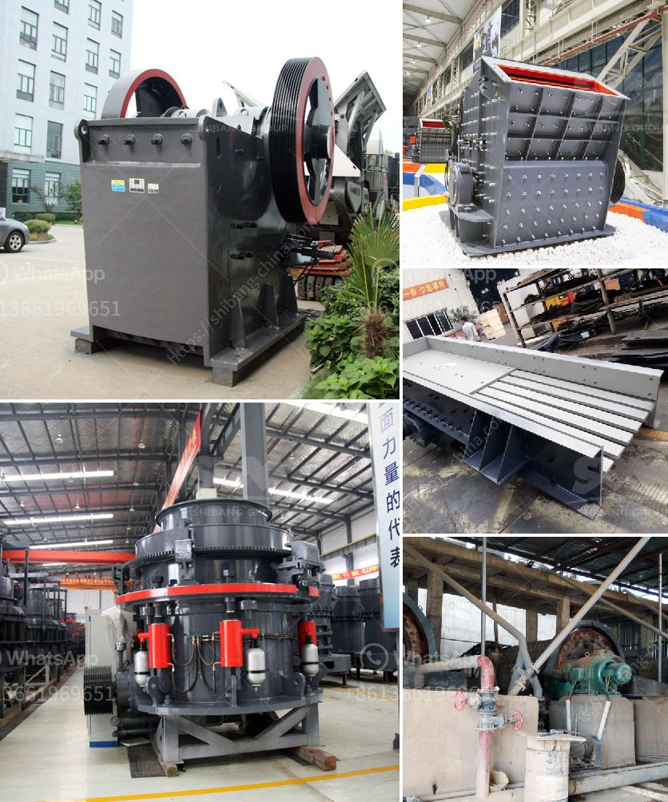

<h3>سير الناقل في زامبيا</h3>
زامبيا هي دولة رائعة في شرق أفريقيا وتعد واحدة من الدول الأكثر استقرارًا في المنطقة. تعتبر زامبيا جنة للسياحة والطبيعة الخلابة. يلعب الناقل دورًا هامًا في ربط المدن والمناطق وتسهيل حركة السفر والسياحة في البلاد.

تعد السكك الحديدية مكوناً أساسياً في نظام النقل في زامبيا. تعمل هذه الشبكة الحديدية على نقل البضائع والركاب على طول البلاد وبالتالي تعزز التجارة والتنمية الاقتصادية. تعمل قطارات الركاب في زامبيا على ربط المدن الرئيسية مثل لوساكا وكيتوي وليفينغستون ونديلي وأنخلسي وغيرها. توفر هذه القطارات وسيلة موثوقة ورخيصة للتنقل بين المدن والاستمتاع بالمناظر الطبيعية الرائعة في البلاد.

إلى جانب السكك الحديدية ، توفر زامبيا أيضًا شبكة طرق جيدة تربط العديد من المدن والمناطق. تم تحسين الطرق في السنوات الأخيرة وتم وضع الكثير من الجهود لتوسيع وإصلاح البنية التحتية. هذا ساهم بشكل كبير في تيسير حركة النقل وخفض تكاليف النقل وتعزيز الاقتصاد.

بالإضافة إلى السكك الحديدية والطرق ، توجد أيضًا مطارات في العديد من المدن الكبرى في زامبيا ، مما يتيح السفر بالطائرات الى ومن زامبيا بسهولة. مطار لوساكا الدولي هو المطار الرئيسي في البلاد ويعتبر بوابة للسفر الدولي والوصول إلى المدن الأخرى في البلاد. يعتبر القطاع الجوي في زامبيا نشطًا ويستقبل العديد من الرحلات الجوية من جميع أنحاء العالم.

على الرغم من التقدم في البنية التحتية للنقل في زامبيا ، فإنها لا تزال تواجه تحديات بعضها لحساب المسافات الكبيرة بين المدن في البلاد وانعدام التطوير في بعض المناطق النائية. هناك احتياج مستمر لإدخال تحسينات إضافية في شبكة النقل لتعزيز التجارة والتواصل والسياحة في البلاد.

باختصار ، نظام النقل في زامبيا يستند إلى السكك الحديدية والطرق والمطارات التي تعمل معًا لتوفير وسائل سفر موثوقة وفعالة في البلاد. تحديث النقل في السنوات الأخيرة أسهم في تعزيز الاقتصاد وتعزيز السياحة في زامبيا وساعد في ربط المدن وتمكين التنقل بينها بسهولة وراحة.
<h3>Contact us</h3><ul><li><strong>Whatsapp:&nbsp;<a href="https://wa.me/8613661969651">+8613661969651</a></strong></li><li><a href="https://swt.shibang-china.com/?git&amp;zhl&amp;سير الناقل في زامبيا"><strong>Online Service(chat now)</strong></a></li></ul><h3>Related</h3><ul><li><a href='تحليل التكلفة للكسارات.md'>تحليل التكلفة للكسارات</a></li><li><a href='كسارة فكية ثابتة للبيع.md'>كسارة فكية ثابتة للبيع</a></li><li><a href='موردين طاحونة الفحم.md'>موردين طاحونة الفحم</a></li><li><a href='مصنعين كسارات في روسيا.md'>مصنعين كسارات في روسيا</a></li><li><a href='سير ناقل في دبي.md'>سير ناقل في دبي</a></li></ul>