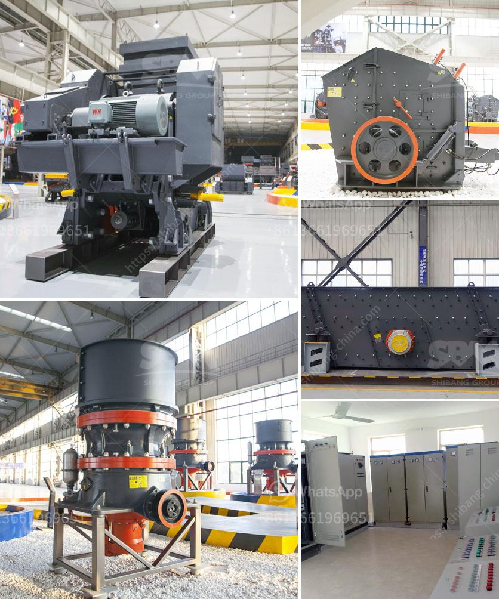

<h3>سير الناقل في ميريدا</h3>
في هذه المقالة، سنتناول سير الناقل في مدينة ميريدا. تعد ميريدا واحدة من أجمل وجهات السفر في المكسيك، وتشتهر بثقافتها الغنية وتاريخها العريق. تعتبر وسائل النقل العامة في ميريدا من بين أفضل وأسهل الطرق لاستكشاف هذه المدينة الجميلة.

تتوفر في ميريدا مجموعة متنوعة من وسائل النقل العامة، بما في ذلك الحافلات وسيارات الأجرة والتاكسي. تعتبر الحافلات وسيلة النقل الأكثر شيوعًا وتستخدم على نطاق واسع من قبل السكان المحليين والسياح على حد سواء. تعمل الحافلات بانتظام وتغطي شبكة واسعة من المسارات في المدينة. بفضل أسعارها المعقولة وراحة استخدامها، يعتبر الناقل في حافلات ميريدا خيارًا شعبيًا للتنقل.

بالإضافة إلى الحافلات، يمكن العثور على العديد من سيارات الأجرة في ميريدا. تعد سيارات الأجرة وسيلة نقل سريعة ومريحة وتتيح للمسافر الانتقال بسهولة إلى الوجهات المحددة بدون توقفات تتعلق بالحافلات. من الجدير بالذكر أن أسعار سيارات الأجرة يمكن التفاوض فيها قبل الركوب لتجنب المشاكل في المستقبل.

وبالطبع، يوجد أيضًا خيار التاكسي التقليدي في ميريدا. يوجد العديد من سيارات التاكسي في المدينة، ويتميز سائقو التاكسي بالمعرفة الجيدة بالمنطقة وإمكانية الوصول إلى الوجهات بسرعة ودقة. تعتبر استخدام سيارات التاكسي خيارًا ملائمًا ومناسبًا للرحلات القصيرة وللمناطق التي لا يصلها الحافلات أو سيارات الأجرة.

لا يزال بإمكان الزائرين الاكتشاف والتجوال في ميريدا سيرًا على الأقدام. يعد المشي وسيلة رائعة للاستمتاع بجمال المدينة واستكشاف ازدحامها الحضري الرائع والثقافة المحلية. بفضل الطقس المعتدل على مدار العام والمعالم السياحية الشهيرة المنتشرة في جميع أنحاء المدينة، يمكن للمشاة الانتقال بسهولة من مكان لآخر والاستمتاع بكل تفاصيل المدينة.

باختصار، يمتاز سير الناقل في ميريدا بتنوعه وسهولة استخدامه. من خلال استخدام الحافلات أو سيارات الأجرة أو التاكسي، يمكن للسائحين والسكان المحليين استكشاف المدينة والانتقال بسلاسة وراحة. كما يمكن الاستمتاع بالمشي في شوارع ميريدا الجميلة والاستمتاع بجمالها وتاريخها. إن سير الناقل في ميريدا لا شك أمر يستحق التجربة.
<h3>Contact us</h3><ul><li><strong>Whatsapp:&nbsp;<a href="https://wa.me/8613661969651">+8613661969651</a></strong></li><li><a href="https://swt.shibang-china.com/?git&amp;zhl&amp;سير الناقل في ميريدا"><strong>Online Service(chat now)</strong></a></li></ul><h3>Related</h3><ul><li><a href='سحق 100 طن في الساعة.md'>سحق 100 طن في الساعة</a></li><li><a href='مطحنة أسطوانية عمودية.md'>مطحنة أسطوانية عمودية</a></li><li><a href='مصنع كسارة الحجر في ويست بنغال.md'>مصنع كسارة الحجر في ويست بنغال</a></li><li><a href='مطحنة ريموند في تشيناي.md'>مطحنة ريموند في تشيناي</a></li><li><a href='معدات تعدين الذهب الطبيعي في الصين.md'>معدات تعدين الذهب الطبيعي في الصين</a></li></ul>