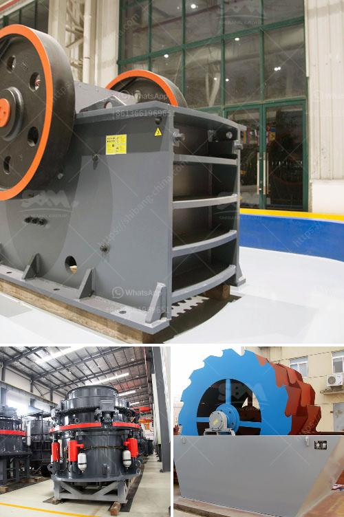

<h3>سير ناقل في دبي</h3>
تشتهر مدينة دبي بتقديم خدمات النقل العام الحديثة والمتطورة. تعتبر السكك الحديدية والأتوبيسات والمترو والتاكسي من وسائل النقل الشائعة في المدينة. تعتبر هذه الوسائل آمنة وفعالة وموثوقة، وتسهم في تسهيل حركة المرور وتقليل الازدحامات المرورية.

تعتبر السكك الحديدية واحدة من أفضل طرق النقل العام في دبي. تتصل العديد من مناطق المدينة الرئيسية بالسكك الحديدية، مما يسهل على السكان التنقل من مكان لآخر. بالإضافة إلى ذلك، فإن استخدام القطارات يحافظ على الوقت الثمين، حيث تتوقف القطارات في محطات محددة ومجدولة.

وفيما يتعلق بالأتوبيسات، تعد واحدة من أسرع وأوفر وسائل النقل في دبي. تغطي الأتوبيسات شبكة واسعة من المسارات في المدينة، وتمتاز بترددها المنتظم وتوفر خدمة على مدار الساعة. تقدم الأتوبيسات أيضًا مزايا إضافية مثل توفير تذاكر الانتقال المتعددة الراحة والمرونة للمسافرين.

جاء مترو دبي ليكون من بين أكثر وسائل النقل العام شعبية. يتميز نظام المترو بكونه سريع ونظيف وسهل الاستخدام. يبلغ طول شبكة المترو في دبي حوالي 75 كيلومترًا، وتعتبر محطات المترو مواقع رئيسية للتواصل بين المناطق المختلفة في المدينة. وتتميز عربات المترو بالراحة والتكيف المثلى للحرارة، مما يجعل رحلة المترو إجمالاً تجربة ممتعة.

يعتبر التاكسي أيضًا وسيلة شائعة للنقل في دبي، ويتوفر بكثرة في مختلف أنحاء المدينة. يُعتبر التاكسي واحدًا من أسرع وأسهل الوسائل للتنقل في مدينة دبي، خاصة في الأوقات التي تعج فيها الطرق المزدحمة. يتميز التاكسي في دبي بالنظافة والاحترافية، ويستخدم المقيمون والزوار التاكسي باستمرار للوصول إلى وجهاتهم بسهولة.

في الختام، نجد أن دبي توفر مجموعة متنوعة من وسائل النقل العام الحديثة والمريحة. إن مزايا هذه الوسائل تشجع الناس على استخدامها وتقليل حاجتهم إلى الاعتماد على وسائل النقل الخاصة. يعتبر تطوير سير النقل في دبي إنجازًا كبيرًا في تسهيل حياة الناس وتحسين رفاهيتهم.
<h3>Contact us</h3><ul><li><strong>Whatsapp:&nbsp;<a href="https://wa.me/8613661969651">+8613661969651</a></strong></li><li><a href="https://swt.shibang-china.com/?git&amp;zhl&amp;سير ناقل في دبي"><strong>Online Service(chat now)</strong></a></li></ul><h3>Related</h3><ul><li><a href='قائمة بشركات تصنيع مصنع كسارة الحجر.md'>قائمة بشركات تصنيع مصنع كسارة الحجر</a></li><li><a href='تطبيق آلة صنع الرمل.md'>تطبيق آلة صنع الرمل</a></li><li><a href='معدات تعدين الرمال في ماليزيا.md'>معدات تعدين الرمال في ماليزيا</a></li><li><a href='عملية الحجر الجيري.md'>عملية الحجر الجيري</a></li><li><a href='تأجير حزام الناقل في أيرلندا.md'>تأجير حزام الناقل في أيرلندا</a></li></ul>