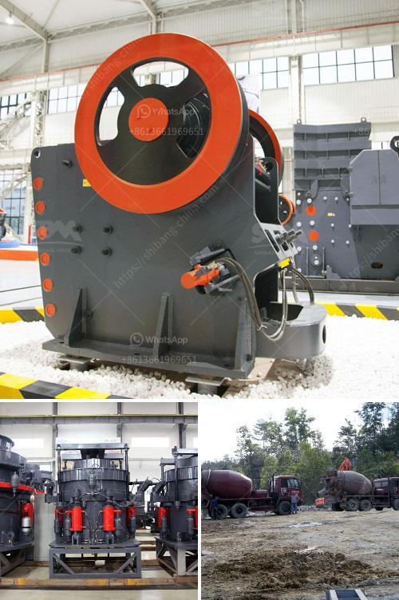

<h3>سير ناقل لرماد الفحم</h3>
سير ناقل لرماد الفحم هو نظام يستخدم لنقل الرماد المتولد من محطات توليد الطاقة التي تعتمد على الفحم كوقود. يعتبر الرماد الناتج عن احتراق الفحم بديلاً قابلاً للاستخدام في العديد من الصناعات من أجل تقليل التلوث البيئي والاستفادة الاقتصادية من المخلفات.

يتكون سير ناقل لرماد الفحم من مجموعة من السيور الناقلة المتصلة بأحزمة معدنية تنقل الرماد من منطقة تجميعه إلى منطقة التخزين أو الاستخدام. تتميز هذه السيور بقدرتها على تحمل الأحمال الثقيلة وسرعة الحركة التي تعمل بها.

يمتاز سير ناقل لرماد الفحم بعدة مزايا. أولاً، يوفر طريقة فعالة وآمنة لنقل الرماد دون الحاجة إلى استخدام الشاحنات أو القطارات، مما يقلل من انبعاثات غازات العادم ويحسن جودة الهواء في المنطقة المحيطة بالمحطة. ثانيًا، يساهم في تقليل تكاليف الإنتاج والصيانة المتعلقة بالنقل، حيث يمكن الاعتماد على السيور الناقلة لتلبية الاحتياجات اليومية. 

بالإضافة إلى ذلك، يتميز سير ناقل لرماد الفحم بقدرته على التكيف مع أي مسافة أو ارتفاع يلزم للنقل. حيث يمكن تصميم السيور بطول يتراوح بين مئات الأمتار والعديد من الكيلومترات، ويمكن رفعها بشكل عمودي لمئات الأمتار في حالة الحاجة.

علاوة على ذلك، يساهم سير ناقل لرماد الفحم في تحسين جودة العمل والأمان. حيث يعمل النظام بشكل تلقائي دون الحاجة لتدخل بشري كبير، مما يقلل من حوادث العمل ويضمن استمرارية العمل في المحطة.

وفي الختام، يجب الإشارة إلى أن استخدام سير ناقل لرماد الفحم يعتبر خطوة مهمة في تعزيز الاستدامة البيئية وتقليل التلوث الناتج عن هذه الصناعة. كما يعد تحسينًا في عملية النقل والتخلص من مخلفات الفحم، ويساهم في الاستفادة الاقتصادية من الرماد كمورد ثانوي قابل للتطبيق في العديد من الصناعات الأخرى.
<h3>Contact us</h3><ul><li><strong>Whatsapp:&nbsp;<a href="https://wa.me/8613661969651">+8613661969651</a></strong></li><li><a href="https://swt.shibang-china.com/?git&amp;zhl&amp;سير ناقل لرماد الفحم"><strong>Online Service(chat now)</strong></a></li></ul><h3>Related</h3><ul><li><a href='مصنع كسارة الحجر بسعة 100 طن.md'>مصنع كسارة الحجر بسعة 100 طن</a></li><li><a href='عملية تحسين الحجر الجيري.md'>عملية تحسين الحجر الجيري</a></li><li><a href='أسعار آلات تكسير الحجر في زيمبابوي.md'>أسعار آلات تكسير الحجر في زيمبابوي</a></li><li><a href='مطحنة الكرة التجارية للمبيعات.md'>مطحنة الكرة التجارية للمبيعات</a></li><li><a href='كسارة مستعملة للبيع في تنزانيا.md'>كسارة مستعملة للبيع في تنزانيا</a></li></ul>