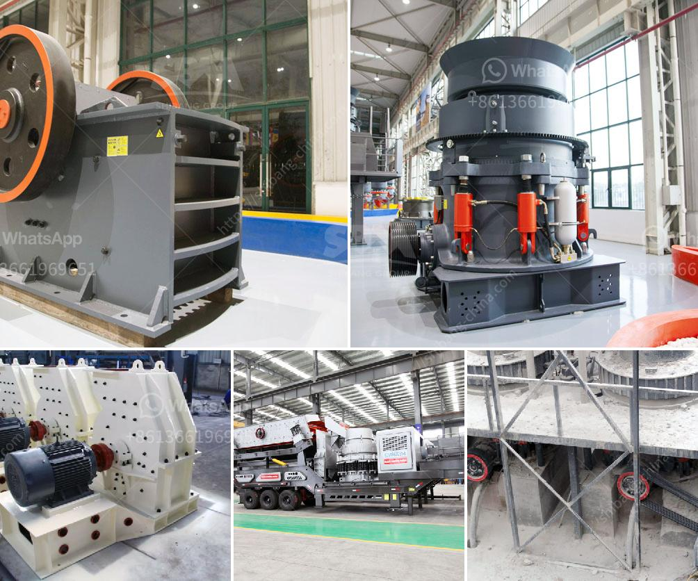

<h3>سير ناقل لسعر كسارة الحجر</h3>
تُعد كسارة الحجر من أهم المعدات في صناعة التعدين والبناء. فهي تستخدم لتكسير وسحق الصخور والأحجار الكبيرة للحصول على حجم صغير ومناسب للاستخدام في مختلف المشاريع الإنشائية. وبما أن الطلب على الحجر المكسر كبير جدًا، فإن سعر كسارة الحجر يعتبر مؤشرًا رئيسيًا لسوق البناء والتعدين.

تتوفر كسارات الحجر في العديد من الموديلات والأحجام والقدرات. قد تتراوح أسعار كسارات الحجر بين 200 و400 دولار على حسب الحجم والقدرة والمواصفات الفنية. فمن المهم أن يتم اختيار الموديل المناسب وفقًا لاحتياجات المشروع ومتطلبات الإنتاج.

وعلى الرغم من أن سعر كسارة الحجر هو عامل مهم في اتخاذ القرار، إلا أنه لا ينبغي أن يكون المعيار الوحيد. يجب أن يتم النظر أيضًا في جودة الكسارة وكفاءتها ودقتها في العمل. فكسارة ذات جودة عالية ستوفر الكثير من الوقت والجهد في عملية التكسير وتقليل التكاليف المرتبطة بالصيانة والإصلاح.

بالإضافة إلى ذلك، قد تؤثر تكلفة الشحن والتسليم على السعر النهائي المدفوع. فكسارات الحجر هي معدات ثقيلة وثقيلة الوزن، وبالتالي يجب أن تنقل بواسطة وسائل نقل خاصة وتحتاج إلى عملية تجميع وتثبيت لاحقة. يجب أن يؤخذ بالاعتبار مدى تأثير تكلفة الشحن والتسليم على السعر النهائي ومدى توافر التجميع والتثبيت.

أخيرًا، يجب أن يتم النظر في عوامل أخرى تؤثر على السعر مثل الماركة والتكنولوجيا المستخدمة وسمعة الشركة المصنعة. فعلى سبيل المثال، الكسارات المصنوعة من العلامات التجارية الرائدة قد تكون أكثر تكلفة، ولكنها توفر ضمانًا وصيانة موثوقة. كما يمكن أن تكون التكنولوجيا المستخدمة في بعض الكسارات أكثر تقدمًا وفعالية من حيث استهلاك الطاقة والإنتاجية.

باختصار، سير ناقل لسعر كسارة الحجر يعتمد على العديد من العوامل مثل الحجم والقدرة والجودة وتكاليف التسليم والشحن والماركة والتكنولوجيا المستخدمة. يجب على المشتري أن يقوم بدراسة السوق واختيار الكسارة التي تلبي احتياجاته ومتطلباته المحددة. على المشتري أن يضع في الاعتبار أهمية الاستثمار في كسارة ذات جودة مرتفعة لتحقيق أقصى قدر من الكفاءة وتقليل التكاليف على المدى الطويل.
<h3>Contact us</h3><ul><li><strong>Whatsapp:&nbsp;<a href="https://wa.me/8613661969651">+8613661969651</a></strong></li><li><a href="https://swt.shibang-china.com/?git&amp;zhl&amp;سير ناقل لسعر كسارة الحجر"><strong>Online Service(chat now)</strong></a></li></ul><h3>Related</h3><ul><li><a href='تكلفة سيور النقل.md'>تكلفة سيور النقل</a></li><li><a href='طاحونة كرات في كينيا.md'>طاحونة كرات في كينيا</a></li><li><a href='معدات معالجة الكروم لباكستان.md'>معدات معالجة الكروم لباكستان</a></li><li><a href='سعر آلة معالجة الحديد.md'>سعر آلة معالجة الحديد</a></li><li><a href='تكلفة الكسارة المحمولة.md'>تكلفة الكسارة المحمولة</a></li></ul>