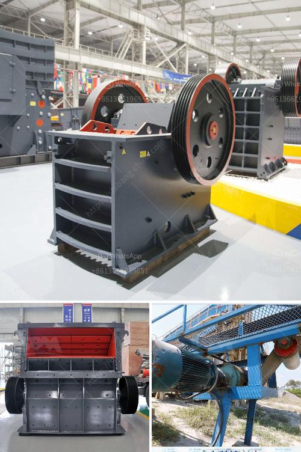

<h3>سينغ كسارة الحجر ناشيك</h3>
تُعَدُّ سينغ كسارة الحجر ناشيك واحدة من أهم وأشهر كسارات الحجارة في العالم. تم تأسيسها في عام 1939 في مدينة جامشدبور بولاية راجستان في الهند. تعمل الشركة في مجال تصنيع وتوريد وتصدير كسارات الحجر ومنتجات ذات الصلة. بالإضافة إلى ذلك، فهي تنتج أيضًا آلات الطحن وآلات الغربلة وآلات التغذية وغيرها من المعدات المستخدمة في صناعة المحاجر والتعدين.

تتميز سينغ كسارة الحجر ناشيك بجودة منتجاتها وقدرتها على تلبية متطلبات عملائها المختلفين. تستثمر الشركة بشكل مستمر في البحث والتطوير لتحسين تقنيات الإنتاج وتطوير المنتجات الجديدة. كما تلتزم الشركة بتقديم خدمة عملاء ممتازة وتلبية احتياجاتهم بأفضل الطرق الممكنة.

توفر سينغ كسارة الحجر ناشيك مجموعة متنوعة من المنتجات، بما في ذلك كسارات الفك، وكسارات الصدم، ومعدات التكسير الثانوية والتكرير، وآلات الطحن وغيرها. يتم استخدام هذه المعدات على نطاق واسع في صناعات التعدين والبناء وتصنيع الركام والطرق والسكك الحديدية وغيرها من الصناعات ذات الصلة.

تعد جودة منتجات سينغ كسارة الحجر ناشيك العالمية، والتزامها بالابتكار وتقديم خدمات متميزة للعملاء، هي أهم عوامل نجاحها في السوق العالمية. تصدّر الشركة منتجاتها إلى العديد من البلدان حول العالم، وقد حازت على سمعة طيبة في سوق الصناعة.

بالإضافة إلى جودة منتجاتها، تعمل سينغ كسارة الحجر ناشيك أيضًا على تحسين أدائها البيئي. فقد اعتمدت الشركة سياسة بيئية صارمة تهدف إلى تقليل تأثيراتها البيئية السلبية وتحقيق التنمية المستدامة.

باختصار، تُعَدُّ سينغ كسارة الحجر ناشيك شركة رائدة في مجال تصنيع وتوريد كسارات الحجارة ومعدات التكسير والطحن. تتمتع بسمعة طيبة في السوق العالمية بفضل جودة منتجاتها والالتزام الذي تظهره تجاه الابتكار والخدمة الممتازة للعملاء. تعمل الشركة أيضًا على تحقيق التنمية المستدامة والحفاظ على البيئة.
<h3>Contact us</h3><ul><li><strong>Whatsapp:&nbsp;<a href="https://wa.me/8613661969651">+8613661969651</a></strong></li><li><a href="https://swt.shibang-china.com/?git&amp;zhl&amp;سينغ كسارة الحجر ناشيك"><strong>Online Service(chat now)</strong></a></li></ul><h3>Related</h3><ul><li><a href='الرمل المصنع مقابل الرمل الطبيعي.md'>الرمل المصنع مقابل الرمل الطبيعي</a></li><li><a href='سحق 100 طن في الساعة.md'>سحق 100 طن في الساعة</a></li><li><a href='آلات غسيل الفحم.md'>آلات غسيل الفحم</a></li><li><a href='كسارة الصدم PF لآلة تكسير الحجر للبيع.md'>كسارة الصدم PF لآلة تكسير الحجر للبيع</a></li><li><a href='سعر كسارة الحجر في نيجيريا.md'>سعر كسارة الحجر في نيجيريا</a></li></ul>